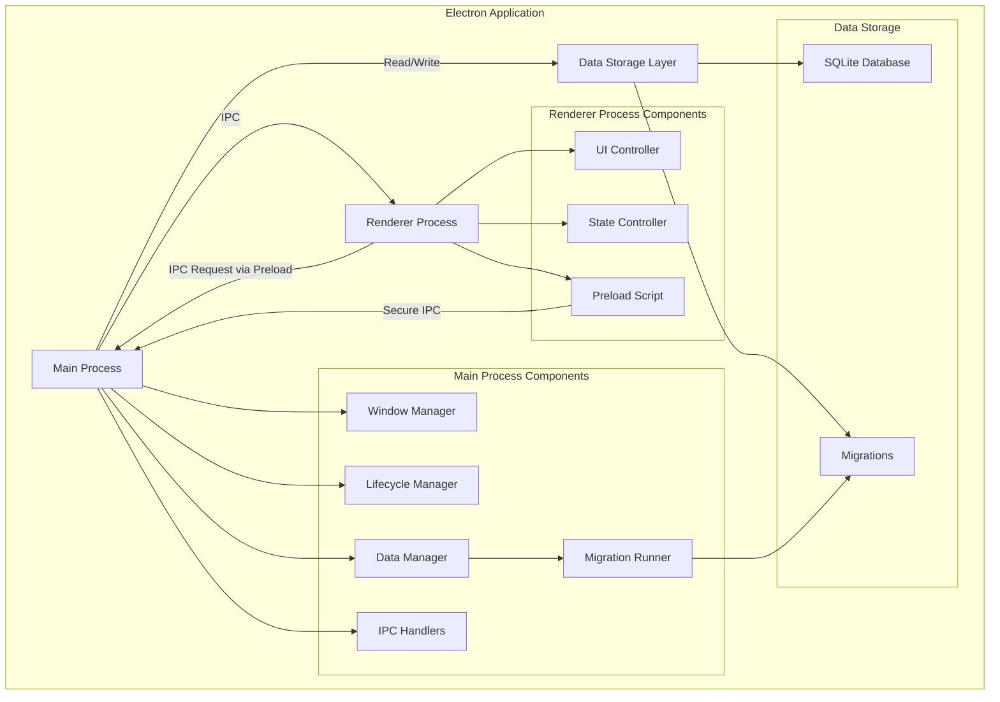

# Дизайн: Clerkly - AI Agent для менеджеров

## Обзор

Clerkly - это Electron-приложение для Mac OS X, предназначенное для менеджеров. На текущем этапе реализуется базовая структура приложения с локальным хранением данных, нативным Mac OS X интерфейсом и комплексным тестовым покрытием. Приложение построено с учетом требований производительности, безопасности и совместимости, создавая надежную платформу для будущих AI-функций.

Реализация включает систему миграций базы данных, расширенную обработку ошибок, IPC коммуникацию с таймаутами и валидацией, а также компоненты управления состоянием и UI с мониторингом производительности.

## Архитектура

Приложение следует стандартной архитектуре Electron с разделением на "Main Process" и "Renderer Process", с добавлением слоя для локального хранения данных и системы миграций.



### Технологический стек

- **Electron** (v28+) - для создания desktop приложения
- **Node.js** (v18+) - runtime для main process
- **HTML5/CSS3** - для отображения UI
- **TypeScript** (v5+) - язык программирования
- **SQLite** - для локального хранения данных
- **Jest** - для модульного и функционального тестирования
- **ts-jest** - для запуска TypeScript тестов
- **Electron Builder** - для сборки Mac OS X приложения

## Компоненты и интерфейсы

### Компоненты Main Process

#### Window Manager
Управляет созданием и конфигурацией окна приложения с нативным Mac OS X интерфейсом.

```typescript
import { BrowserWindow } from 'electron';

interface WindowOptions {
  width?: number;
  height?: number;
  title?: string;
  resizable?: boolean;
  fullscreen?: boolean;
}

class WindowManager {
  private mainWindow: BrowserWindow | null = null;
  
  createWindow(): BrowserWindow {
    // Создает окно с нативным Mac OS X видом
    // Настраивает titleBarStyle: 'hiddenInset', vibrancy, trafficLightPosition
    // Возвращает: BrowserWindow instance
  }
  
  configureWindow(options: WindowOptions): void {
    // Настраивает параметры окна
  }
  
  closeWindow(): void {
    // Корректно закрывает окно с очисткой listeners
  }
  
  getWindow(): BrowserWindow | null {
    // Возвращает текущее окно
    return this.mainWindow;
  }
  
  isWindowCreated(): boolean {
    // Проверяет, создано ли окно
    return this.mainWindow !== null;
  }
}
```

#### Lifecycle Manager
Управляет жизненным циклом приложения, включая запуск, активацию и завершение.

```typescript
interface InitializeResult {
  success: boolean;
  loadTime: number;
}

class LifecycleManager {
  private windowManager: WindowManager;
  private dataManager: DataManager;
  private startTime: number | null = null;
  private initialized: boolean = false;
  
  constructor(windowManager: WindowManager, dataManager: DataManager) {
    this.windowManager = windowManager;
    this.dataManager = dataManager;
  }
  
  async initialize(): Promise<InitializeResult> {
    // Инициализирует приложение
    // Обеспечивает запуск менее чем за 3 секунды
  }
  
  handleActivation(): void {
    // Обрабатывает активацию приложения (Mac OS X специфика)
    // Пересоздает окно при клике на dock icon
  }
  
  async handleQuit(): Promise<void> {
    // Корректно завершает приложение
    // Сохраняет все данные перед выходом
  }
  
  handleWindowClose(): void {
    // Обрабатывает закрытие всех окон
    // Mac OS X: приложение остается активным
  }
  
  getStartupTime(): number | null {
    // Возвращает время запуска
    return this.startTime;
  }
  
  isAppInitialized(): boolean {
    // Проверяет, инициализировано ли приложение
    return this.initialized;
  }
}
```

#### Data Manager
Управляет локальным хранением данных пользователя с использованием SQLite.

```typescript
import Database from 'better-sqlite3';

interface InitializeResult {
  success: boolean;
  migrations?: number;
  warning?: string;
  path?: string;
}

interface SaveResult {
  success: boolean;
  error?: string;
}

interface LoadResult<T = any> {
  success: boolean;
  data?: T;
  error?: string;
}

class DataManager {
  private storagePath: string;
  private db: Database.Database | null = null;
  private migrationRunner: MigrationRunner | null = null;
  
  constructor(storagePath: string) {
    this.storagePath = storagePath;
  }
  
  initialize(): InitializeResult {
    // Инициализирует локальное хранилище
    // Создает необходимые директории и файлы
    // Запускает миграции базы данных
    // Обрабатывает ошибки прав доступа (fallback на temp directory)
    // Обрабатывает поврежденные базы данных (backup и пересоздание)
  }
  
  saveData(key: string, value: any): SaveResult {
    // Сохраняет данные локально
    // Валидирует key (non-empty string, max 1000 chars)
    // Сериализует value в JSON
    // Проверяет размер (max 10MB)
    // Обрабатывает ошибки (SQLITE_FULL, SQLITE_BUSY, SQLITE_LOCKED, SQLITE_READONLY)
  }
  
  loadData<T = any>(key: string): LoadResult<T> {
    // Загружает данные из локального хранилища
    // Валидирует key
    // Десериализует JSON
    // Обрабатывает ошибки (SQLITE_BUSY, SQLITE_LOCKED)
  }
  
  deleteData(key: string): SaveResult {
    // Удаляет данные из локального хранилища
    // Валидирует key
    // Обрабатывает ошибки
  }
  
  getStoragePath(): string {
    // Возвращает путь к локальному хранилищу
    return this.storagePath;
  }
  
  close(): void {
    // Закрывает соединение с базой данных
  }
  
  getMigrationRunner(): MigrationRunner | null {
    // Возвращает экземпляр Migration Runner
    return this.migrationRunner;
  }
}
```

#### Migration Runner
Управляет миграциями схемы базы данных.

```typescript
import Database from 'better-sqlite3';

interface MigrationResult {
  success: boolean;
  appliedMigrations?: number;
  error?: string;
}

class MigrationRunner {
  private db: Database.Database;
  private migrationsPath: string;
  
  constructor(db: Database.Database, migrationsPath: string) {
    this.db = db;
    this.migrationsPath = migrationsPath;
  }
  
  runMigrations(): MigrationResult {
    // Запускает все pending миграции
    // Создает таблицу migrations для отслеживания
    // Выполняет миграции в порядке возрастания версий
  }
  
  getCurrentVersion(): number {
    // Возвращает текущую версию схемы
  }
  
  getPendingMigrations(): string[] {
    // Возвращает список pending миграций
  }
}
```

#### IPC Handlers
Управляет IPC коммуникацией между Main и Renderer процессами.

```typescript
import { IpcMainInvokeEvent } from 'electron';

class IPCHandlers {
  private dataManager: DataManager;
  private timeout: number = 10000; // 10 секунд
  
  constructor(dataManager: DataManager) {
    this.dataManager = dataManager;
  }
  
  registerHandlers(): void {
    // Регистрирует все IPC handlers
    // Каналы: 'save-data', 'load-data', 'delete-data'
  }
  
  unregisterHandlers(): void {
    // Удаляет все IPC handlers
  }
  
  async handleSaveData(event: IpcMainInvokeEvent, key: string, value: any): Promise<SaveResult> {
    // Обрабатывает save-data запрос
    // Валидирует параметры
    // Применяет timeout (10 секунд)
    // Логирует ошибки
  }
  
  async handleLoadData<T = any>(event: IpcMainInvokeEvent, key: string): Promise<LoadResult<T>> {
    // Обрабатывает load-data запрос
    // Валидирует параметры
    // Применяет timeout
    // Логирует ошибки
  }
  
  async handleDeleteData(event: IpcMainInvokeEvent, key: string): Promise<SaveResult> {
    // Обрабатывает delete-data запрос
    // Валидирует параметры
    // Применяет timeout
    // Логирует ошибки
  }
  
  withTimeout<T>(promise: Promise<T>, timeoutMs: number, timeoutMessage: string): Promise<T> {
    // Выполняет promise с timeout
  }
  
  setTimeout(timeoutMs: number): void {
    // Устанавливает timeout для IPC запросов
    this.timeout = timeoutMs;
  }
  
  getTimeout(): number {
    // Возвращает текущий timeout
    return this.timeout;
  }
}
```

### Компоненты Renderer Process

#### UI Controller
Отвечает за отображение пользовательского интерфейса с мониторингом производительности.

```typescript
interface RenderResult {
  success: boolean;
  renderTime: number;
  performanceWarning?: boolean;
}

interface UpdateResult {
  success: boolean;
  updateTime: number;
  performanceWarning?: boolean;
}

interface LoadingResult {
  success: boolean;
  duration?: number;
  error?: string;
}

class UIController {
  private container: HTMLElement;
  private loadingIndicators: Map<string, { element: HTMLElement; startTime: number }>;
  private performanceThreshold: number = 100; // ms
  private loadingThreshold: number = 200; // ms
  
  constructor(container: HTMLElement) {
    this.container = container;
    this.loadingIndicators = new Map();
  }
  
  render(): RenderResult {
    // Отрисовывает UI
    // Создает header, content, footer
    // Мониторит время отрисовки (< 100ms)
    // Логирует предупреждения при медленной отрисовке
  }
  
  updateView(data: any): UpdateResult {
    // Обновляет отображение с новыми данными
    // Эффективное обновление без полной перерисовки
    // Мониторит время обновления (< 100ms)
  }
  
  showLoading(operationId: string, message: string): LoadingResult {
    // Показывает индикатор загрузки
    // Для операций > 200ms
  }
  
  hideLoading(operationId: string): LoadingResult {
    // Скрывает индикатор загрузки
  }
  
  async withLoading<T>(operationId: string, operation: () => Promise<T>, loadingMessage: string): Promise<T> {
    // Выполняет операцию с автоматическим индикатором загрузки
    // Показывает индикатор после 200ms
  }
  
  private createHeader(): HTMLElement {
    // Создает header элемент
  }
  
  private createContent(): HTMLElement {
    // Создает content area элемент
  }
  
  private createFooter(): HTMLElement {
    // Создает footer элемент
  }
  
  private createDataDisplay(data: any): HTMLElement {
    // Создает отображение данных (таблица/список)
  }
  
  clearAllLoading(): void {
    // Очищает все индикаторы загрузки
  }
}
```

#### State Controller
Управляет состоянием приложения в renderer process.

```typescript
interface AppState {
  [key: string]: any;
}

interface StateResult {
  success: boolean;
  state?: AppState;
  error?: string;
}

class StateController {
  private state: AppState;
  private stateHistory: AppState[] = [];
  private maxHistorySize: number = 10;
  
  constructor(initialState?: AppState) {
    this.state = initialState || {};
  }
  
  setState(newState: Partial<AppState>): StateResult {
    // Обновляет состояние приложения
    // Выполняет shallow merge
    // Сохраняет историю изменений
  }
  
  getState(): AppState {
    // Возвращает копию текущего состояния
  }
  
  resetState(newState?: AppState): StateResult {
    // Сбрасывает состояние
  }
  
  getStateProperty(key: string): any {
    // Возвращает конкретное свойство состояния
    return this.state[key];
  }
  
  setStateProperty(key: string, value: any): void {
    // Устанавливает конкретное свойство состояния
  }
  
  removeStateProperty(key: string): void {
    // Удаляет свойство из состояния
  }
  
  hasStateProperty(key: string): boolean {
    // Проверяет наличие свойства
    return key in this.state;
  }
  
  getStateHistory(): AppState[] {
    // Возвращает историю изменений состояния
    return [...this.stateHistory];
  }
  
  clearStateHistory(): void {
    // Очищает историю состояний
    this.stateHistory = [];
  }
  
  getStateKeys(): string[] {
    // Возвращает все ключи состояния
    return Object.keys(this.state);
  }
  
  getStateSize(): number {
    // Возвращает количество свойств в состоянии
    return Object.keys(this.state).length;
  }
  
  isStateEmpty(): boolean {
    // Проверяет, пусто ли состояние
    return Object.keys(this.state).length === 0;
  }
}
```

#### Preload Script (IPC Client)
Обеспечивает безопасную IPC коммуникацию из renderer process.

```typescript
// Preload script с contextBridge
import { contextBridge, ipcRenderer } from 'electron';

interface API {
  saveData(key: string, value: any): Promise<SaveResult>;
  loadData<T = any>(key: string): Promise<LoadResult<T>>;
  deleteData(key: string): Promise<SaveResult>;
}

contextBridge.exposeInMainWorld('api', {
  async saveData(key: string, value: any): Promise<SaveResult> {
    // Вызывает 'save-data' через ipcRenderer.invoke
    return await ipcRenderer.invoke('save-data', key, value);
  },
  
  async loadData<T = any>(key: string): Promise<LoadResult<T>> {
    // Вызывает 'load-data' через ipcRenderer.invoke
    return await ipcRenderer.invoke('load-data', key);
  },
  
  async deleteData(key: string): Promise<SaveResult> {
    // Вызывает 'delete-data' через ipcRenderer.invoke
    return await ipcRenderer.invoke('delete-data', key);
  }
} as API);

// Глобальное объявление типов для window.api
declare global {
  interface Window {
    api: API;
  }
}
```

### IPC Communication

Коммуникация между Main и Renderer процессами через IPC (Inter-Process Communication) с использованием contextBridge для безопасности.

```javascript
// Main Process - IPC Handlers
const ipcHandlers = new IPCHandlers(dataManager)
ipcHandlers.registerHandlers()

// Renderer Process - через Preload Script
const result = await window.api.saveData('my-key', 'my-value')
if (result.success) {
  console.log('Data saved successfully')
} else {
  console.error('Failed to save data:', result.error)
}
```

### IPC Communication

Коммуникация между Main и Renderer процессами через IPC (Inter-Process Communication) с использованием contextBridge для безопасности.

```typescript
// Main Process - IPC Handlers
const ipcHandlers = new IPCHandlers(dataManager);
ipcHandlers.registerHandlers();

// Renderer Process - через Preload Script
const result = await window.api.saveData('my-key', 'my-value');
if (result.success) {
  console.log('Data saved successfully');
} else {
  console.error('Failed to save data:', result.error);
}
```

### Application Configuration

```typescript
interface WindowSettings {
  width: number;
  height: number;
  minWidth: number;
  minHeight: number;
  titleBarStyle: string;
  vibrancy: string;
}

class AppConfig {
  readonly version: string = '1.0.0';
  readonly platform: string = 'darwin'; // Mac OS X
  readonly minOSVersion: string = '10.13';
  readonly windowSettings: WindowSettings = {
    width: 800,
    height: 600,
    minWidth: 600,
    minHeight: 400,
    titleBarStyle: 'hiddenInset',
    vibrancy: 'under-window'
  };
}
```

### User Data

```typescript
class UserData {
  constructor(
    public readonly key: string,      // уникальный идентификатор (max 1000 chars)
    public readonly value: any,       // данные пользователя (сериализуются в JSON, max 10MB)
    public readonly timestamp: number // время создания/обновления
  ) {}
}
```

### Storage Schema

Локальное хранилище использует SQLite с следующей схемой (управляется через миграции):

```sql
-- Migration 001: Initial schema
CREATE TABLE user_data (
  key TEXT PRIMARY KEY,
  value TEXT NOT NULL,
  timestamp INTEGER NOT NULL,
  created_at INTEGER NOT NULL,
  updated_at INTEGER NOT NULL
);

CREATE INDEX idx_timestamp ON user_data(timestamp);

-- Migration tracking table
CREATE TABLE migrations (
  version INTEGER PRIMARY KEY,
  name TEXT NOT NULL,
  applied_at INTEGER NOT NULL
);
```

## Свойства корректности

*Свойство (property) - это характеристика или поведение, которое должно выполняться для всех валидных выполнений системы - по сути, формальное утверждение о том, что система должна делать. Свойства служат мостом между человекочитаемыми спецификациями и машинно-проверяемыми гарантиями корректности.*

### Property 1: Data Storage Round-Trip

*Для любых* валидных данных пользователя (key-value пары), сохранение данных с последующей загрузкой должно возвращать эквивалентное значение.

**Validates: Requirements 1.4**

**Обоснование:** Это свойство проверяет, что локальное хранилище данных работает корректно. Если мы сохраняем данные и затем загружаем их, мы должны получить те же данные обратно. Это классическое round-trip свойство, которое гарантирует целостность данных при сохранении и загрузке через SQLite.

**Тестовый сценарий:**
- Генерируем случайные key-value пары различных типов (строки, числа, объекты, массивы, boolean)
- Сохраняем каждую пару через DataManager.saveData()
- Загружаем каждую пару через DataManager.loadData()
- Проверяем, что загруженное значение эквивалентно сохраненному (deep equality)

**Edge cases для тестирования:**
- Пустые строки как значения
- Специальные символы в ключах (дефисы, подчеркивания, точки)
- Большие объекты данных (массивы с 1000+ элементов)
- Вложенные объекты и массивы
- Перезапись существующих ключей
- Граничные значения для чисел (0, отрицательные, дробные)

### Property 2: Invalid Key Rejection

*Для любых* невалидных ключей (пустые строки, null, undefined, не-строки, слишком длинные строки > 1000 символов), операции saveData, loadData и deleteData должны возвращать ошибку без изменения состояния базы данных.

**Validates: Requirements 1.4**

**Обоснование:** Это свойство проверяет, что система корректно валидирует входные данные и отклоняет невалидные запросы. Это критически важно для безопасности и надежности приложения, предотвращая некорректные операции с базой данных.

**Тестовый сценарий:**
- Генерируем различные типы невалидных ключей
- Пытаемся выполнить операции saveData, loadData, deleteData с невалидными ключами
- Проверяем, что все операции возвращают { success: false, error: ... }
- Проверяем, что состояние базы данных не изменилось

**Edge cases для тестирования:**
- Пустая строка как ключ
- null и undefined как ключи
- Числа, объекты, массивы как ключи (не-строки)
- Строки длиной ровно 1000 символов (граница)
- Строки длиной 1001+ символов (превышение лимита)

### Property 3: State Immutability

*Для любого* состояния в "State Controller", вызов getState() должен возвращать копию состояния, и изменения в возвращенном объекте не должны влиять на внутреннее состояние.

**Validates: Requirements 1.3**

**Обоснование:** Это свойство проверяет, что "State Controller" корректно изолирует внутреннее состояние от внешних изменений. Это предотвращает непреднамеренные мутации состояния и обеспечивает предсказуемое поведение приложения.

**Тестовый сценарий:**
- Создаем "State Controller" с начальным состоянием
- Вызываем getState() и получаем копию состояния
- Изменяем возвращенный объект (добавляем/удаляем/изменяем свойства)
- Вызываем getState() снова
- Проверяем, что внутреннее состояние не изменилось

**Edge cases для тестирования:**
- Вложенные объекты в состоянии
- Массивы в состоянии
- Пустое состояние
- Состояние с большим количеством свойств

### Property 4: IPC Timeout Enforcement

*Для любой* IPC операции (save-data, load-data, delete-data), если операция не завершается в течение установленного timeout (по умолчанию 10 секунд), должна возвращаться ошибка timeout.

**Validates: Requirements 1.4**

**Обоснование:** Это свойство проверяет, что IPC коммуникация корректно обрабатывает таймауты, предотвращая зависание приложения при медленных или зависших операциях. Это критически важно для отзывчивости UI и надежности приложения.

**Тестовый сценарий:**
- Создаем mock DataManager с искусственной задержкой > timeout
- Выполняем IPC операции через IPCHandlers
- Проверяем, что операции возвращают ошибку timeout
- Проверяем, что время выполнения примерно равно timeout (не намного больше)

**Edge cases для тестирования:**
- Операции, завершающиеся ровно на границе timeout
- Операции, завершающиеся чуть быстрее timeout
- Операции, завершающиеся значительно медленнее timeout
- Различные значения timeout (изменение через setTimeout)

## Обработка ошибок

### Ошибки жизненного цикла приложения

**Ошибки запуска:**
- Если приложение не может создать окно, логировать ошибку и показать системное уведомление
- Если инициализация хранилища данных не удалась, создать резервное in-memory хранилище и предупредить пользователя
- Если инициализация занимает > 3 секунд, логировать предупреждение о медленном запуске

**Ошибки управления окнами:**
- Корректно обрабатывать закрытие окна (освобождать ресурсы, удалять listeners)
- На Mac OS X: при закрытии последнего окна приложение остается активным (стандартное поведение Mac)
- Обрабатывать ошибки при загрузке HTML файлов (показывать error page)

**Ошибки завершения:**
- Гарантировать сохранение всех данных перед завершением
- Корректно закрывать соединения с базой данных
- Таймаут на завершение: максимум 5 секунд

### Ошибки хранения данных

**Ошибки инициализации хранилища:**
```typescript
initialize(): InitializeResult {
  try {
    // Создание директории
    if (!fs.existsSync(this.storagePath)) {
      fs.mkdirSync(this.storagePath, { recursive: true });
    }
  } catch (dirError: any) {
    // Обработка ошибок прав доступа
    if (dirError.code === 'EACCES' || dirError.code === 'EPERM') {
      console.warn('Permission denied, using temp directory');
      this.storagePath = path.join(os.tmpdir(), 'clerkly-fallback');
      return { success: true, warning: 'Using temporary directory', path: this.storagePath };
    }
    throw dirError;
  }
  
  // Проверка поврежденной базы данных
  if (fs.existsSync(dbPath)) {
    try {
      const testDb = new Database(dbPath);
      testDb.prepare('SELECT 1').get();
      testDb.close();
    } catch (corruptError) {
      console.warn('Database corrupted, creating backup');
      const backupPath = path.join(this.storagePath, `clerkly.db.backup-${Date.now()}`);
      fs.copyFileSync(dbPath, backupPath);
      fs.unlinkSync(dbPath);
    }
  }
  
  return { success: true };
}
```

**Ошибки операций сохранения:**
```typescript
saveData(key: string, value: any): SaveResult {
  try {
    // Валидация ключа
    if (!key || typeof key !== 'string') {
      return { success: false, error: 'Invalid key: must be non-empty string' };
    }
    
    if (key.length > 1000) {
      return { success: false, error: 'Invalid key: exceeds maximum length of 1000 characters' };
    }
    
    // Сериализация значения
    let serializedValue: string;
    try {
      serializedValue = JSON.stringify(value);
    } catch (serializeError: any) {
      return { success: false, error: `Failed to serialize value: ${serializeError.message}` };
    }
    
    // Проверка размера
    if (serializedValue.length > 10 * 1024 * 1024) {
      return { success: false, error: 'Value too large: exceeds 10MB limit' };
    }
    
    // Сохранение в базу данных
    // ...
    return { success: true };
  } catch (writeError: any) {
    // Обработка специфичных ошибок SQLite
    if (writeError.code === 'SQLITE_FULL') {
      return { success: false, error: 'Database is full: no space left on device' };
    } else if (writeError.code === 'SQLITE_BUSY' || writeError.code === 'SQLITE_LOCKED') {
      return { success: false, error: 'Database is locked: try again later' };
    } else if (writeError.code === 'SQLITE_READONLY') {
      return { success: false, error: 'Database is read-only: check permissions' };
    }
    return { success: false, error: `Database write failed: ${writeError.message}` };
  }
}
```

**Ошибки операций загрузки:**
```typescript
loadData<T = any>(key: string): LoadResult<T> {
  try {
    // Валидация ключа
    if (!key || typeof key !== 'string') {
      return { success: false, error: 'Invalid key: must be non-empty string' };
    }
    
    if (key.length > 1000) {
      return { success: false, error: 'Invalid key: exceeds maximum length of 1000 characters' };
    }
    
    // Проверка инициализации базы данных
    if (!this.db || !this.db.open) {
      return { success: false, error: 'Database not initialized or closed' };
    }
    
    // Запрос данных
    const row = this.db.prepare('SELECT value FROM user_data WHERE key = ?').get(key) as { value: string } | undefined;
    
    if (!row) {
      return { success: false, error: 'Key not found' };
    }
    
    // Десериализация
    let data: T;
    try {
      data = JSON.parse(row.value);
    } catch (e) {
      data = row.value as any; // Fallback для plain string
    }
    
    return { success: true, data };
  } catch (queryError: any) {
    if (queryError.code === 'SQLITE_BUSY' || queryError.code === 'SQLITE_LOCKED') {
      return { success: false, error: 'Database is locked: try again later' };
    }
    return { success: false, error: `Database query failed: ${queryError.message}` };
  }
}
```

### Ошибки IPC коммуникации

**Ошибки каналов:**
```typescript
class IPCHandlers {
  async handleSaveData(event: IpcMainInvokeEvent, key: string, value: any): Promise<SaveResult> {
    try {
      // Валидация параметров
      if (key === undefined || key === null) {
        const error = 'Invalid parameters: key is required';
        console.error(`[IPC] save-data failed: ${error}`);
        return { success: false, error };
      }
      
      if (value === undefined) {
        const error = 'Invalid parameters: value is required';
        console.error(`[IPC] save-data failed: ${error}`);
        return { success: false, error };
      }
      
      // Выполнение с timeout
      const result = await this.withTimeout(
        this.dataManager.saveData(key, value),
        this.timeout,
        'save-data operation timed out'
      );
      
      // Логирование ошибок
      if (!result.success) {
        console.error(`[IPC] save-data failed for key "${key}": ${result.error}`);
      }
      
      return result;
    } catch (error: any) {
      console.error(`[IPC] save-data exception: ${error.message}`);
      return { success: false, error: error.message };
    }
  }
  
  withTimeout<T>(promise: Promise<T>, timeoutMs: number, timeoutMessage: string): Promise<T> {
    return Promise.race([
      promise,
      new Promise<T>((_, reject) => {
        setTimeout(() => reject(new Error(timeoutMessage)), timeoutMs);
      })
    ]);
  }
}
```

**Ошибки безопасности:**
- Отклонять IPC запросы с невалидными параметрами
- Не допускать выполнение произвольного кода через IPC
- Использовать contextBridge для изоляции renderer process

### Мониторинг производительности

**Мониторинг времени запуска:**
```typescript
const startTime = Date.now();
app.whenReady().then(async () => {
  await lifecycleManager.initialize();
  const loadTime = Date.now() - startTime;
  if (loadTime > 3000) {
    console.warn(`Slow startup: ${loadTime}ms (target: <3000ms)`);
  }
});
```

**Отзывчивость UI:**
```typescript
class UIController {
  render(): RenderResult {
    const startTime = performance.now();
    // ... отрисовка UI ...
    const renderTime = performance.now() - startTime;
    
    if (renderTime > this.performanceThreshold) {
      console.warn(`Slow UI render: ${renderTime.toFixed(2)}ms (target: <${this.performanceThreshold}ms)`);
    }
    
    return { success: true, renderTime, performanceWarning: renderTime > this.performanceThreshold };
  }
  
  async withLoading<T>(operationId: string, operation: () => Promise<T>, loadingMessage: string): Promise<T> {
    // Показывать индикатор загрузки для операций > 200ms
    const loadingTimeout = setTimeout(() => {
      this.showLoading(operationId, loadingMessage);
    }, this.loadingThreshold);
    
    try {
      const result = await operation();
      clearTimeout(loadingTimeout);
      this.hideLoading(operationId);
      return result;
    } catch (error) {
      clearTimeout(loadingTimeout);
      this.hideLoading(operationId);
      throw error;
    }
  }
}
```

## Стратегия тестирования

### Двойной подход к тестированию

Приложение использует комбинацию модульных тестов и property-based тестов для обеспечения комплексного покрытия:

- **Модульные тесты (Unit Tests):** Проверяют конкретные примеры, граничные случаи и условия ошибок
- **Property-based тесты:** Проверяют универсальные свойства на множестве сгенерированных входных данных

Оба подхода дополняют друг друга и необходимы для комплексного покрытия.

### Фреймворк тестирования

**Основной фреймворк:** Jest
- Поддержка как unit, так и property-based тестов
- Встроенные моки для Electron API
- Поддержка асинхронного тестирования
- Генерация отчетов о покрытии кода

**Property-Based Testing:** fast-check (JavaScript библиотека для property-based testing)
- Автоматическая генерация тестовых данных
- Минимум 100 итераций на каждый property тест
- Shrinking для поиска минимального failing case

### Стратегия модульного тестирования

**Компоненты для модульного тестирования:**

1. **Window Manager**
   - Создание окна с корректными параметрами (Mac OS X специфика)
   - Конфигурация окна (размеры, заголовок, resizable, fullscreen)
   - Закрытие окна с очисткой listeners
   - Проверка состояния окна (isWindowCreated)

2. **Lifecycle Manager**
   - Инициализация приложения (< 3 секунды)
   - Обработка активации (Mac OS X специфика - пересоздание окна)
   - Корректное завершение (сохранение данных, закрытие соединений)
   - Обработка закрытия окон (Mac OS X поведение)
   - Мониторинг времени запуска

3. **Data Manager**
   - Инициализация хранилища (создание директорий, миграции)
   - Сохранение данных (успешные случаи, различные типы данных)
   - Загрузка данных (успешные случаи, десериализация)
   - Удаление данных
   - Обработка ошибок:
     - Невалидные ключи (пустые, null, undefined, не-строки, слишком длинные)
     - Отсутствующие данные
     - Ошибки прав доступа (fallback на temp directory)
     - Поврежденная база данных (backup и пересоздание)
     - SQLite ошибки (SQLITE_FULL, SQLITE_BUSY, SQLITE_LOCKED, SQLITE_READONLY)

4. **Migration Runner**
   - Запуск миграций (создание таблицы migrations, выполнение pending миграций)
   - Получение текущей версии схемы
   - Получение списка pending миграций
   - Обработка ошибок миграций

5. **IPC Handlers**
   - Регистрация и удаление handlers
   - Корректная передача сообщений между процессами
   - Обработка таймаутов (10 секунд)
   - Валидация параметров (key, value)
   - Логирование ошибок

6. **UI Controller**
   - Отрисовка UI (header, content, footer)
   - Обновление view с новыми данными
   - Показ/скрытие индикаторов загрузки
   - Выполнение операций с автоматическим loading (> 200ms)
   - Мониторинг производительности (< 100ms)

7. **State Controller**
   - Установка состояния (shallow merge)
   - Получение состояния (immutable copy)
   - Сброс состояния
   - Операции с отдельными свойствами (get, set, remove, has)
   - История состояний
   - Валидация параметров

**Примеры модульных тестов:**

```typescript
/* Preconditions: DataManager initialized with test storage path, database is empty
   Action: save string data with valid key, then load it back
   Assertions: save returns success true, load returns success true with same data
   Requirements: clerkly.1.4 */
test('should save and load string data', async () => {
  const dataManager = new DataManager('/tmp/test-storage');
  await dataManager.initialize();
  
  const key = 'test-key';
  const value = 'test-value';
  
  const saveResult = dataManager.saveData(key, value);
  expect(saveResult.success).toBe(true);
  
  const loadResult = dataManager.loadData(key);
  expect(loadResult.success).toBe(true);
  expect(loadResult.data).toBe(value);
});

/* Preconditions: DataManager initialized
   Action: attempt to save data with empty string key
   Assertions: returns success false with error message about invalid key
   Requirements: clerkly.1.4 */
test('should reject empty string key', () => {
  const dataManager = new DataManager('/tmp/test-storage');
  dataManager.initialize();
  
  const result = dataManager.saveData('', 'value');
  expect(result.success).toBe(false);
  expect(result.error).toContain('Invalid key');
});

/* Preconditions: DataManager initialized, key does not exist in database
   Action: attempt to load data with non-existent key
   Assertions: returns success false with "Key not found" error
   Requirements: clerkly.1.4 */
test('should handle missing key', () => {
  const dataManager = new DataManager('/tmp/test-storage');
  dataManager.initialize();
  
  const result = dataManager.loadData('non-existent-key');
  expect(result.success).toBe(false);
  expect(result.error).toContain('Key not found');
});

/* Preconditions: UIController initialized with container element
   Action: call render() method
   Assertions: container has main-container element, render time < 100ms, returns success true
   Requirements: clerkly.1.3 */
test('should render UI within performance threshold', () => {
  const container = document.createElement('div');
  const uiController = new UIController(container);
  
  const result = uiController.render();
  
  expect(result.success).toBe(true);
  expect(result.renderTime).toBeLessThan(100);
  expect(container.querySelector('[data-testid="main-container"]')).toBeTruthy();
});

/* Preconditions: StateController initialized with empty state
   Action: call setState with new properties, then getState and mutate returned object
   Assertions: internal state remains unchanged after mutation of returned object
   Requirements: clerkly.1.3 */
test('should return immutable copy of state', () => {
  const stateController = new StateController();
  stateController.setState({ key: 'value' });
  
  const state1 = stateController.getState();
  state1.key = 'modified';
  state1.newKey = 'new';
  
  const state2 = stateController.getState();
  expect(state2.key).toBe('value');
  expect(state2.newKey).toBeUndefined();
});
```

### Стратегия Property-Based тестирования

**Конфигурация Property тестов:**
- Минимум 100 итераций на каждый property тест
- Каждый property тест должен ссылаться на свойство из документа дизайна
- Формат тега: **Feature: clerkly, Property {number}: {property_text}**

**Property 1: Data Storage Round-Trip**

```typescript
import * as fc from 'fast-check';

describe('Property Tests - Data Storage', () => {
  let dataManager: DataManager;
  
  beforeEach(() => {
    dataManager = new DataManager('/tmp/test-storage');
    dataManager.initialize();
  });
  
  afterEach(() => {
    dataManager.close();
  });
  
  /* Preconditions: DataManager initialized with clean database
     Action: generate random key-value pairs, save each, then load each
     Assertions: for all pairs, loaded value equals saved value (deep equality)
     Requirements: clerkly.1.4 */
  // Feature: clerkly, Property 1: Data Storage Round-Trip
  test('Property 1: saving then loading data returns equivalent value', async () => {
    await fc.assert(
      fc.asyncProperty(
        fc.string({ minLength: 1, maxLength: 100 }), // key
        fc.oneof(
          fc.string(),
          fc.integer(),
          fc.boolean(),
          fc.double(),
          fc.object(),
          fc.array(fc.anything())
        ), // value
        async (key: string, value: any) => {
          // Save data
          const saveResult = dataManager.saveData(key, value);
          expect(saveResult.success).toBe(true);
          
          // Load data
          const loadResult = dataManager.loadData(key);
          expect(loadResult.success).toBe(true);
          
          // Verify equivalence
          expect(loadResult.data).toEqual(value);
        }
      ),
      { numRuns: 100 }
    );
  });
  
  /* Preconditions: DataManager initialized
     Action: generate random invalid keys (empty, null, undefined, non-strings, too long)
     Assertions: for all invalid keys, saveData/loadData/deleteData return success false
     Requirements: clerkly.1.4 */
  // Feature: clerkly, Property 2: Invalid Key Rejection
  test('Property 2: invalid keys are rejected', () => {
    fc.assert(
      fc.property(
        fc.oneof(
          fc.constant(''),
          fc.constant(null),
          fc.constant(undefined),
          fc.integer(),
          fc.object(),
          fc.string({ minLength: 1001 })
        ),
        (invalidKey: any) => {
          const saveResult = dataManager.saveData(invalidKey, 'value');
          expect(saveResult.success).toBe(false);
          expect(saveResult.error).toBeTruthy();
          
          const loadResult = dataManager.loadData(invalidKey);
          expect(loadResult.success).toBe(false);
          expect(loadResult.error).toBeTruthy();
          
          const deleteResult = dataManager.deleteData(invalidKey);
          expect(deleteResult.success).toBe(false);
          expect(deleteResult.error).toBeTruthy();
        }
      ),
      { numRuns: 100 }
    );
  });
  
  /* Preconditions: StateController initialized with random state
     Action: call getState, mutate returned object, call getState again
     Assertions: for all states, internal state remains unchanged after mutation
     Requirements: clerkly.1.3 */
  // Feature: clerkly, Property 3: State Immutability
  test('Property 3: getState returns immutable copy', () => {
    fc.assert(
      fc.property(
        fc.object(),
        (initialState: any) => {
          const stateController = new StateController(initialState);
          
          const state1 = stateController.getState();
          // Mutate returned object
          state1.newKey = 'new-value';
          if (Object.keys(state1).length > 0) {
            const firstKey = Object.keys(state1)[0];
            state1[firstKey] = 'modified';
          }
          
          const state2 = stateController.getState();
          expect(state2).toEqual(initialState);
        }
      ),
      { numRuns: 100 }
    );
  });
});
```

**Edge cases для Property тестов:**

```typescript
/* Preconditions: DataManager initialized
   Action: save empty string value
   Assertions: save succeeds, load returns same empty string
   Requirements: clerkly.1.4 */
test('Property 1 edge case: empty string values', () => {
  const key = 'test-key';
  const value = '';
  
  const saveResult = dataManager.saveData(key, value);
  expect(saveResult.success).toBe(true);
  
  const loadResult = dataManager.loadData(key);
  expect(loadResult.success).toBe(true);
  expect(loadResult.data).toBe(value);
});

/* Preconditions: DataManager initialized
   Action: save data with keys containing special characters
   Assertions: all saves succeed, all loads return correct values
   Requirements: clerkly.1.4 */
test('Property 1 edge case: special characters in keys', () => {
  const specialKeys = ['key-with-dash', 'key_with_underscore', 'key.with.dot'];
  
  for (const key of specialKeys) {
    const value = 'test-value';
    const saveResult = dataManager.saveData(key, value);
    expect(saveResult.success).toBe(true);
    
    const loadResult = dataManager.loadData(key);
    expect(loadResult.success).toBe(true);
    expect(loadResult.data).toBe(value);
  }
});

/* Preconditions: DataManager initialized
   Action: save large object (1000 items array)
   Assertions: save succeeds, load returns equivalent object
   Requirements: clerkly.1.4 */
test('Property 1 edge case: large objects', () => {
  const key = 'large-object';
  const value = {
    data: Array(1000).fill(0).map((_, i) => ({ id: i, value: `item-${i}` }))
  };
  
  const saveResult = dataManager.saveData(key, value);
  expect(saveResult.success).toBe(true);
  
  const loadResult = dataManager.loadData(key);
  expect(loadResult.success).toBe(true);
  expect(loadResult.data).toEqual(value);
});
```

### Стратегия функционального тестирования

**Интеграционные тесты проверяют взаимодействие между компонентами:**

1. **Application Lifecycle Integration**
   - Запуск приложения → создание окна → инициализация хранилища → запуск миграций
   - Сохранение данных → перезапуск приложения → загрузка данных (персистентность)
   - Закрытие окна → корректное завершение → сохранение данных

2. **IPC Integration**
   - Renderer process → IPC запрос через preload → Main process → Data Manager → ответ
   - Обработка ошибок через IPC (невалидные параметры, timeout)
   - Таймауты IPC запросов (10 секунд)

3. **Data Persistence Integration**
   - Сохранение данных → проверка файловой системы (SQLite файл) → загрузка данных
   - Множественные операции сохранения/загрузки
   - Конкурентные операции с данными

4. **Migration Integration**
   - Первый запуск → создание схемы через миграции
   - Обновление схемы → запуск новых миграций
   - Откат миграций при ошибках

**Пример функционального теста:**

```typescript
/* Preconditions: application not running, test database does not exist
   Action: start app, save data, quit app, restart app, load data
   Assertions: loaded data equals saved data (persistence across restarts)
   Requirements: clerkly.1.4, clerkly.2.4 */
test('should persist data across application restarts', async () => {
  // Start application
  const app = await startTestApp();
  const dataManager = app.getDataManager();
  
  // Save data
  const testData = { key: 'test-key', value: { nested: 'test-value', count: 42 } };
  const saveResult = dataManager.saveData(testData.key, testData.value);
  expect(saveResult.success).toBe(true);
  
  // Quit application
  await app.quit();
  
  // Restart application
  const newApp = await startTestApp();
  const newDataManager = newApp.getDataManager();
  
  // Verify data persisted
  const loadResult = newDataManager.loadData(testData.key);
  expect(loadResult.success).toBe(true);
  expect(loadResult.data).toEqual(testData.value);
  
  await newApp.quit();
});

/* Preconditions: application running, IPC handlers registered
   Action: send IPC request from renderer to save data, then load it
   Assertions: IPC communication succeeds, data is saved and loaded correctly
   Requirements: clerkly.1.4, clerkly.2.4 */
test('should handle IPC communication end-to-end', async () => {
  const app = await startTestApp();
  
  // Send save-data IPC request
  const saveResult = await app.ipcInvoke('save-data', 'ipc-key', 'ipc-value');
  expect(saveResult.success).toBe(true);
  
  // Send load-data IPC request
  const loadResult = await app.ipcInvoke('load-data', 'ipc-key');
  expect(loadResult.success).toBe(true);
  expect(loadResult.data).toBe('ipc-value');
  
  await app.quit();
});
```

### Выполнение тестов

**Команды для запуска тестов:**

```bash
# Запуск всех тестов
npm test

# Запуск только модульных тестов
npm run test:unit

# Запуск только property-based тестов
npm run test:property

# Запуск функциональных тестов (ТОЛЬКО при явной просьбе пользователя)
npm run test:functional

# Запуск с отчетом о покрытии
npm run test:coverage

# Полная валидация (TypeScript, ESLint, Prettier, тесты)
npm run validate
```

**Требования к покрытию:**
- Минимум 80% покрытие кода для бизнес-логики
- 100% покрытие для критических компонентов ("Data Manager", "Lifecycle Manager", "IPC Handlers")
- Все публичные API должны иметь тесты
- Все edge cases должны быть покрыты модульными тестами
- Все универсальные свойства должны быть покрыты property-based тестами

### Continuous Integration

**Автоматизация тестирования:**
- Все тесты запускаются автоматически при каждом коммите
- Property-based тесты запускаются с увеличенным количеством итераций (1000+) в CI
- Тесты должны проходить на Mac OS X 10.13+ для валидации совместимости
- Функциональные тесты НЕ запускаются автоматически (только вручную)

### Тестирование производительности

**Метрики производительности:**
- Время запуска приложения: < 3 секунды (автоматический тест)
- Время отклика UI: < 100ms (мониторинг в тестах)
- Время операций с данными: < 50ms для простых операций
- Показ индикаторов загрузки для операций > 200ms

```typescript
/* Preconditions: application not running
   Action: start application and measure startup time
   Assertions: startup time is less than 3000ms
   Requirements: clerkly.1.2, clerkly.1.3 */
test('application should start within 3 seconds', async () => {
  const startTime = Date.now();
  const app = await startTestApp();
  const loadTime = Date.now() - startTime;
  
  expect(loadTime).toBeLessThan(3000);
  
  await app.quit();
});

/* Preconditions: UIController initialized
   Action: render UI and measure render time
   Assertions: render time is less than 100ms
   Requirements: clerkly.1.3 */
test('UI should render within 100ms', () => {
  const container = document.createElement('div');
  const uiController = new UIController(container);
  
  const result = uiController.render();
  
  expect(result.success).toBe(true);
  expect(result.renderTime).toBeLessThan(100);
});
```
