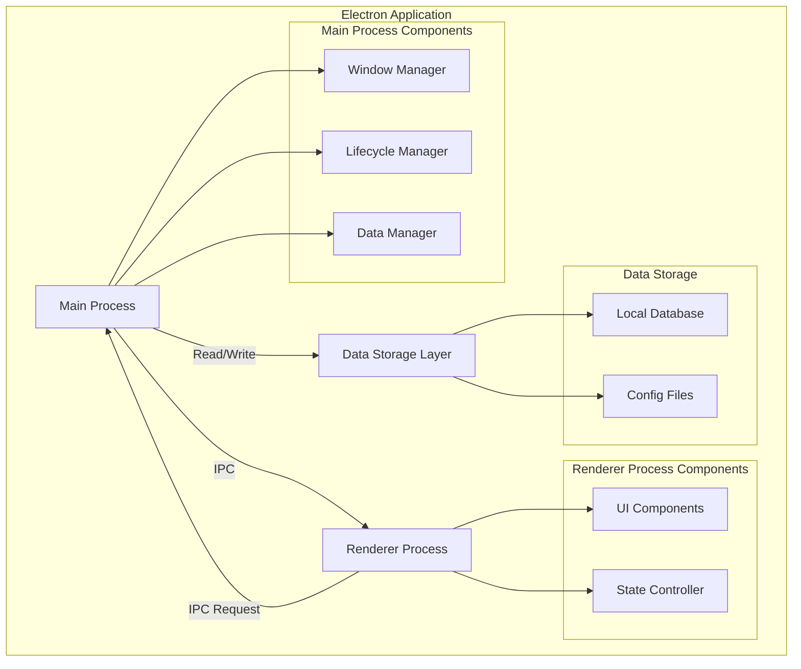

# Дизайн: Clerkly - AI Agent для менеджеров

## Overview

Clerkly - это Electron-приложение для Mac OS X, предназначенное для менеджеров. На текущем этапе реализуется базовая структура приложения с локальным хранением данных, нативным Mac OS X интерфейсом и комплексным тестовым покрытием. Приложение построено с учетом требований производительности, безопасности и совместимости, создавая надежную платформу для будущих AI-функций.

## Architecture

Приложение следует стандартной архитектуре Electron с разделением на Main Process и Renderer Process, с добавлением слоя для локального хранения данных.



### Технологический стек

- **Electron** (v28+) - для создания desktop приложения
- **Node.js** (v18+) - runtime для main process
- **HTML5/CSS3** - для отображения UI
- **JavaScript/ES6+** - язык программирования
- **SQLite** - для локального хранения данных
- **Jest** - для модульного и функционального тестирования
- **Electron Builder** - для сборки Mac OS X приложения

## Components and Interfaces

### Main Process Components

#### Window Manager
Управляет созданием и конфигурацией окна приложения с нативным Mac OS X интерфейсом.

```javascript
class WindowManager {
  constructor() {
    this.mainWindow = null
  }
  
  createWindow() {
    // Создает окно с нативным Mac OS X видом
    // Возвращает: BrowserWindow instance
  }
  
  configureWindow(options) {
    // Настраивает параметры окна
    // Параметры: { width, height, title, ... }
  }
  
  closeWindow() {
    // Корректно закрывает окно
  }
}
```

#### Lifecycle Manager
Управляет жизненным циклом приложения, включая запуск, активацию и завершение.

```javascript
class LifecycleManager {
  initialize() {
    // Инициализирует приложение
    // Обеспечивает запуск менее чем за 3 секунды
  }
  
  handleActivation() {
    // Обрабатывает активацию приложения (Mac OS X специфика)
  }
  
  handleQuit() {
    // Корректно завершает приложение
  }
  
  handleWindowClose() {
    // Обрабатывает закрытие всех окон
  }
}
```

#### Data Manager
Управляет локальным хранением данных пользователя.

```javascript
class DataManager {
  constructor(storagePath) {
    this.storagePath = storagePath
    this.db = null
  }
  
  initialize() {
    // Инициализирует локальное хранилище
    // Создает необходимые директории и файлы
  }
  
  saveData(key, value) {
    // Сохраняет данные локально
    // Параметры: key (string), value (any)
    // Возвращает: Promise<boolean>
  }
  
  loadData(key) {
    // Загружает данные из локального хранилища
    // Параметры: key (string)
    // Возвращает: Promise<any>
  }
  
  deleteData(key) {
    // Удаляет данные из локального хранилища
    // Параметры: key (string)
    // Возвращает: Promise<boolean>
  }
  
  getStoragePath() {
    // Возвращает путь к локальному хранилищу
    // Возвращает: string
  }
}
```

### Renderer Process Components

#### UI Components
Отвечает за отображение пользовательского интерфейса.

```javascript
class UIController {
  render() {
    // Отрисовывает UI
    // Обеспечивает отзывчивость без задержек
  }
  
  updateView(data) {
    // Обновляет отображение с новыми данными
  }
}
```

#### State Controller
Управляет состоянием приложения в renderer process.

```javascript
class StateController {
  constructor() {
    this.state = {}
  }
  
  setState(newState) {
    // Обновляет состояние приложения
  }
  
  getState() {
    // Возвращает текущее состояние
  }
}
```

### IPC Communication

Коммуникация между Main и Renderer процессами через IPC (Inter-Process Communication).

```javascript
// Main Process
ipcMain.handle('save-data', async (event, key, value) => {
  return await dataManager.saveData(key, value)
})

ipcMain.handle('load-data', async (event, key) => {
  return await dataManager.loadData(key)
})

// Renderer Process
const { ipcRenderer } = require('electron')

async function saveData(key, value) {
  return await ipcRenderer.invoke('save-data', key, value)
}

async function loadData(key) {
  return await ipcRenderer.invoke('load-data', key)
}
```

## Data Models

### Application Configuration

```javascript
class AppConfig {
  constructor() {
    this.version = '1.0.0'
    this.platform = 'darwin' // Mac OS X
    this.minOSVersion = '10.13'
    this.windowSettings = {
      width: 800,
      height: 600,
      minWidth: 600,
      minHeight: 400
    }
  }
}
```

### User Data

```javascript
class UserData {
  constructor(key, value, timestamp) {
    this.key = key           // string - уникальный идентификатор
    this.value = value       // any - данные пользователя
    this.timestamp = timestamp // number - время создания/обновления
  }
}
```

### Storage Schema

Локальное хранилище использует SQLite с следующей схемой:

```sql
CREATE TABLE user_data (
  key TEXT PRIMARY KEY,
  value TEXT NOT NULL,
  timestamp INTEGER NOT NULL,
  created_at INTEGER NOT NULL,
  updated_at INTEGER NOT NULL
);

CREATE INDEX idx_timestamp ON user_data(timestamp);
```

## Correctness Properties

*Свойство (property) - это характеристика или поведение, которое должно выполняться для всех валидных выполнений системы - по сути, формальное утверждение о том, что система должна делать. Свойства служат мостом между человекочитаемыми спецификациями и машинно-проверяемыми гарантиями корректности.*

### Property 1: Data Storage Round-Trip

*Для любых* валидных данных пользователя (key-value пары), сохранение данных с последующей загрузкой должно возвращать эквивалентное значение.

**Validates: Requirements 1.4**

**Обоснование:** Это свойство проверяет, что локальное хранилище данных работает корректно. Если мы сохраняем данные и затем загружаем их, мы должны получить те же данные обратно. Это классическое round-trip свойство, которое гарантирует целостность данных при сохранении и загрузке.

**Тестовый сценарий:**
- Генерируем случайные key-value пары различных типов (строки, числа, объекты, массивы)
- Сохраняем каждую пару через DataManager.saveData()
- Загружаем каждую пару через DataManager.loadData()
- Проверяем, что загруженное значение эквивалентно сохраненному

**Edge cases для тестирования:**
- Пустые строки как ключи
- Специальные символы в ключах
- Большие объекты данных
- Null и undefined значения
- Перезапись существующих ключей

## Error Handling

### Application Lifecycle Errors

**Startup Failures:**
- Если приложение не может создать окно, логировать ошибку и показать системное уведомление
- Если инициализация хранилища данных не удалась, создать резервное in-memory хранилище и предупредить пользователя

**Window Management Errors:**
- Корректно обрабатывать закрытие окна (освобождать ресурсы)
- На Mac OS X: при закрытии последнего окна приложение остается активным (стандартное поведение Mac)
- Обрабатывать ошибки при загрузке HTML файлов

**Shutdown Errors:**
- Гарантировать сохранение всех данных перед завершением
- Корректно закрывать соединения с базой данных
- Таймаут на завершение: максимум 5 секунд

### Data Storage Errors

**Save Operation Errors:**
```javascript
async saveData(key, value) {
  try {
    // Валидация входных данных
    if (!key || typeof key !== 'string') {
      throw new Error('Invalid key: must be non-empty string')
    }
    
    // Попытка сохранения
    await this.db.save(key, value)
    return { success: true }
  } catch (error) {
    console.error('Failed to save data:', error)
    return { success: false, error: error.message }
  }
}
```

**Load Operation Errors:**
```javascript
async loadData(key) {
  try {
    if (!key || typeof key !== 'string') {
      throw new Error('Invalid key: must be non-empty string')
    }
    
    const data = await this.db.load(key)
    if (data === null) {
      return { success: false, error: 'Key not found' }
    }
    return { success: true, data }
  } catch (error) {
    console.error('Failed to load data:', error)
    return { success: false, error: error.message }
  }
}
```

**Storage Initialization Errors:**
- Если директория для хранения не существует, создать её
- Если нет прав на запись, использовать временную директорию и предупредить пользователя
- Если база данных повреждена, создать новую и сохранить backup старой

### IPC Communication Errors

**Channel Errors:**
- Таймаут на IPC запросы: максимум 10 секунд
- Валидация всех входящих сообщений от renderer process
- Логирование всех неудачных IPC вызовов

**Security Errors:**
- Отклонять IPC запросы с невалидными параметрами
- Не допускать выполнение произвольного кода через IPC

### Performance Monitoring

**Startup Time Monitoring:**
```javascript
const startTime = Date.now()
app.whenReady().then(() => {
  const loadTime = Date.now() - startTime
  if (loadTime > 3000) {
    console.warn(`Slow startup: ${loadTime}ms (target: <3000ms)`)
  }
})
```

**UI Responsiveness:**
- Все UI операции должны завершаться менее чем за 100ms
- Длительные операции должны выполняться асинхронно
- Показывать индикаторы загрузки для операций > 200ms

## Testing Strategy

### Dual Testing Approach

Приложение использует комбинацию модульных тестов и property-based тестов для обеспечения комплексного покрытия:

- **Модульные тесты (Unit Tests):** Проверяют конкретные примеры, граничные случаи и условия ошибок
- **Property-based тесты:** Проверяют универсальные свойства на множестве сгенерированных входных данных

Оба подхода дополняют друг друга и необходимы для комплексного покрытия.

### Testing Framework

**Основной фреймворк:** Jest
- Поддержка как unit, так и property-based тестов
- Встроенные моки для Electron API
- Поддержка асинхронного тестирования
- Генерация отчетов о покрытии кода

**Property-Based Testing:** fast-check (JavaScript библиотека для property-based testing)
- Автоматическая генерация тестовых данных
- Минимум 100 итераций на каждый property тест
- Shrinking для поиска минимального failing case

### Unit Testing Strategy

**Компоненты для модульного тестирования:**

1. **WindowManager**
   - Создание окна с корректными параметрами
   - Конфигурация окна
   - Закрытие окна

2. **LifecycleManager**
   - Инициализация приложения
   - Обработка активации (Mac OS X специфика)
   - Корректное завершение

3. **DataManager**
   - Инициализация хранилища
   - Сохранение данных (успешные случаи)
   - Загрузка данных (успешные случаи)
   - Удаление данных
   - Обработка ошибок (невалидные ключи, отсутствующие данные)

4. **IPC Communication**
   - Корректная передача сообщений между процессами
   - Обработка таймаутов
   - Валидация параметров

**Примеры модульных тестов:**

```javascript
describe('DataManager', () => {
  let dataManager
  
  beforeEach(() => {
    dataManager = new DataManager('/tmp/test-storage')
    await dataManager.initialize()
  })
  
  test('should save and load string data', async () => {
    const key = 'test-key'
    const value = 'test-value'
    
    const saveResult = await dataManager.saveData(key, value)
    expect(saveResult.success).toBe(true)
    
    const loadResult = await dataManager.loadData(key)
    expect(loadResult.success).toBe(true)
    expect(loadResult.data).toBe(value)
  })
  
  test('should reject invalid key', async () => {
    const result = await dataManager.saveData('', 'value')
    expect(result.success).toBe(false)
    expect(result.error).toContain('Invalid key')
  })
  
  test('should handle missing key', async () => {
    const result = await dataManager.loadData('non-existent-key')
    expect(result.success).toBe(false)
    expect(result.error).toContain('Key not found')
  })
})
```

### Property-Based Testing Strategy

**Property Test Configuration:**
- Минимум 100 итераций на каждый property тест
- Каждый property тест должен ссылаться на свойство из документа дизайна
- Формат тега: **Feature: clerkly, Property {number}: {property_text}**

**Property 1: Data Storage Round-Trip**

```javascript
const fc = require('fast-check')

describe('Property Tests - Data Storage', () => {
  let dataManager
  
  beforeEach(async () => {
    dataManager = new DataManager('/tmp/test-storage')
    await dataManager.initialize()
  })
  
  // Feature: clerkly, Property 1: Data Storage Round-Trip
  test('Property 1: saving then loading data returns equivalent value', async () => {
    await fc.assert(
      fc.asyncProperty(
        fc.string({ minLength: 1 }), // key
        fc.oneof(
          fc.string(),
          fc.integer(),
          fc.boolean(),
          fc.object(),
          fc.array(fc.anything())
        ), // value
        async (key, value) => {
          // Save data
          const saveResult = await dataManager.saveData(key, value)
          expect(saveResult.success).toBe(true)
          
          // Load data
          const loadResult = await dataManager.loadData(key)
          expect(loadResult.success).toBe(true)
          
          // Verify equivalence
          expect(loadResult.data).toEqual(value)
        }
      ),
      { numRuns: 100 }
    )
  })
  
  // Edge cases for Property 1
  test('Property 1 edge case: empty string values', async () => {
    const key = 'test-key'
    const value = ''
    
    const saveResult = await dataManager.saveData(key, value)
    expect(saveResult.success).toBe(true)
    
    const loadResult = await dataManager.loadData(key)
    expect(loadResult.success).toBe(true)
    expect(loadResult.data).toBe(value)
  })
  
  test('Property 1 edge case: special characters in keys', async () => {
    const specialKeys = ['key-with-dash', 'key_with_underscore', 'key.with.dot']
    
    for (const key of specialKeys) {
      const value = 'test-value'
      const saveResult = await dataManager.saveData(key, value)
      expect(saveResult.success).toBe(true)
      
      const loadResult = await dataManager.loadData(key)
      expect(loadResult.success).toBe(true)
      expect(loadResult.data).toBe(value)
    }
  })
  
  test('Property 1 edge case: large objects', async () => {
    const key = 'large-object'
    const value = {
      data: Array(1000).fill(0).map((_, i) => ({ id: i, value: `item-${i}` }))
    }
    
    const saveResult = await dataManager.saveData(key, value)
    expect(saveResult.success).toBe(true)
    
    const loadResult = await dataManager.loadData(key)
    expect(loadResult.success).toBe(true)
    expect(loadResult.data).toEqual(value)
  })
})
```

### Functional Testing Strategy

**Интеграционные тесты проверяют взаимодействие между компонентами:**

1. **Application Lifecycle Integration**
   - Запуск приложения → создание окна → инициализация хранилища
   - Сохранение данных → перезапуск приложения → загрузка данных
   - Закрытие окна → корректное завершение

2. **IPC Integration**
   - Renderer process → IPC запрос → Main process → Data Manager → ответ
   - Обработка ошибок через IPC
   - Таймауты IPC запросов

3. **Data Persistence Integration**
   - Сохранение данных → проверка файловой системы → загрузка данных
   - Множественные операции сохранения/загрузки
   - Конкурентные операции с данными

**Пример функционального теста:**

```javascript
describe('Functional Tests - Application Lifecycle', () => {
  test('should persist data across application restarts', async () => {
    // Start application
    const app = await startTestApp()
    const dataManager = app.getDataManager()
    
    // Save data
    const testData = { key: 'test-key', value: 'test-value' }
    await dataManager.saveData(testData.key, testData.value)
    
    // Restart application
    await app.quit()
    const newApp = await startTestApp()
    const newDataManager = newApp.getDataManager()
    
    // Verify data persisted
    const loadResult = await newDataManager.loadData(testData.key)
    expect(loadResult.success).toBe(true)
    expect(loadResult.data).toBe(testData.value)
    
    await newApp.quit()
  })
})
```

### Test Execution

**Команды для запуска тестов:**

```bash
# Запуск всех тестов
npm test

# Запуск только модульных тестов
npm run test:unit

# Запуск только property-based тестов
npm run test:property

# Запуск функциональных тестов
npm run test:functional

# Запуск с отчетом о покрытии
npm run test:coverage
```

**Требования к покрытию:**
- Минимум 80% покрытие кода для бизнес-логики
- 100% покрытие для критических компонентов (DataManager, LifecycleManager)
- Все публичные API должны иметь тесты

### Continuous Integration

**Автоматизация тестирования:**
- Все тесты запускаются автоматически при каждом коммите
- Property-based тесты запускаются с увеличенным количеством итераций (1000+) в CI
- Тесты должны проходить на Mac OS X 10.13+ для валидации совместимости

### Performance Testing

**Метрики производительности:**
- Время запуска приложения: < 3 секунды (автоматический тест)
- Время отклика UI: < 100ms (мониторинг в тестах)
- Время операций с данными: < 50ms для простых операций

```javascript
test('application should start within 3 seconds', async () => {
  const startTime = Date.now()
  const app = await startTestApp()
  const loadTime = Date.now() - startTime
  
  expect(loadTime).toBeLessThan(3000)
  
  await app.quit()
})
```
