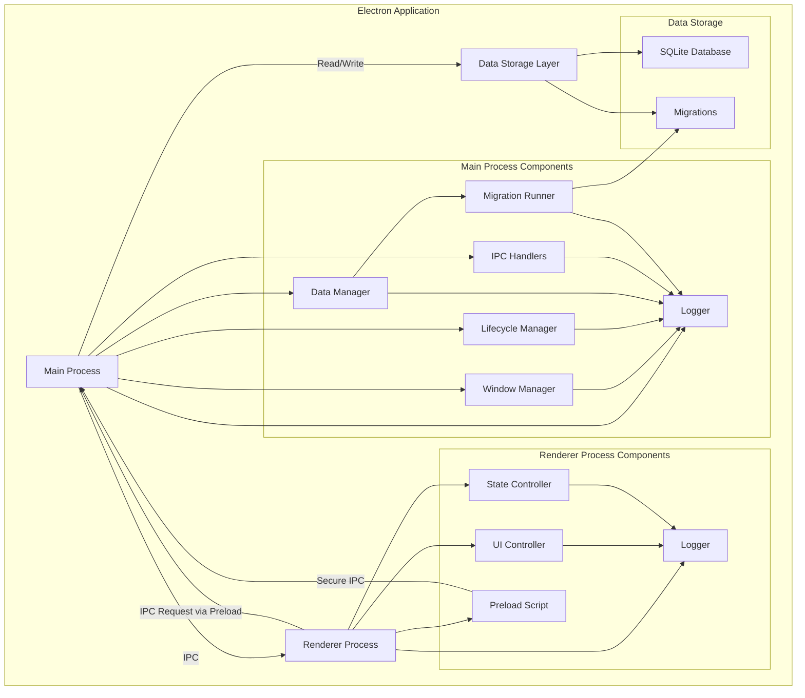

# Дизайн: Clerkly - AI Agent для менеджеров

## Обзор

Clerkly - это Electron-приложение для Mac OS X, предназначенное для менеджеров. На текущем этапе реализуется базовая структура приложения с локальным хранением данных, нативным Mac OS X интерфейсом и комплексным тестовым покрытием. Приложение построено с учетом требований производительности, безопасности и совместимости, создавая надежную платформу для будущих AI-функций.

Реализация включает систему миграций базы данных, расширенную обработку ошибок, IPC коммуникацию с таймаутами и валидацией, а также компоненты управления состоянием и UI с мониторингом производительности.

**Ключевые характеристики:**
- Нативное Mac OS X приложение на базе Electron 28+
- Локальное хранение данных с использованием SQLite
- Комплексное тестовое покрытие (модульные, property-based, функциональные тесты)
- Производительность: запуск < 3 секунды, UI отклик < 100ms
- Безопасность: локальное хранение, валидация IPC, изоляция процессов
- Надежность: обработка ошибок, backup базы данных, graceful degradation

## Архитектура

Приложение следует стандартной архитектуре Electron с разделением на "Main Process" и "Renderer Process", с добавлением слоя для локального хранения данных и системы миграций.

### Реализация нефункциональных требований

**Производительность (NFR 1):**
- **NFR 1.1 - Запуск < 3 секунды**: Оптимизация инициализации, ленивая загрузка компонентов, мониторинг времени запуска в "Lifecycle Manager"
- **NFR 1.2 - UI отклик < 100ms**: Мониторинг производительности в "UI Controller", предупреждения при превышении порога
- **NFR 1.3 - Длительные операции > 200ms**: Автоматические индикаторы загрузки через `withLoading()` в "UI Controller"
- **NFR 1.4 - Операции с данными < 50ms**: Индексирование SQLite, оптимизированные запросы, prepared statements

**Надежность (NFR 2):**
- **NFR 2.1 - Обработка ошибок инициализации**: Fallback на temp directory при проблемах с правами, backup при повреждении базы данных
- **NFR 2.2 - Сохранение данных перед завершением**: Graceful shutdown в "Lifecycle Manager" с таймаутом 5 секунд
- **NFR 2.3 - IPC таймауты**: 10 секунд на операцию в "IPC Handlers", предотвращение зависания
- **NFR 2.4 - Backup при повреждении**: Автоматическое создание backup и пересоздание базы данных в "Data Manager"

**Совместимость (NFR 3):**
- **NFR 3.1 - Mac OS X 10.13+**: Использование стабильных Electron API, тестирование на разных версиях
- **NFR 3.2 - Нативный интерфейс**: titleBarStyle 'hiddenInset', vibrancy, traffic light positioning в "Window Manager"
- **NFR 3.3 - Mac OS X конвенции**: Приложение остается активным при закрытии окна в "Lifecycle Manager"

**Тестируемость (NFR 4):**
- **NFR 4.1 - Изоляция компонентов**: Dependency injection, моки для Electron API
- **NFR 4.2 - Моки Electron API**: Jest моки для BrowserWindow, ipcMain, app в тестах
- **NFR 4.3 - Отчеты о покрытии**: Jest coverage, минимум 80% для бизнес-логики, 100% для критических компонентов
- **NFR 4.4 - Property-based тесты**: Минимум 100 итераций, fast-check для генерации данных



### Технологический стек

- **Electron** (v28+) - для создания desktop приложения
- **Node.js** (v18+) - runtime для main process
- **HTML5/CSS3** - для отображения UI
- **TypeScript** (v5+) - основной язык программирования для всего проекта
- **SQLite** (better-sqlite3) - для локального хранения данных
- **Jest** - для модульного и функционального тестирования
- **ts-jest** - для запуска TypeScript тестов в Jest
- **fast-check** - для property-based тестирования
- **Electron Builder** - для сборки Mac OS X приложения

**Обоснование выбора технологий:**
- **Electron 28+**: Стабильная версия с поддержкой Mac OS X 10.13+, обеспечивает нативный вид и производительность
- **TypeScript**: Статическая типизация обеспечивает раннее обнаружение ошибок, улучшает поддерживаемость кода и IDE поддержку
- **SQLite**: Легковесная встроенная база данных, не требует отдельного сервера, идеальна для локального хранения
- **Jest + ts-jest + fast-check**: Комплексное тестирование (unit + property-based) с полной поддержкой TypeScript

## Компоненты и интерфейсы

### Компоненты Main Process

#### Logger
Централизованный компонент для логирования во всем приложении с фиксированным форматом временных меток.

```typescript
// Requirements: clerkly.3.1, clerkly.3.2, clerkly.3.3, clerkly.3.4, clerkly.3.5, clerkly.3.6
import { DateTimeFormatter } from './utils/DateTimeFormatter';

type LogLevel = 'debug' | 'info' | 'warn' | 'error';

class Logger {
  private context: string;
  
  /**
   * Приватный конструктор для создания параметризованного logger
   * Requirements: clerkly.3.5
   * 
   * @param {string} context - Контекст (имя компонента)
   */
  private constructor(context: string) {
    this.context = context;
  }
  
  /**
   * Создает параметризованный logger для модуля
   * Requirements: clerkly.3.5, clerkly.3.7
   * 
   * @param {string} context - Контекст (имя компонента)
   * @returns {Logger} - Экземпляр logger с заданным контекстом
   */
  static create(context: string): Logger {
    return new Logger(context);
  }
  
  /**
   * Логирует сообщение с указанным уровнем (статический метод)
   * Requirements: clerkly.3.5, clerkly.3.6, clerkly.3.8
   * 
   * @param {string} context - Контекст (имя компонента), обязательный
   * @param {string} message - Сообщение для логирования (БЕЗ дублирования контекста), обязательное
   * @param {LogLevel} level - Уровень логирования, опциональный (по умолчанию 'info')
   */
  static log(context: string, message: string, level: LogLevel = 'info'): void {
    // Requirements: clerkly.3.2, clerkly.3.3, clerkly.3.8
    const timestamp = DateTimeFormatter.formatLogTimestamp(new Date());
    
    // Requirements: clerkly.3.6
    const formattedMessage = `[${timestamp}] [${level.toUpperCase()}] [${context}] ${message}`;
    
    // Используем console.* только внутри Logger класса
    // Requirements: clerkly.3.12
    switch (level) {
      case 'debug':
        console.debug(formattedMessage);
        break;
      case 'info':
        console.info(formattedMessage);
        break;
      case 'warn':
        console.warn(formattedMessage);
        break;
      case 'error':
        console.error(formattedMessage);
        break;
    }
  }
  
  /**
   * Логирует сообщение с указанным уровнем (метод экземпляра)
   * Requirements: clerkly.3.5, clerkly.3.7
   * 
   * @param {string} message - Сообщение для логирования (БЕЗ дублирования контекста)
   * @param {LogLevel} level - Уровень логирования, опциональный (по умолчанию 'info')
   */
  log(message: string, level: LogLevel = 'info'): void {
    Logger.log(this.context, message, level);
  }
  
  /**
   * Логирует debug сообщение (статический)
   * Requirements: clerkly.3.4, clerkly.3.6
   * 
   * @param {string} context - Контекст (имя компонента)
   * @param {string} message - Сообщение для логирования
   */
  static debug(context: string, message: string): void {
    Logger.log(context, message, 'debug');
  }
  
  /**
   * Логирует debug сообщение (экземпляр)
   * Requirements: clerkly.3.4, clerkly.3.7
   * 
   * @param {string} message - Сообщение для логирования
   */
  debug(message: string): void {
    this.log(message, 'debug');
  }
  
  /**
   * Логирует info сообщение (статический)
   * Requirements: clerkly.3.4, clerkly.3.6
   * 
   * @param {string} context - Контекст (имя компонента)
   * @param {string} message - Сообщение для логирования
   */
  static info(context: string, message: string): void {
    Logger.log(context, message, 'info');
  }
  
  /**
   * Логирует info сообщение (экземпляр)
   * Requirements: clerkly.3.4, clerkly.3.7
   * 
   * @param {string} message - Сообщение для логирования
   */
  info(message: string): void {
    this.log(message, 'info');
  }
  
  /**
   * Логирует warning сообщение (статический)
   * Requirements: clerkly.3.4, clerkly.3.6
   * 
   * @param {string} context - Контекст (имя компонента)
   * @param {string} message - Сообщение для логирования
   */
  static warn(context: string, message: string): void {
    Logger.log(context, message, 'warn');
  }
  
  /**
   * Логирует warning сообщение (экземпляр)
   * Requirements: clerkly.3.4, clerkly.3.7
   * 
   * @param {string} message - Сообщение для логирования
   */
  warn(message: string): void {
    this.log(message, 'warn');
  }
  
  /**
   * Логирует error сообщение (статический)
   * Requirements: clerkly.3.4, clerkly.3.6
   * 
   * @param {string} context - Контекст (имя компонента)
   * @param {string} message - Сообщение для логирования
   */
  static error(context: string, message: string): void {
    Logger.log(context, message, 'error');
  }
  
  /**
   * Логирует error сообщение (экземпляр)
   * Requirements: clerkly.3.4, clerkly.3.7
   * 
   * @param {string} message - Сообщение для логирования
   */
  error(message: string): void {
    this.log(message, 'error');
  }
}

**Примеры использования:**

```typescript
// Requirements: clerkly.3.5, clerkly.3.7, clerkly.3.9
// Способ 1: Статические методы (для разовых вызовов)
Logger.info('WindowManager', 'Window created successfully');
Logger.error('DataManager', 'Failed to save data');
Logger.debug('LifecycleManager', 'Application initialized');

// Способ 2: Параметризованный экземпляр (рекомендуется для модулей)
const logger = Logger.create('Main');
logger.info('Process defaultApp: ' + process.defaultApp);
logger.debug('Application starting');
logger.error('Failed to initialize: ' + error.message);

// НЕПРАВИЛЬНО - дублирование контекста в сообщении
Logger.info('Main', '[Main] Process defaultApp: ' + process.defaultApp); // ❌

// ПРАВИЛЬНО - контекст только в параметре
Logger.info('Main', 'Process defaultApp: ' + process.defaultApp); // ✅

// ПРАВИЛЬНО - использование параметризованного экземпляра
const logger = Logger.create('Main');
logger.info('Process defaultApp: ' + process.defaultApp); // ✅
```

**Важно:** 
- Requirements: clerkly.3.2, clerkly.3.8 - Logger автоматически форматирует timestamp через DateTimeFormatter.formatLogTimestamp()
- Requirements: clerkly.3.15 - "DateTimeFormatter" НЕ использует "Logger" для избежания циклической зависимости (Logger → DateTimeFormatter)
- Requirements: clerkly.3.9 - Сообщения НЕ ДОЛЖНЫ дублировать контекст (контекст добавляется автоматически)
- Requirements: clerkly.3.9 - Прямые вызовы console.* разрешены только в "Logger" и "DateTimeFormatter"
```

#### Window Manager
Управляет созданием и конфигурацией окна приложения с нативным Mac OS X интерфейсом.

```typescript
// Requirements: clerkly.1.2, clerkly.1.3
import { BrowserWindow } from 'electron';

interface WindowOptions {
  width?: number;
  height?: number;
  title?: string;
  resizable?: boolean;
  fullscreen?: boolean;
}

class WindowManager {
  private mainWindow: BrowserWindow | null = null;
  
  /**
   * Создает окно с нативным Mac OS X видом
   * @returns {BrowserWindow} instance
   */
  createWindow(): BrowserWindow {
    // Настраивает titleBarStyle: 'hiddenInset', vibrancy, trafficLightPosition
    // Возвращает: BrowserWindow instance
  }
  
  /**
   * Настраивает параметры окна
   * @param options - { width, height, title, resizable, fullscreen }
   */
  configureWindow(options: WindowOptions): void {
    // Настраивает параметры окна
  }
  
  /**
   * Корректно закрывает окно с очисткой listeners
   */
  closeWindow(): void {
    // Корректно закрывает окно с очисткой listeners
  }
  
  /**
   * Возвращает текущее окно
   * @returns {BrowserWindow|null}
   */
  getWindow(): BrowserWindow | null {
    return this.mainWindow;
  }
  
  /**
   * Проверяет, создано ли окно
   * @returns {boolean}
   */
  isWindowCreated(): boolean {
    return this.mainWindow !== null;
  }
}
```

#### Lifecycle Manager
Управляет жизненным циклом приложения, включая запуск, активацию и завершение.

```typescript
// Requirements: clerkly.1.2, clerkly.1.3
interface InitializeResult {
  success: boolean;
  loadTime: number;
}

class LifecycleManager {
  private windowManager: WindowManager;
  private dataManager: DataManager;
  private startTime: number | null = null;
  private initialized: boolean = false;
  
  constructor(windowManager: WindowManager, dataManager: DataManager) {
    this.windowManager = windowManager;
    this.dataManager = dataManager;
  }
  
  /**
   * Инициализирует приложение
   * Обеспечивает запуск менее чем за 3 секунды
   * @returns {Promise<InitializeResult>}
   */
  async initialize(): Promise<InitializeResult> {
    // Инициализирует приложение
  }
  
  /**
   * Обрабатывает активацию приложения (Mac OS X специфика)
   * Пересоздает окно при клике на dock icon
   */
  handleActivation(): void {
    // Обрабатывает активацию приложения
  }
  
  /**
   * Корректно завершает приложение
   * Сохраняет все данные перед выходом
   * @returns {Promise<void>}
   */
  async handleQuit(): Promise<void> {
    // Корректно завершает приложение
  }
  
  /**
   * Обрабатывает закрытие всех окон
   * Mac OS X: приложение остается активным
   */
  handleWindowClose(): void {
    // Обрабатывает закрытие всех окон
  }
  
  /**
   * Возвращает время запуска
   * @returns {number|null}
   */
  getStartupTime(): number | null {
    return this.startTime;
  }
  
  /**
   * Проверяет, инициализировано ли приложение
   * @returns {boolean}
   */
  isAppInitialized(): boolean {
    return this.initialized;
  }
}
```

#### Data Manager
Управляет локальным хранением данных пользователя с использованием SQLite.

```typescript
// Requirements: clerkly.1.4, clerkly.2.7
interface InitializeResult {
  success: boolean;
  migrations?: {
    success: boolean;
    appliedCount: number;
    message: string;
  };
  warning?: string;
  path?: string;
}

interface SaveDataResult {
  success: boolean;
  error?: string;
}

interface LoadDataResult {
  success: boolean;
  data?: any;
  error?: string;
}

interface DeleteDataResult {
  success: boolean;
  error?: string;
}

class DataManager {
  private storagePath: string;
  private db: Database | null = null;
  private migrationRunner: MigrationRunner | null = null;
  
  constructor(storagePath: string) {
    this.storagePath = storagePath;
  }
  
  /**
   * Инициализирует локальное хранилище
   * Создает необходимые директории и файлы
   * Запускает миграции базы данных
   * Обрабатывает ошибки прав доступа (fallback на temp directory)
   * Обрабатывает поврежденные базы данных (backup и пересоздание)
   * @returns {InitializeResult}
   */
  initialize(): InitializeResult {
    // Инициализирует локальное хранилище
  }
  
  /**
   * Сохраняет данные локально
   * Валидирует key (non-empty string, max 1000 chars)
   * Сериализует value в JSON
   * Проверяет размер (max 10MB)
   * Обрабатывает ошибки (SQLITE_FULL, SQLITE_BUSY, SQLITE_LOCKED, SQLITE_READONLY)
   * @param {string} key
   * @param {any} value
   * @returns {SaveDataResult}
   */
  saveData(key: string, value: any): SaveDataResult {
    // Сохраняет данные локально
  }
  
  /**
   * Загружает данные из локального хранилища
   * Валидирует key
   * Десериализует JSON
   * Обрабатывает ошибки (SQLITE_BUSY, SQLITE_LOCKED)
   * @param {string} key
   * @returns {LoadDataResult}
   */
  loadData(key: string): LoadDataResult {
    // Загружает данные из локального хранилища
  }
  
  /**
   * Удаляет данные из локального хранилища
   * Валидирует key
   * Обрабатывает ошибки
   * @param {string} key
   * @returns {DeleteDataResult}
   */
  deleteData(key: string): DeleteDataResult {
    // Удаляет данные из локального хранилища
  }
  
  /**
   * Возвращает путь к локальному хранилищу
   * @returns {string}
   */
  getStoragePath(): string {
    return this.storagePath;
  }
  
  /**
   * Закрывает соединение с базой данных
   */
  close(): void {
    // Закрывает соединение с базой данных
  }
  
  /**
   * Возвращает экземпляр Migration Runner
   * @returns {MigrationRunner}
   */
  getMigrationRunner(): MigrationRunner {
    // Создает и возвращает новый экземпляр MigrationRunner
  }
}
```

#### Migration Runner
Управляет миграциями схемы базы данных.

```typescript
// Requirements: clerkly.1.4
interface MigrationResult {
  success: boolean;
  appliedCount?: number;
  message?: string;
  error?: string;
}

interface MigrationStatus {
  currentVersion: number;
  appliedMigrations: number;
  pendingMigrations: number;
  totalMigrations: number;
  pending: Array<{version: number; name: string}>;
}

class MigrationRunner {
  private db: Database;
  private migrationsPath: string;
  
  constructor(db: Database, migrationsPath: string) {
    this.db = db;
    this.migrationsPath = migrationsPath;
  }
  
  /**
   * Инициализирует таблицу отслеживания миграций
   * Создает таблицу schema_migrations для отслеживания примененных миграций
   */
  initializeMigrationTable(): void {
    // Создает таблицу schema_migrations
  }
  
  /**
   * Возвращает текущую версию схемы
   * @returns {number} Текущая версия схемы (0 если миграции не применены)
   */
  getCurrentVersion(): number {
    // Возвращает текущую версию схемы
  }
  
  /**
   * Возвращает список примененных версий миграций
   * @returns {number[]} Массив примененных версий миграций
   */
  getAppliedMigrations(): number[] {
    // Возвращает список примененных миграций
  }
  
  /**
   * Загружает файлы миграций из директории
   * @returns {Array} Массив объектов миграций, отсортированных по версии
   */
  loadMigrations(): Array<{version: number; name: string; up: string; down: string}> {
    // Загружает и валидирует файлы миграций
  }
  
  /**
   * Запускает все pending миграции
   * Создает таблицу migrations для отслеживания
   * Выполняет миграции в порядке возрастания версий
   * @returns {MigrationResult}
   */
  runMigrations(): MigrationResult {
    // Запускает все pending миграции
  }
  
  /**
   * Откатывает последнюю примененную миграцию
   * @returns {MigrationResult}
   */
  rollbackLastMigration(): MigrationResult {
    // Откатывает последнюю миграцию
  }
  
  /**
   * Возвращает статус миграций
   * @returns {MigrationStatus}
   */
  getStatus(): MigrationStatus {
    // Возвращает информацию о текущем состоянии миграций
  }
}
```

#### IPC Handlers
Управляет IPC коммуникацией между Main и Renderer процессами.

```typescript
// Requirements: clerkly.1.4, clerkly.2.5
import { IpcMainInvokeEvent } from 'electron';

interface IPCResult {
  success: boolean;
  data?: any;
  error?: string;
}

class IPCHandlers {
  private dataManager: DataManager;
  private timeout: number = 10000; // 10 секунд
  
  constructor(dataManager: DataManager) {
    this.dataManager = dataManager;
  }
  
  /**
   * Регистрирует все IPC handlers
   * Каналы: 'save-data', 'load-data', 'delete-data'
   */
  registerHandlers(): void {
    // Регистрирует все IPC handlers
  }
  
  /**
   * Удаляет все IPC handlers
   */
  unregisterHandlers(): void {
    // Удаляет все IPC handlers
  }
  
  /**
   * Обрабатывает save-data запрос
   * Валидирует параметры
   * Применяет timeout (10 секунд)
   * Логирует ошибки
   * @param {IpcMainInvokeEvent} event
   * @param {string} key
   * @param {any} value
   * @returns {Promise<IPCResult>}
   */
  async handleSaveData(event: IpcMainInvokeEvent, key: string, value: any): Promise<IPCResult> {
    // Обрабатывает save-data запрос
  }
  
  /**
   * Обрабатывает load-data запрос
   * Валидирует параметры
   * Применяет timeout
   * Логирует ошибки
   * @param {IpcMainInvokeEvent} event
   * @param {string} key
   * @returns {Promise<IPCResult>}
   */
  async handleLoadData(event: IpcMainInvokeEvent, key: string): Promise<IPCResult> {
    // Обрабатывает load-data запрос
  }
  
  /**
   * Обрабатывает delete-data запрос
   * Валидирует параметры
   * Применяет timeout
   * Логирует ошибки
   * @param {IpcMainInvokeEvent} event
   * @param {string} key
   * @returns {Promise<IPCResult>}
   */
  async handleDeleteData(event: IpcMainInvokeEvent, key: string): Promise<IPCResult> {
    // Обрабатывает delete-data запрос
  }
  
  /**
   * Выполняет promise с timeout
   * @param {Promise<T>} promise
   * @param {number} timeoutMs
   * @param {string} timeoutMessage
   * @returns {Promise<T>}
   */
  withTimeout<T>(promise: Promise<T>, timeoutMs: number, timeoutMessage: string): Promise<T> {
    // Выполняет promise с timeout
  }
  
  /**
   * Устанавливает timeout для IPC запросов
   * @param {number} timeoutMs
   */
  setTimeout(timeoutMs: number): void {
    this.timeout = timeoutMs;
  }
  
  /**
   * Возвращает текущий timeout
   * @returns {number}
   */
  getTimeout(): number {
    return this.timeout;
  }
}
```

### Компоненты Renderer Process

#### UI Controller
Отвечает за отображение пользовательского интерфейса с мониторингом производительности.

```typescript
// Requirements: clerkly.1.3, clerkly.2.1
interface RenderResult {
  success: boolean;
  renderTime: number;
  performanceWarning?: boolean;
}

interface UpdateResult {
  success: boolean;
  updateTime: number;
  performanceWarning?: boolean;
}

interface LoadingResult {
  success: boolean;
  duration?: number;
  error?: string;
}

class UIController {
  private container: HTMLElement;
  private loadingIndicators: Map<string, {element: HTMLElement; startTime: number}>;
  private performanceThreshold: number = 100; // ms
  private loadingThreshold: number = 200; // ms
  
  constructor(container: HTMLElement) {
    this.container = container;
    this.loadingIndicators = new Map();
  }
  
  /**
   * Отрисовывает UI
   * Создает header, content, footer
   * Мониторит время отрисовки (< 100ms)
   * Логирует предупреждения при медленной отрисовке
   * @returns {RenderResult}
   */
  render(): RenderResult {
    // Отрисовывает UI
  }
  
  /**
   * Обновляет отображение с новыми данными
   * Эффективное обновление без полной перерисовки
   * Мониторит время обновления (< 100ms)
   * @param {any} data
   * @returns {UpdateResult}
   */
  updateView(data: any): UpdateResult {
    // Обновляет отображение с новыми данными
  }
  
  /**
   * Показывает индикатор загрузки
   * Для операций > 200ms
   * @param {string} operationId
   * @param {string} message
   * @returns {LoadingResult}
   */
  showLoading(operationId: string, message: string): LoadingResult {
    // Показывает индикатор загрузки
  }
  
  /**
   * Скрывает индикатор загрузки
   * @param {string} operationId
   * @returns {LoadingResult}
   */
  hideLoading(operationId: string): LoadingResult {
    // Скрывает индикатор загрузки
  }
  
  /**
   * Выполняет операцию с автоматическим индикатором загрузки
   * Показывает индикатор после 200ms
   * @param {string} operationId
   * @param {Function} operation
   * @param {string} loadingMessage
   * @returns {Promise<any>}
   */
  async withLoading(operationId: string, operation: () => Promise<any>, loadingMessage: string): Promise<any> {
    // Выполняет операцию с автоматическим индикатором загрузки
  }
  
  /**
   * Создает header элемент
   * @returns {HTMLElement}
   */
  createHeader(): HTMLElement {
    // Создает header элемент
  }
  
  /**
   * Создает content area элемент
   * @returns {HTMLElement}
   */
  createContent(): HTMLElement {
    // Создает content area элемент
  }
  
  /**
   * Создает footer элемент
   * @returns {HTMLElement}
   */
  createFooter(): HTMLElement {
    // Создает footer элемент
  }
  
  /**
   * Создает отображение данных (таблица/список)
   * @param {any} data
   * @returns {HTMLElement}
   */
  createDataDisplay(data: any): HTMLElement {
    // Создает отображение данных
  }
  
  /**
   * Очищает все индикаторы загрузки
   */
  clearAllLoading(): void {
    // Очищает все индикаторы загрузки
  }
  
  /**
   * Возвращает текущий контейнер
   * @returns {HTMLElement}
   */
  getContainer(): HTMLElement {
    return this.container;
  }
  
  /**
   * Устанавливает новый контейнер
   * @param {HTMLElement} container
   */
  setContainer(container: HTMLElement): void {
    // Устанавливает новый контейнер
  }
}
```

#### State Controller
Управляет состоянием приложения в renderer process.

```typescript
// Requirements: clerkly.1.3, clerkly.2.1
interface StateResult {
  success: boolean;
  state?: Record<string, any>;
  error?: string;
}

class StateController {
  private state: Record<string, any>;
  private stateHistory: Array<Record<string, any>>;
  private maxHistorySize: number = 10;
  
  constructor(initialState: Record<string, any> = {}) {
    this.state = initialState;
    this.stateHistory = [];
  }
  
  /**
   * Обновляет состояние приложения
   * Выполняет shallow merge
   * Сохраняет историю изменений
   * @param {Record<string, any>} newState
   * @returns {StateResult}
   */
  setState(newState: Record<string, any>): StateResult {
    // Обновляет состояние приложения
  }
  
  /**
   * Возвращает копию текущего состояния
   * @returns {Record<string, any>}
   */
  getState(): Record<string, any> {
    // Возвращает копию текущего состояния
  }
  
  /**
   * Сбрасывает состояние
   * @param {Record<string, any>} newState
   * @returns {StateResult}
   */
  resetState(newState: Record<string, any> = {}): StateResult {
    // Сбрасывает состояние
  }
  
  /**
   * Возвращает конкретное свойство состояния
   * @param {string} key
   * @returns {any}
   */
  getStateProperty(key: string): any {
    return this.state[key];
  }
  
  /**
   * Устанавливает конкретное свойство состояния
   * @param {string} key
   * @param {any} value
   */
  setStateProperty(key: string, value: any): void {
    // Устанавливает конкретное свойство состояния
  }
  
  /**
   * Удаляет свойство из состояния
   * @param {string} key
   */
  removeStateProperty(key: string): void {
    // Удаляет свойство из состояния
  }
  
  /**
   * Проверяет наличие свойства
   * @param {string} key
   * @returns {boolean}
   */
  hasStateProperty(key: string): boolean {
    return key in this.state;
  }
  
  /**
   * Возвращает историю изменений состояния
   * @returns {Array<Record<string, any>>}
   */
  getStateHistory(): Array<Record<string, any>> {
    return [...this.stateHistory];
  }
  
  /**
   * Очищает историю состояний
   * @returns {{success: boolean}}
   */
  clearStateHistory(): {success: boolean} {
    this.stateHistory = [];
    return { success: true };
  }
  
  /**
   * Возвращает все ключи состояния
   * @returns {string[]}
   */
  getStateKeys(): string[] {
    return Object.keys(this.state);
  }
  
  /**
   * Возвращает количество свойств в состоянии
   * @returns {number}
   */
  getStateSize(): number {
    return Object.keys(this.state).length;
  }
  
  /**
   * Проверяет, пусто ли состояние
   * @returns {boolean}
   */
  isStateEmpty(): boolean {
    return Object.keys(this.state).length === 0;
  }
}
```

#### Preload Script (IPC Client)
Обеспечивает безопасную IPC коммуникацию из renderer process.

```typescript
// Requirements: clerkly.1.4, clerkly.2.5
// Preload script с contextBridge
import { contextBridge, ipcRenderer } from 'electron';

/**
 * API для безопасной IPC коммуникации
 */
interface API {
  saveData: (key: string, value: any) => Promise<{success: boolean; error?: string}>;
  loadData: (key: string) => Promise<{success: boolean; data?: any; error?: string}>;
  deleteData: (key: string) => Promise<{success: boolean; error?: string}>;
}

contextBridge.exposeInMainWorld('api', {
  /**
   * Вызывает 'save-data' через ipcRenderer.invoke
   * @param {string} key
   * @param {any} value
   * @returns {Promise<{success: boolean, error?: string}>}
   */
  async saveData(key: string, value: any): Promise<{success: boolean; error?: string}> {
    return await ipcRenderer.invoke('save-data', key, value);
  },
  
  /**
   * Вызывает 'load-data' через ipcRenderer.invoke
   * @param {string} key
   * @returns {Promise<{success: boolean, data?: any, error?: string}>}
   */
  async loadData(key: string): Promise<{success: boolean; data?: any; error?: string}> {
    return await ipcRenderer.invoke('load-data', key);
  },
  
  /**
   * Вызывает 'delete-data' через ipcRenderer.invoke
   * @param {string} key
   * @returns {Promise<{success: boolean, error?: string}>}
   */
  async deleteData(key: string): Promise<{success: boolean; error?: string}> {
    return await ipcRenderer.invoke('delete-data', key);
  }
} as API);

// Глобальное объявление для window.api доступно в renderer process
declare global {
  interface Window {
    api: API;
  }
}

// window.api.saveData(key, value)
// window.api.loadData(key)
// window.api.deleteData(key)
```

### IPC Communication

Коммуникация между Main и Renderer процессами через IPC (Inter-Process Communication) с использованием contextBridge для безопасности.

```typescript
// Requirements: clerkly.1.4, clerkly.2.4, clerkly.2.5
// Main Process - IPC Handlers
const ipcHandlers = new IPCHandlers(dataManager);
ipcHandlers.registerHandlers();

// Renderer Process - через Preload Script
const result = await window.api.saveData('my-key', 'my-value');
if (result.success) {
  console.log('Data saved successfully');
} else {
  console.error('Failed to save data:', result.error);
}
```

### Application Configuration

```typescript
// Requirements: clerkly.1.2, clerkly.1.3
interface WindowSettings {
  width: number;
  height: number;
  minWidth: number;
  minHeight: number;
  titleBarStyle: string;
  vibrancy: string;
}

class AppConfig {
  version: string = '1.0.0';
  platform: string = 'darwin'; // Mac OS X
  minOSVersion: string = '10.13';
  windowSettings: WindowSettings = {
    width: 800,
    height: 600,
    minWidth: 600,
    minHeight: 400,
    titleBarStyle: 'hiddenInset',
    vibrancy: 'under-window'
  };
}
```

### User Data

```typescript
// Requirements: clerkly.1.4
class UserData {
  key: string;
  value: any;
  timestamp: number;
  
  /**
   * @param {string} key - уникальный идентификатор (max 1000 chars)
   * @param {any} value - данные пользователя (сериализуются в JSON, max 10MB)
   * @param {number} timestamp - время создания/обновления
   */
  constructor(key: string, value: any, timestamp: number) {
    this.key = key;
    this.value = value;
    this.timestamp = timestamp;
  }
}
```

### Storage Schema

Локальное хранилище использует SQLite с следующей схемой (управляется через миграции):

```sql
-- Migration 001: Initial schema
CREATE TABLE user_data (
  key TEXT PRIMARY KEY,
  value TEXT NOT NULL,
  timestamp INTEGER NOT NULL,
  created_at INTEGER NOT NULL,
  updated_at INTEGER NOT NULL
);

CREATE INDEX idx_timestamp ON user_data(timestamp);

-- Migration tracking table
CREATE TABLE schema_migrations (
  version INTEGER PRIMARY KEY,
  name TEXT NOT NULL,
  applied_at INTEGER NOT NULL
);
```

## Свойства корректности

*Свойство (property) - это характеристика или поведение, которое должно выполняться для всех валидных выполнений системы - по сути, формальное утверждение о том, что система должна делать. Свойства служат мостом между человекочитаемыми спецификациями и машинно-проверяемыми гарантиями корректности.*

### Property 1: Data Storage Round-Trip

*Для любых* валидных данных пользователя (key-value пары), сохранение данных с последующей загрузкой должно возвращать эквивалентное значение.

**Validates: Requirements 1.4, 2.6**

**Обоснование:** Это свойство проверяет, что локальное хранилище данных работает корректно. Если мы сохраняем данные и затем загружаем их, мы должны получить те же данные обратно. Это классическое round-trip свойство, которое гарантирует целостность данных при сохранении и загрузке через SQLite. Это также демонстрирует property-based тестирование (требование 2.6).

**Тестовый сценарий:**
- Генерируем случайные key-value пары различных типов (строки, числа, объекты, массивы, boolean)
- Сохраняем каждую пару через DataManager.saveData()
- Загружаем каждую пару через DataManager.loadData()
- Проверяем, что загруженное значение эквивалентно сохраненному (deep equality)

**Edge cases для тестирования:**
- Пустые строки как значения
- Специальные символы в ключах (дефисы, подчеркивания, точки)
- Большие объекты данных (массивы с 1000+ элементов)
- Вложенные объекты и массивы
- Перезапись существующих ключей
- Граничные значения для чисел (0, отрицательные, дробные)

### Property 2: Invalid Key Rejection

*Для любых* невалидных ключей (пустые строки, null, undefined, не-строки, слишком длинные строки > 1000 символов), операции saveData, loadData и deleteData должны возвращать ошибку без изменения состояния базы данных.

**Validates: Requirements 1.4, 2.3, 2.6**

**Обоснование:** Это свойство проверяет, что система корректно валидирует входные данные и отклоняет невалидные запросы. Это критически важно для безопасности и надежности приложения, предотвращая некорректные операции с базой данных. Это также демонстрирует тестирование edge cases (требование 2.3) и property-based тестирование (требование 2.6).

**Тестовый сценарий:**
- Генерируем различные типы невалидных ключей
- Пытаемся выполнить операции saveData, loadData, deleteData с невалидными ключами
- Проверяем, что все операции возвращают { success: false, error: ... }
- Проверяем, что состояние базы данных не изменилось

**Edge cases для тестирования:**
- Пустая строка как ключ
- null и undefined как ключи
- Числа, объекты, массивы как ключи (не-строки)
- Строки длиной ровно 1000 символов (граница)
- Строки длиной 1001+ символов (превышение лимита)

### Property 3: State Immutability

*Для любого* состояния в "State Controller", вызов getState() должен возвращать копию состояния, и изменения в возвращенном объекте не должны влиять на внутреннее состояние.

**Validates: Requirements 1.3, 2.6**

**Обоснование:** Это свойство проверяет, что "State Controller" корректно изолирует внутреннее состояние от внешних изменений. Это предотвращает непреднамеренные мутации состояния и обеспечивает предсказуемое поведение приложения. Это также демонстрирует property-based тестирование (требование 2.6).

**Тестовый сценарий:**
- Создаем "State Controller" с начальным состоянием
- Вызываем getState() и получаем копию состояния
- Изменяем возвращенный объект (добавляем/удаляем/изменяем свойства)
- Вызываем getState() снова
- Проверяем, что внутреннее состояние не изменилось

**Edge cases для тестирования:**
- Вложенные объекты в состоянии
- Массивы в состоянии
- Пустое состояние
- Состояние с большим количеством свойств

### Property 4: IPC Timeout Enforcement

*Для любой* IPC операции (save-data, load-data, delete-data), если операция не завершается в течение установленного timeout (по умолчанию 10 секунд), должна возвращаться ошибка timeout.

**Validates: Requirements 1.4, NFR 2.3**

**Обоснование:** Это свойство проверяет, что IPC коммуникация корректно обрабатывает таймауты, предотвращая зависание приложения при медленных или зависших операциях. Это критически важно для отзывчивости UI и надежности приложения.

**Тестовый сценарий:**
- Создаем mock DataManager с искусственной задержкой > timeout
- Выполняем IPC операции через IPCHandlers
- Проверяем, что операции возвращают ошибку timeout
- Проверяем, что время выполнения примерно равно timeout (не намного больше)

**Edge cases для тестирования:**
- Операции, завершающиеся ровно на границе timeout
- Операции, завершающиеся чуть быстрее timeout
- Операции, завершающиеся значительно медленнее timeout
- Различные значения timeout (изменение через setTimeout)

### Property 5: Migration Idempotence

*Для любой* миграции базы данных, повторное применение той же миграции не должно изменять схему базы данных или вызывать ошибки.

**Validates: Requirements 1.4, NFR 2.1**

**Обоснование:** Это свойство проверяет, что система миграций корректно отслеживает примененные миграции и не применяет их повторно. Это критически важно для надежности приложения и предотвращения повреждения базы данных.

**Тестовый сценарий:**
- Создаем базу данных и применяем набор миграций
- Запоминаем текущую версию схемы и состояние базы данных
- Пытаемся применить те же миграции снова
- Проверяем, что версия схемы не изменилась
- Проверяем, что состояние базы данных не изменилось
- Проверяем, что не возникло ошибок

**Edge cases для тестирования:**
- Пустая база данных (первое применение миграций)
- База данных с частично примененными миграциями
- База данных со всеми примененными миграциями
- Попытка применить миграции в неправильном порядке

### Property 6: Performance Threshold Monitoring

*Для любой* операции UI (render, updateView), если время выполнения превышает установленный порог (100ms), должно генерироваться предупреждение о производительности.

**Validates: Requirements NFR 1.2, NFR 1.3**

**Обоснование:** Это свойство проверяет, что система мониторинга производительности корректно отслеживает время выполнения операций и предупреждает о медленных операциях. Это критически важно для поддержания отзывчивости UI и выявления проблем производительности.

**Тестовый сценарий:**
- Создаем UIController с установленным порогом производительности
- Выполняем операции render/updateView с различным временем выполнения
- Для операций < 100ms: проверяем, что performanceWarning = false
- Для операций > 100ms: проверяем, что performanceWarning = true
- Проверяем, что время выполнения корректно измеряется и возвращается

**Edge cases для тестирования:**
- Операции, выполняющиеся ровно на границе порога (100ms)
- Очень быстрые операции (< 10ms)
- Очень медленные операции (> 1000ms)
- Различные значения порога производительности

### Property 7: Application Startup Performance

*Для любого* запуска приложения, время инициализации (от старта до готовности окна) должно быть меньше 3000 миллисекунд на современных Mac системах.

**Validates: Requirements NFR 1.1**

**Обоснование:** Это свойство проверяет, что приложение запускается достаточно быстро для обеспечения хорошего пользовательского опыта. Быстрый запуск критически важен для продуктивности пользователей.

**Тестовый сценарий:**
- Запускаем приложение и измеряем время от app.whenReady() до завершения initialize()
- Проверяем, что время запуска < 3000ms
- Проверяем, что логируется предупреждение, если время > 3000ms
- Проверяем, что все компоненты корректно инициализированы

**Edge cases для тестирования:**
- Первый запуск (создание базы данных, миграции)
- Последующие запуски (база данных уже существует)
- Запуск с большим объемом данных в базе
- Запуск на медленных системах

### Property 8: Data Operations Performance

*Для любой* простой операции с данными (saveData, loadData, deleteData с небольшими объектами < 1KB), время выполнения должно быть меньше 50 миллисекунд.

**Validates: Requirements NFR 1.4**

**Обоснование:** Это свойство проверяет, что операции с данными выполняются достаточно быстро для обеспечения отзывчивости приложения. Медленные операции с данными могут привести к зависанию UI.

**Тестовый сценарий:**
- Генерируем случайные небольшие объекты данных (< 1KB)
- Выполняем операции saveData, loadData, deleteData
- Измеряем время выполнения каждой операции
- Проверяем, что время < 50ms для каждой операции

**Edge cases для тестирования:**
- Операции с пустыми строками
- Операции с простыми примитивами (числа, boolean)
- Операции с небольшими объектами
- Операции с небольшими массивами
- Конкурентные операции (несколько операций одновременно)

### Property 9: Graceful Shutdown Data Persistence

*Для любых* данных, сохраненных перед завершением приложения, эти данные должны быть доступны после перезапуска приложения.

**Validates: Requirements NFR 2.2**

**Обоснование:** Это свойство проверяет, что приложение корректно сохраняет все данные перед завершением и что данные персистентны между сессиями. Это критически важно для надежности приложения и предотвращения потери данных пользователя.

**Тестовый сценарий:**
- Запускаем приложение и сохраняем случайные данные
- Корректно завершаем приложение через handleQuit()
- Перезапускаем приложение
- Загружаем сохраненные данные
- Проверяем, что все данные доступны и эквивалентны сохраненным

**Edge cases для тестирования:**
- Завершение с одним ключом данных
- Завершение с множеством ключей данных
- Завершение с большими объектами данных
- Завершение во время выполнения операции сохранения
- Завершение с таймаутом (проверка, что данные сохраняются в течение 5 секунд)

### Property 10: Database Corruption Recovery

*Для любой* поврежденной базы данных, при инициализации приложение должно создать backup поврежденной базы и создать новую рабочую базу данных.

**Validates: Requirements NFR 2.4**

**Обоснование:** Это свойство проверяет, что приложение корректно обрабатывает повреждение базы данных и восстанавливается без потери данных (через backup). Это критически важно для надежности приложения.

**Тестовый сценарий:**
- Создаем поврежденную базу данных (невалидный SQLite файл)
- Запускаем инициализацию DataManager
- Проверяем, что создан backup файл с timestamp
- Проверяем, что создана новая рабочая база данных
- Проверяем, что новая база данных функциональна (можно сохранять/загружать данные)
- Проверяем, что backup файл содержит данные поврежденной базы

**Edge cases для тестирования:**
- Полностью поврежденная база (невалидный формат)
- Частично поврежденная база (некоторые таблицы доступны)
- Поврежденная база с большим объемом данных
- Ошибки прав доступа при создании backup
- Недостаточно места на диске для backup

## Обработка ошибок

### Ошибки жизненного цикла приложения

**Ошибки запуска:**
- Если приложение не может создать окно, логировать ошибку и показать системное уведомление
- Если инициализация хранилища данных не удалась, создать резервное in-memory хранилище и предупредить пользователя
- Если инициализация занимает > 3 секунд, логировать предупреждение о медленном запуске

**Ошибки управления окнами:**
- Корректно обрабатывать закрытие окна (освобождать ресурсы, удалять listeners)
- На Mac OS X: при закрытии последнего окна приложение остается активным (стандартное поведение Mac)
- Обрабатывать ошибки при загрузке HTML файлов (показывать error page)

**Ошибки завершения:**
- Гарантировать сохранение всех данных перед завершением
- Корректно закрывать соединения с базой данных
- Таймаут на завершение: максимум 5 секунд

### Ошибки хранения данных

**Ошибки инициализации хранилища:**
```typescript
// Requirements: clerkly.1.4
initialize(): InitializeResult {
  try {
    // Создание директории
    if (!fs.existsSync(this.storagePath)) {
      fs.mkdirSync(this.storagePath, { recursive: true });
    }
  } catch (dirError: any) {
    // Обработка ошибок прав доступа
    if (dirError.code === 'EACCES' || dirError.code === 'EPERM') {
      console.warn('Permission denied, using temp directory');
      this.storagePath = path.join(os.tmpdir(), 'clerkly-fallback');
      return { success: true, warning: 'Using temporary directory', path: this.storagePath };
    }
    throw dirError;
  }
  
  // Проверка поврежденной базы данных
  if (fs.existsSync(dbPath)) {
    try {
      const testDb = new Database(dbPath);
      testDb.prepare('SELECT 1').get();
      testDb.close();
    } catch (corruptError) {
      console.warn('Database corrupted, creating backup');
      const backupPath = path.join(this.storagePath, `clerkly.db.backup-${Date.now()}`);
      fs.copyFileSync(dbPath, backupPath);
      fs.unlinkSync(dbPath);
    }
  }
  
  return { success: true };
}
```

**Ошибки операций сохранения:**
```typescript
// Requirements: clerkly.1.4
saveData(key: string, value: any): SaveDataResult {
  try {
    // Валидация ключа
    if (!key || typeof key !== 'string') {
      return { success: false, error: 'Invalid key: must be non-empty string' };
    }
    
    if (key.length > 1000) {
      return { success: false, error: 'Invalid key: exceeds maximum length of 1000 characters' };
    }
    
    // Сериализация значения
    let serializedValue: string;
    try {
      serializedValue = JSON.stringify(value);
    } catch (serializeError: any) {
      return { success: false, error: `Failed to serialize value: ${serializeError.message}` };
    }
    
    // Проверка размера
    if (serializedValue.length > 10 * 1024 * 1024) {
      return { success: false, error: 'Value too large: exceeds 10MB limit' };
    }
    
    // Сохранение в базу данных
    // ...
    return { success: true };
  } catch (writeError: any) {
    // Обработка специфичных ошибок SQLite
    if (writeError.code === 'SQLITE_FULL') {
      return { success: false, error: 'Database is full: no space left on device' };
    } else if (writeError.code === 'SQLITE_BUSY' || writeError.code === 'SQLITE_LOCKED') {
      return { success: false, error: 'Database is locked: try again later' };
    } else if (writeError.code === 'SQLITE_READONLY') {
      return { success: false, error: 'Database is read-only: check permissions' };
    }
    return { success: false, error: `Database write failed: ${writeError.message}` };
  }
}
```

**Ошибки операций загрузки:**
```typescript
// Requirements: clerkly.1.4
loadData(key: string): LoadDataResult {
  try {
    // Валидация ключа
    if (!key || typeof key !== 'string') {
      return { success: false, error: 'Invalid key: must be non-empty string' };
    }
    
    if (key.length > 1000) {
      return { success: false, error: 'Invalid key: exceeds maximum length of 1000 characters' };
    }
    
    // Проверка инициализации базы данных
    if (!this.db || !this.db.open) {
      return { success: false, error: 'Database not initialized or closed' };
    }
    
    // Запрос данных
    const row = this.db.prepare('SELECT value FROM user_data WHERE key = ?').get(key);
    
    if (!row) {
      return { success: false, error: 'Key not found' };
    }
    
    // Десериализация
    let data: any;
    try {
      data = JSON.parse(row.value);
    } catch (e) {
      data = row.value; // Fallback для plain string
    }
    
    return { success: true, data };
  } catch (queryError: any) {
    if (queryError.code === 'SQLITE_BUSY' || queryError.code === 'SQLITE_LOCKED') {
      return { success: false, error: 'Database is locked: try again later' };
    }
    return { success: false, error: `Database query failed: ${queryError.message}` };
  }
}
```Error.code === 'SQLITE_LOCKED') {
      return { success: false, error: 'Database is locked: try again later' };
    } else if (writeError.code === 'SQLITE_READONLY') {
      return { success: false, error: 'Database is read-only: check permissions' };
    }
    return { success: false, error: `Database write failed: ${writeError.message}` };
  }
}
```

**Ошибки операций загрузки:**
```javascript
// Requirements: clerkly.1.4
loadData(key) {
  try {
    // Валидация ключа
    if (!key || typeof key !== 'string') {
      return { success: false, error: 'Invalid key: must be non-empty string' };
    }
    
    if (key.length > 1000) {
      return { success: false, error: 'Invalid key: exceeds maximum length of 1000 characters' };
    }
    
    // Проверка инициализации базы данных
    if (!this.db || !this.db.open) {
      return { success: false, error: 'Database not initialized or closed' };
    }
    
    // Запрос данных
    const row = this.db.prepare('SELECT value FROM user_data WHERE key = ?').get(key);
    
    if (!row) {
      return { success: false, error: 'Key not found' };
    }
    
    // Десериализация
    let data;
    try {
      data = JSON.parse(row.value);
    } catch (e) {
      data = row.value; // Fallback для plain string
    }
    
    return { success: true, data };
  } catch (queryError) {
    if (queryError.code === 'SQLITE_BUSY' || queryError.code === 'SQLITE_LOCKED') {
      return { success: false, error: 'Database is locked: try again later' };
    }
    return { success: false, error: `Database query failed: ${queryError.message}` };
  }
}
```

### Ошибки IPC коммуникации

**Ошибки каналов:**
```typescript
// Requirements: clerkly.1.4, clerkly.2.5
class IPCHandlers {
  async handleSaveData(event: IpcMainInvokeEvent, key: string, value: any): Promise<IPCResult> {
    try {
      // Валидация параметров
      if (key === undefined || key === null) {
        const error = 'Invalid parameters: key is required';
        console.error(`[IPC] save-data failed: ${error}`);
        return { success: false, error };
      }
      
      if (value === undefined) {
        const error = 'Invalid parameters: value is required';
        console.error(`[IPC] save-data failed: ${error}`);
        return { success: false, error };
      }
      
      // Выполнение с timeout
      const result = await this.withTimeout(
        this.dataManager.saveData(key, value),
        this.timeout,
        'save-data operation timed out'
      );
      
      // Логирование ошибок
      if (!result.success) {
        console.error(`[IPC] save-data failed for key "${key}": ${result.error}`);
      }
      
      return result;
    } catch (error: any) {
      console.error(`[IPC] save-data exception: ${error.message}`);
      return { success: false, error: error.message };
    }
  }
  
  withTimeout<T>(promise: Promise<T>, timeoutMs: number, timeoutMessage: string): Promise<T> {
    return Promise.race([
      promise,
      new Promise<T>((_, reject) => {
        setTimeout(() => reject(new Error(timeoutMessage)), timeoutMs);
      })
    ]);
  }
}
```

**Ошибки безопасности:**
- Отклонять IPC запросы с невалидными параметрами
- Не допускать выполнение произвольного кода через IPC
- Использовать contextBridge для изоляции renderer process

### Мониторинг производительности

**Мониторинг времени запуска:**
```typescript
// Requirements: clerkly.1.2, clerkly.1.3
const startTime = Date.now();
app.whenReady().then(async () => {
  await lifecycleManager.initialize();
  const loadTime = Date.now() - startTime;
  if (loadTime > 3000) {
    console.warn(`Slow startup: ${loadTime}ms (target: <3000ms)`);
  }
});
```

**Отзывчивость UI:**
```typescript
// Requirements: clerkly.1.3, clerkly.2.1
class UIController {
  render(): RenderResult {
    const startTime = performance.now();
    // ... отрисовка UI ...
    const renderTime = performance.now() - startTime;
    
    if (renderTime > this.performanceThreshold) {
      console.warn(`Slow UI render: ${renderTime.toFixed(2)}ms (target: <${this.performanceThreshold}ms)`);
    }
    
    return { success: true, renderTime, performanceWarning: renderTime > this.performanceThreshold };
  }
  
  async withLoading(operationId: string, operation: () => Promise<any>, loadingMessage: string): Promise<any> {
    // Показывать индикатор загрузки для операций > 200ms
    const loadingTimeout = setTimeout(() => {
      this.showLoading(operationId, loadingMessage);
    }, this.loadingThreshold);
    
    try {
      const result = await operation();
      clearTimeout(loadingTimeout);
      this.hideLoading(operationId);
      return result;
    } catch (error) {
      clearTimeout(loadingTimeout);
      this.hideLoading(operationId);
      throw error;
    }
  }
}
```

## Стратегия тестирования

### Двойной подход к тестированию

Приложение использует комбинацию модульных тестов и property-based тестов для обеспечения комплексного покрытия:

- **Модульные тесты (Unit Tests):** Проверяют конкретные примеры, граничные случаи и условия ошибок
- **Property-based тесты:** Проверяют универсальные свойства на множестве сгенерированных входных данных

Оба подхода дополняют друг друга и необходимы для комплексного покрытия.

### Требования к документированию кода и тестов

**Комментарии с требованиями в коде (Requirements 2.9):**

Каждый фрагмент кода ДОЛЖЕН содержать комментарии со ссылками на требования, которые он реализует:

```javascript
// Requirements: clerkly.1.4, clerkly.2.7
class DataManager {
  // Requirements: clerkly.1.4
  initialize() {
    // Инициализирует локальное хранилище
  }
  
  // Requirements: clerkly.1.4
  saveData(key, value) {
    // Сохраняет данные локально
  }
}
```

**Структурированные комментарии в тестах (Requirements 2.8):**

Каждый тест ДОЛЖЕН содержать структурированный комментарий с описанием всех аспектов тестирования:

```javascript
/* Preconditions: описание начального состояния системы
   Action: описание выполняемого действия
   Assertions: описание ожидаемых результатов и проверок
   Requirements: requirement-id.1.1, requirement-id.1.2 */
it("should perform expected behavior", () => {
  // Тест реализация
});
```

**Обязательные компоненты структурированного комментария:**
- **Preconditions**: Четко описать начальное состояние системы, моков, данных
- **Action**: Конкретно указать, какое действие выполняется в тесте
- **Assertions**: Детально описать все ожидаемые результаты и проверки
- **Requirements**: Перечислить все требования, которые покрывает данный тест

Эти требования обеспечивают прослеживаемость между требованиями, кодом и тестами, упрощая поддержку и валидацию покрытия требований.

### Фреймворк тестирования

**Основной фреймворк:** Jest
- Поддержка как unit, так и property-based тестов
- Встроенные моки для Electron API
- Поддержка асинхронного тестирования
- Генерация отчетов о покрытии кода

**Property-Based Testing:** fast-check (JavaScript библиотека для property-based testing)
- Автоматическая генерация тестовых данных
- Минимум 100 итераций на каждый property тест
- Shrinking для поиска минимального failing case

### Стратегия модульного тестирования

**Компоненты для модульного тестирования:**

1. **Logger**
   - Создание Logger с контекстом
   - Логирование на разных уровнях (debug, info, warn, error)
   - Форматирование сообщений с timestamp, level, context
   - Использование DateTimeFormatter.formatLogTimestamp()
   - Проверка формата timestamp (YYYY-MM-DD HH:MM:SS±HH:MM)

2. **Window Manager**
   - Создание окна с корректными параметрами (Mac OS X специфика)
   - Конфигурация окна (размеры, заголовок, resizable, fullscreen)
   - Закрытие окна с очисткой listeners
   - Проверка состояния окна (isWindowCreated)

3. **Lifecycle Manager**
   - Инициализация приложения (< 3 секунды)
   - Обработка активации (Mac OS X специфика - пересоздание окна)
   - Корректное завершение (сохранение данных, закрытие соединений)
   - Обработка закрытия окон (Mac OS X поведение)
   - Мониторинг времени запуска

4. **Data Manager**
   - Инициализация хранилища (создание директорий, миграции)
   - Сохранение данных (успешные случаи, различные типы данных)
   - Загрузка данных (успешные случаи, десериализация)
   - Удаление данных
   - Обработка ошибок:
     - Невалидные ключи (пустые, null, undefined, не-строки, слишком длинные)
     - Отсутствующие данные
     - Ошибки прав доступа (fallback на temp directory)
     - Поврежденная база данных (backup и пересоздание)
     - SQLite ошибки (SQLITE_FULL, SQLITE_BUSY, SQLITE_LOCKED, SQLITE_READONLY)

5. **Migration Runner**
   - Запуск миграций (создание таблицы migrations, выполнение pending миграций)
   - Получение текущей версии схемы
   - Получение списка pending миграций
   - Обработка ошибок миграций

6. **IPC Handlers**
   - Регистрация и удаление handlers
   - Корректная передача сообщений между процессами
   - Обработка таймаутов (10 секунд)
   - Валидация параметров (key, value)
   - Логирование ошибок через Logger

7. **UI Controller**
   - Отрисовка UI (header, content, footer)
   - Обновление view с новыми данными
   - Показ/скрытие индикаторов загрузки
   - Выполнение операций с автоматическим loading (> 200ms)
   - Мониторинг производительности (< 100ms)

8. **State Controller**
   - Установка состояния (shallow merge)
   - Получение состояния (immutable copy)
   - Сброс состояния
   - Операции с отдельными свойствами (get, set, remove, has)
   - История состояний
   - Валидация параметров

**Примеры модульных тестов:**

```typescript
/* Preconditions: Logger created with context "TestComponent"
   Action: call logger.info("test message")
   Assertions: console.info called with formatted message containing timestamp, level, context, message
   Requirements: clerkly.3.1, clerkly.3.4, clerkly.3.5 */
test('should log info message with correct format', () => {
  const logger = new Logger('TestComponent');
  const consoleSpy = jest.spyOn(console, 'info');
  
  logger.info('test message');
  
  expect(consoleSpy).toHaveBeenCalledWith(
    expect.stringMatching(/^\[\d{4}-\d{2}-\d{2} \d{2}:\d{2}:\d{2}[+-]\d{2}:\d{2}\] \[INFO\] \[TestComponent\] test message$/)
  );
  
  consoleSpy.mockRestore();
});

/* Preconditions: Logger created with context
   Action: call logger.error("error message")
   Assertions: timestamp format is YYYY-MM-DD HH:MM:SS±HH:MM (with timezone)
   Requirements: clerkly.3.2, clerkly.3.3 */
test('should use fixed format with timezone for log timestamps', () => {
  const logger = new Logger('TestComponent');
  const consoleSpy = jest.spyOn(console, 'error');
  
  logger.error('error message');
  
  const loggedMessage = consoleSpy.mock.calls[0][0];
  const timestampMatch = loggedMessage.match(/^\[(\d{4}-\d{2}-\d{2} \d{2}:\d{2}:\d{2}[+-]\d{2}:\d{2})\]/);
  
  expect(timestampMatch).not.toBeNull();
  expect(timestampMatch[1]).toMatch(/^\d{4}-\d{2}-\d{2} \d{2}:\d{2}:\d{2}[+-]\d{2}:\d{2}$/);
  
  consoleSpy.mockRestore();
});

/* Preconditions: Logger created
   Action: call all log level methods (debug, info, warn, error)
   Assertions: each method calls corresponding console method with correct level in message
   Requirements: clerkly.3.4 */
test('should support all log levels', () => {
  const logger = new Logger('TestComponent');
  const debugSpy = jest.spyOn(console, 'debug');
  const infoSpy = jest.spyOn(console, 'info');
  const warnSpy = jest.spyOn(console, 'warn');
  const errorSpy = jest.spyOn(console, 'error');
  
  logger.debug('debug message');
  logger.info('info message');
  logger.warn('warn message');
  logger.error('error message');
  
  expect(debugSpy).toHaveBeenCalledWith(expect.stringContaining('[DEBUG]'));
  expect(infoSpy).toHaveBeenCalledWith(expect.stringContaining('[INFO]'));
  expect(warnSpy).toHaveBeenCalledWith(expect.stringContaining('[WARN]'));
  expect(errorSpy).toHaveBeenCalledWith(expect.stringContaining('[ERROR]'));
  
  debugSpy.mockRestore();
  infoSpy.mockRestore();
  warnSpy.mockRestore();
  errorSpy.mockRestore();
});

/* Preconditions: DataManager initialized with test storage path, database is empty
   Action: save string data with valid key, then load it back
   Assertions: save returns success true, load returns success true with same data
   Requirements: clerkly.1.4 */
test('should save and load string data', async () => {
  const dataManager = new DataManager('/tmp/test-storage');
  await dataManager.initialize();
  
  const key = 'test-key';
  const value = 'test-value';
  
  const saveResult = dataManager.saveData(key, value);
  expect(saveResult.success).toBe(true);
  
  const loadResult = dataManager.loadData(key);
  expect(loadResult.success).toBe(true);
  expect(loadResult.data).toBe(value);
});

/* Preconditions: DataManager initialized
   Action: attempt to save data with empty string key
   Assertions: returns success false with error message about invalid key
   Requirements: clerkly.1.4 */
test('should reject empty string key', () => {
  const dataManager = new DataManager('/tmp/test-storage');
  dataManager.initialize();
  
  const result = dataManager.saveData('', 'value');
  expect(result.success).toBe(false);
  expect(result.error).toContain('Invalid key');
});

/* Preconditions: DataManager initialized, key does not exist in database
   Action: attempt to load data with non-existent key
   Assertions: returns success false with "Key not found" error
   Requirements: clerkly.1.4 */
test('should handle missing key', () => {
  const dataManager = new DataManager('/tmp/test-storage');
  dataManager.initialize();
  
  const result = dataManager.loadData('non-existent-key');
  expect(result.success).toBe(false);
  expect(result.error).toContain('Key not found');
});

/* Preconditions: UIController initialized with container element
   Action: call render() method
   Assertions: container has main-container element, render time < 100ms, returns success true
   Requirements: clerkly.1.3 */
test('should render UI within performance threshold', () => {
  const container = document.createElement('div');
  const uiController = new UIController(container);
  
  const result = uiController.render();
  
  expect(result.success).toBe(true);
  expect(result.renderTime).toBeLessThan(100);
  expect(container.querySelector('[data-testid="main-container"]')).toBeTruthy();
});

/* Preconditions: StateController initialized with empty state
   Action: call setState with new properties, then getState and mutate returned object
   Assertions: internal state remains unchanged after mutation of returned object
   Requirements: clerkly.1.3 */
test('should return immutable copy of state', () => {
  const stateController = new StateController();
  stateController.setState({ key: 'value' });
  
  const state1 = stateController.getState();
  state1.key = 'modified';
  state1.newKey = 'new';
  
  const state2 = stateController.getState();
  expect(state2.key).toBe('value');
  expect(state2.newKey).toBeUndefined();
});
```

### Стратегия Property-Based тестирования

**Конфигурация Property тестов:**
- Минимум 100 итераций на каждый property тест
- Каждый property тест должен ссылаться на свойство из документа дизайна
- Формат тега: **Feature: clerkly, Property {number}: {property_text}**

**Property 1: Data Storage Round-Trip**

```typescript
// Requirements: clerkly.1.4, clerkly.2.6
import * as fc from 'fast-check';

describe('Property Tests - Data Storage', () => {
  let dataManager: DataManager;
  
  beforeEach(() => {
    dataManager = new DataManager('/tmp/test-storage');
    dataManager.initialize();
  });
  
  afterEach(() => {
    dataManager.close();
  });
  
  /* Preconditions: DataManager initialized with clean database
     Action: generate random key-value pairs, save each, then load each
     Assertions: for all pairs, loaded value equals saved value (deep equality)
     Requirements: clerkly.1.4 */
  // Feature: clerkly, Property 1: Data Storage Round-Trip
  test('Property 1: saving then loading data returns equivalent value', async () => {
    await fc.assert(
      fc.asyncProperty(
        fc.string({ minLength: 1, maxLength: 100 }), // key
        fc.oneof(
          fc.string(),
          fc.integer(),
          fc.boolean(),
          fc.double(),
          fc.object(),
          fc.array(fc.anything())
        ), // value
        async (key: string, value: any) => {
          // Save data
          const saveResult = dataManager.saveData(key, value);
          expect(saveResult.success).toBe(true);
          
          // Load data
          const loadResult = dataManager.loadData(key);
          expect(loadResult.success).toBe(true);
          
          // Verify equivalence
          expect(loadResult.data).toEqual(value);
        }
      ),
      { numRuns: 100 }
    );
  });
  
  /* Preconditions: DataManager initialized
     Action: generate random invalid keys (empty, null, undefined, non-strings, too long)
     Assertions: for all invalid keys, saveData/loadData/deleteData return success false
     Requirements: clerkly.1.4 */
  // Feature: clerkly, Property 2: Invalid Key Rejection
  test('Property 2: invalid keys are rejected', () => {
    fc.assert(
      fc.property(
        fc.oneof(
          fc.constant(''),
          fc.constant(null),
          fc.constant(undefined),
          fc.integer(),
          fc.object(),
          fc.string({ minLength: 1001 })
        ),
        (invalidKey: any) => {
          const saveResult = dataManager.saveData(invalidKey, 'value');
          expect(saveResult.success).toBe(false);
          expect(saveResult.error).toBeTruthy();
          
          const loadResult = dataManager.loadData(invalidKey);
          expect(loadResult.success).toBe(false);
          expect(loadResult.error).toBeTruthy();
          
          const deleteResult = dataManager.deleteData(invalidKey);
          expect(deleteResult.success).toBe(false);
          expect(deleteResult.error).toBeTruthy();
        }
      ),
      { numRuns: 100 }
    );
  });
  
  /* Preconditions: StateController initialized with random state
     Action: call getState, mutate returned object, call getState again
     Assertions: for all states, internal state remains unchanged after mutation
     Requirements: clerkly.1.3 */
  // Feature: clerkly, Property 3: State Immutability
  test('Property 3: getState returns immutable copy', () => {
    fc.assert(
      fc.property(
        fc.object(),
        (initialState: Record<string, any>) => {
          const stateController = new StateController(initialState);
          
          const state1 = stateController.getState();
          // Mutate returned object
          state1.newKey = 'new-value';
          if (Object.keys(state1).length > 0) {
            const firstKey = Object.keys(state1)[0];
            state1[firstKey] = 'modified';
          }
          
          const state2 = stateController.getState();
          expect(state2).toEqual(initialState);
        }
      ),
      { numRuns: 100 }
    );
  });
  
  /* Preconditions: application not running
     Action: start application and measure startup time
     Assertions: for all startups, time is less than 3000ms
     Requirements: clerkly.nfr.1.1 */
  // Feature: clerkly, Property 7: Application Startup Performance
  test('Property 7: application starts within 3 seconds', async () => {
    await fc.assert(
      fc.asyncProperty(
        fc.constant(null), // No input needed
        async () => {
          const startTime = Date.now();
          const app = await startTestApp();
          const loadTime = Date.now() - startTime;
          
          expect(loadTime).toBeLessThan(3000);
          
          await app.quit();
        }
      ),
      { numRuns: 100 }
    );
  });
  
  /* Preconditions: DataManager initialized
     Action: generate random small data objects, perform save/load/delete operations
     Assertions: for all operations, execution time is less than 50ms
     Requirements: clerkly.nfr.1.4 */
  // Feature: clerkly, Property 8: Data Operations Performance
  test('Property 8: data operations complete within 50ms', () => {
    fc.assert(
      fc.property(
        fc.string({ minLength: 1, maxLength: 100 }), // key
        fc.oneof(
          fc.string({ maxLength: 1000 }),
          fc.integer(),
          fc.boolean()
        ), // small value < 1KB
        (key: string, value: any) => {
          const dataManager = new DataManager('/tmp/test-storage');
          dataManager.initialize();
          
          // Test saveData performance
          const saveStart = performance.now();
          const saveResult = dataManager.saveData(key, value);
          const saveTime = performance.now() - saveStart;
          expect(saveResult.success).toBe(true);
          expect(saveTime).toBeLessThan(50);
          
          // Test loadData performance
          const loadStart = performance.now();
          const loadResult = dataManager.loadData(key);
          const loadTime = performance.now() - loadStart;
          expect(loadResult.success).toBe(true);
          expect(loadTime).toBeLessThan(50);
          
          // Test deleteData performance
          const deleteStart = performance.now();
          const deleteResult = dataManager.deleteData(key);
          const deleteTime = performance.now() - deleteStart;
          expect(deleteResult.success).toBe(true);
          expect(deleteTime).toBeLessThan(50);
          
          dataManager.close();
        }
      ),
      { numRuns: 100 }
    );
  });
  
  /* Preconditions: application not running, test database does not exist
     Action: start app, save random data, quit app, restart app, load data
     Assertions: for all data, loaded data equals saved data after restart
     Requirements: clerkly.nfr.2.2 */
  // Feature: clerkly, Property 9: Graceful Shutdown Data Persistence
  test('Property 9: data persists across application restarts', async () => {
    await fc.assert(
      fc.asyncProperty(
        fc.string({ minLength: 1, maxLength: 100 }), // key
        fc.oneof(fc.string(), fc.integer(), fc.object()), // value
        async (key: string, value: any) => {
          // Start application and save data
          const app1 = await startTestApp();
          const dataManager1 = app1.getDataManager();
          const saveResult = dataManager1.saveData(key, value);
          expect(saveResult.success).toBe(true);
          
          // Gracefully quit application
          await app1.quit();
          
          // Restart application and load data
          const app2 = await startTestApp();
          const dataManager2 = app2.getDataManager();
          const loadResult = dataManager2.loadData(key);
          expect(loadResult.success).toBe(true);
          expect(loadResult.data).toEqual(value);
          
          await app2.quit();
        }
      ),
      { numRuns: 100 }
    );
  });
});
```

**Edge cases для Property тестов:**

```typescript
/* Preconditions: DataManager initialized
   Action: save empty string value
   Assertions: save succeeds, load returns same empty string
   Requirements: clerkly.1.4 */
test('Property 1 edge case: empty string values', () => {
  const key = 'test-key';
  const value = '';
  
  const saveResult = dataManager.saveData(key, value);
  expect(saveResult.success).toBe(true);
  
  const loadResult = dataManager.loadData(key);
  expect(loadResult.success).toBe(true);
  expect(loadResult.data).toBe(value);
});

/* Preconditions: DataManager initialized
   Action: save data with keys containing special characters
   Assertions: all saves succeed, all loads return correct values
   Requirements: clerkly.1.4 */
test('Property 1 edge case: special characters in keys', () => {
  const specialKeys = ['key-with-dash', 'key_with_underscore', 'key.with.dot'];
  
  for (const key of specialKeys) {
    const value = 'test-value';
    const saveResult = dataManager.saveData(key, value);
    expect(saveResult.success).toBe(true);
    
    const loadResult = dataManager.loadData(key);
    expect(loadResult.success).toBe(true);
    expect(loadResult.data).toBe(value);
  }
});

/* Preconditions: DataManager initialized
   Action: save large object (1000 items array)
   Assertions: save succeeds, load returns equivalent object
   Requirements: clerkly.1.4 */
test('Property 1 edge case: large objects', () => {
  const key = 'large-object';
  const value = {
    data: Array(1000).fill(0).map((_, i) => ({ id: i, value: `item-${i}` }))
  };
  
  const saveResult = dataManager.saveData(key, value);
  expect(saveResult.success).toBe(true);
  
  const loadResult = dataManager.loadData(key);
  expect(loadResult.success).toBe(true);
  expect(loadResult.data).toEqual(value);
});

/* Preconditions: corrupted SQLite database file exists at storage path
   Action: initialize DataManager
   Assertions: backup file created, new database created and functional
   Requirements: clerkly.nfr.2.4 */
test('Property 10: database corruption recovery', () => {
  const storagePath = '/tmp/test-storage-corrupted';
  const dbPath = path.join(storagePath, 'clerkly.db');
  
  // Create corrupted database file
  fs.mkdirSync(storagePath, { recursive: true });
  fs.writeFileSync(dbPath, 'CORRUPTED DATA NOT VALID SQLITE');
  
  // Initialize DataManager (should detect corruption and recover)
  const dataManager = new DataManager(storagePath);
  const initResult = dataManager.initialize();
  
  expect(initResult.success).toBe(true);
  
  // Check that backup was created
  const backupFiles = fs.readdirSync(storagePath).filter(f => f.startsWith('clerkly.db.backup-'));
  expect(backupFiles.length).toBeGreaterThan(0);
  
  // Check that new database is functional
  const saveResult = dataManager.saveData('test-key', 'test-value');
  expect(saveResult.success).toBe(true);
  
  const loadResult = dataManager.loadData('test-key');
  expect(loadResult.success).toBe(true);
  expect(loadResult.data).toBe('test-value');
  
  dataManager.close();
});
```

### Стратегия функционального тестирования

**Интеграционные тесты проверяют взаимодействие между компонентами:**

1. **Application Lifecycle Integration**
   - Запуск приложения → создание окна → инициализация хранилища → запуск миграций
   - Сохранение данных → перезапуск приложения → загрузка данных (персистентность)
   - Закрытие окна → корректное завершение → сохранение данных

2. **IPC Integration**
   - Renderer process → IPC запрос через preload → Main process → Data Manager → ответ
   - Обработка ошибок через IPC (невалидные параметры, timeout)
   - Таймауты IPC запросов (10 секунд)

3. **Data Persistence Integration**
   - Сохранение данных → проверка файловой системы (SQLite файл) → загрузка данных
   - Множественные операции сохранения/загрузки
   - Конкурентные операции с данными

4. **Migration Integration**
   - Первый запуск → создание схемы через миграции
   - Обновление схемы → запуск новых миграций
   - Откат миграций при ошибках

**Пример функционального теста:**

```typescript
// Requirements: clerkly.1.4, clerkly.2.4
/* Preconditions: application not running, test database does not exist
   Action: start app, save data, quit app, restart app, load data
   Assertions: loaded data equals saved data (persistence across restarts)
   Requirements: clerkly.1.4, clerkly.2.4 */
test('should persist data across application restarts', async () => {
  // Start application
  const app = await startTestApp();
  const dataManager = app.getDataManager();
  
  // Save data
  const testData = { key: 'test-key', value: { nested: 'test-value', count: 42 } };
  const saveResult = dataManager.saveData(testData.key, testData.value);
  expect(saveResult.success).toBe(true);
  
  // Quit application
  await app.quit();
  
  // Restart application
  const newApp = await startTestApp();
  const newDataManager = newApp.getDataManager();
  
  // Verify data persisted
  const loadResult = newDataManager.loadData(testData.key);
  expect(loadResult.success).toBe(true);
  expect(loadResult.data).toEqual(testData.value);
  
  await newApp.quit();
});

/* Preconditions: application running, IPC handlers registered
   Action: send IPC request from renderer to save data, then load it
   Assertions: IPC communication succeeds, data is saved and loaded correctly
   Requirements: clerkly.1.4, clerkly.2.4 */
test('should handle IPC communication end-to-end', async () => {
  const app = await startTestApp();
  
  // Send save-data IPC request
  const saveResult = await app.ipcInvoke('save-data', 'ipc-key', 'ipc-value');
  expect(saveResult.success).toBe(true);
  
  // Send load-data IPC request
  const loadResult = await app.ipcInvoke('load-data', 'ipc-key');
  expect(loadResult.success).toBe(true);
  expect(loadResult.data).toBe('ipc-value');
  
  await app.quit();
});
```

### Выполнение тестов

**Команды для запуска тестов:**

```bash
# Запуск всех тестов
npm test

# Запуск только модульных тестов
npm run test:unit

# Запуск только property-based тестов
npm run test:property

# Запуск функциональных тестов (ТОЛЬКО при явной просьбе пользователя)
npm run test:functional

# Запуск с отчетом о покрытии
npm run test:coverage

# Полная валидация (TypeScript, ESLint, Prettier, тесты)
npm run validate
```

**Требования к покрытию:**
- Минимум 80% покрытие кода для бизнес-логики (Requirements 2.7)
- 100% покрытие для критических компонентов ("Data Manager", "Lifecycle Manager", "IPC Handlers") (Requirements 2.7)
- Все публичные API должны иметь тесты
- Все edge cases должны быть покрыты модульными тестами (Requirements 2.3)
- Все универсальные свойства должны быть покрыты property-based тестами (Requirements 2.6)
- Все тесты должны содержать структурированные комментарии (Requirements 2.8)
- Весь код должен содержать комментарии с требованиями (Requirements 2.9)

### Continuous Integration

**Автоматизация тестирования:**
- Все тесты запускаются автоматически при каждом коммите (Requirements 2.5)
- Property-based тесты запускаются с увеличенным количеством итераций (1000+) в CI
- Тесты должны проходить на Mac OS X 10.13+ для валидации совместимости (Requirements NFR 3.1)
- Функциональные тесты НЕ запускаются автоматически (только вручную)

### Тестирование производительности

**Метрики производительности:**
- Время запуска приложения: < 3 секунды (автоматический тест) (Requirements NFR 1.1)
- Время отклика UI: < 100ms (мониторинг в тестах) (Requirements NFR 1.2)
- Время операций с данными: < 50ms для простых операций (Requirements NFR 1.4)
- Показ индикаторов загрузки для операций > 200ms (Requirements NFR 1.3)

```typescript
// Requirements: clerkly.1.2, clerkly.1.3
/* Preconditions: application not running
   Action: start application and measure startup time
   Assertions: startup time is less than 3000ms
   Requirements: clerkly.1.2, clerkly.1.3 */
test('application should start within 3 seconds', async () => {
  const startTime = Date.now();
  const app = await startTestApp();
  const loadTime = Date.now() - startTime;
  
  expect(loadTime).toBeLessThan(3000);
  
  await app.quit();
});

/* Preconditions: UIController initialized
   Action: render UI and measure render time
   Assertions: render time is less than 100ms
   Requirements: clerkly.1.3 */
test('UI should render within 100ms', () => {
  const container = document.createElement('div');
  const uiController = new UIController(container);
  
  const result = uiController.render();
  
  expect(result.success).toBe(true);
  expect(result.renderTime).toBeLessThan(100);
});
```

### Покрытие Требований

| Требование | Модульные Тесты | Property-Based Тесты | Функциональные Тесты |
|------------|-----------------|----------------------|----------------------|
| clerkly.1.1 | ✓ | - | - |
| clerkly.1.2 | ✓ | - | ✓ |
| clerkly.1.3 | ✓ | ✓ | ✓ |
| clerkly.1.4 | ✓ | ✓ | ✓ |
| clerkly.1.5 | ✓ | - | - |
| clerkly.2.1 | ✓ | - | - |
| clerkly.2.2 | - | - | ✓ |
| clerkly.2.3 | ✓ | ✓ | - |
| clerkly.2.4 | - | - | ✓ |
| clerkly.2.5 | ✓ | - | - |
| clerkly.2.6 | - | ✓ | - |
| clerkly.2.7 | ✓ | - | - |
| clerkly.2.8 | ✓ | - | - |
| clerkly.2.9 | ✓ | - | - |
| clerkly.3.1 | ✓ | - | - |
| clerkly.3.2 | ✓ | - | - |
| clerkly.3.3 | ✓ | - | - |
| clerkly.3.4 | ✓ | - | - |
| clerkly.3.5 | ✓ | - | - |
| clerkly.3.6 | ✓ | - | - |
| clerkly.3.7 | ✓ | - | - |
| clerkly.3.8 | ✓ | - | - |
| clerkly.3.9 | ✓ | - | - |
| clerkly.3.10 | ✓ | - | - |
| clerkly.nfr.1.1 | ✓ | ✓ | ✓ |
| clerkly.nfr.1.2 | ✓ | ✓ | - |
| clerkly.nfr.1.3 | ✓ | ✓ | - |
| clerkly.nfr.1.4 | ✓ | ✓ | - |
| clerkly.nfr.2.1 | ✓ | ✓ | - |
| clerkly.nfr.2.2 | ✓ | ✓ | ✓ |
| clerkly.nfr.2.3 | ✓ | ✓ | ✓ |
| clerkly.nfr.2.4 | ✓ | ✓ | - |
| clerkly.nfr.3.1 | ✓ | - | - |
| clerkly.nfr.3.2 | ✓ | - | - |
| clerkly.nfr.3.3 | ✓ | - | ✓ |
| clerkly.nfr.4.1 | ✓ | - | - |
| clerkly.nfr.4.2 | ✓ | - | - |
| clerkly.nfr.4.3 | ✓ | - | - |
| clerkly.nfr.4.4 | - | ✓ | - |

**Легенда:**
- ✓ - Требование покрыто данным типом тестов
- \- - Требование не покрыто данным типом тестов

**Примечания:**
- Все функциональные требования (clerkly.1.x, clerkly.2.x) покрыты соответствующими типами тестов
- Все нефункциональные требования (clerkly.nfr.x.x) покрыты соответствующими типами тестов
- Property-based тесты фокусируются на универсальных свойствах корректности (Property 1-10)
- Функциональные тесты проверяют интеграцию между компонентами
- Модульные тесты покрывают конкретные примеры, граничные случаи и обработку ошибок

## Трассировка требований

Эта секция обеспечивает полную прослеживаемость между требованиями и элементами дизайна.

### Функциональные требования

**Требование 1.1 (Electron framework):**
- Реализовано: Вся архитектура приложения построена на Electron 28+
- Компоненты: "Window Manager", "Lifecycle Manager", все Main/Renderer процессы
- Тестирование: Модульные тесты с моками Electron API

**Требование 1.2 (Mac OS X совместимость):**
- Реализовано: Конфигурация для Mac OS X 10.13+
- Компоненты: "Window Manager" (нативный интерфейс), "Lifecycle Manager" (Mac OS X поведение)
- Тестирование: Модульные тесты, ручное тестирование на разных версиях Mac OS X
- NFR: NFR 3.1

**Требование 1.3 (Нативный Mac OS X интерфейс):**
- Реализовано: titleBarStyle 'hiddenInset', vibrancy, traffic light positioning
- Компоненты: "Window Manager", "UI Controller", "State Controller"
- Тестирование: Модульные тесты UI компонентов
- Свойства: Property 3 (State Immutability), Property 6 (Performance Monitoring)
- NFR: NFR 3.2

**Требование 1.4 (Локальное хранение SQLite):**
- Реализовано: SQLite база данных с системой миграций
- Компоненты: "Data Manager", "Migration Runner", "IPC Handlers"
- Тестирование: Модульные тесты, property-based тесты, функциональные тесты
- Свойства: Property 1 (Round-Trip), Property 2 (Invalid Key Rejection), Property 4 (IPC Timeout), Property 5 (Migration Idempotence)
- NFR: NFR 2.1, NFR 2.4

**Требование 1.5 (TypeScript):**
- Реализовано: Весь проект написан на TypeScript
- Компоненты: Все компоненты
- Тестирование: ts-jest для запуска TypeScript тестов

**Требование 2.1 (Модульные тесты):**
- Реализовано: Jest тесты для всех компонентов
- Компоненты: Все компоненты Main и Renderer процессов
- Стратегия: Раздел "Стратегия модульного тестирования"

**Требование 2.2 (Функциональные тесты):**
- Реализовано: Интеграционные тесты для основных сценариев
- Компоненты: Application Lifecycle, IPC, Data Persistence, Migrations
- Стратегия: Раздел "Стратегия функционального тестирования"

**Требование 2.3 (Edge cases):**
- Реализовано: Модульные тесты для граничных условий
- Компоненты: Все компоненты с валидацией данных
- Свойства: Property 2 (Invalid Key Rejection)
- Примеры: Пустые данные, null/undefined, специальные символы, большие объекты

**Требование 2.4 (Интеграционные тесты):**
- Реализовано: Функциональные тесты для интеграции компонентов
- Компоненты: IPC коммуникация, персистентность данных, жизненный цикл
- Стратегия: Раздел "Стратегия функционального тестирования"

**Требование 2.5 (Автоматизация тестов):**
- Реализовано: npm test для запуска всех тестов
- Команды: npm test, npm run test:unit, npm run test:property, npm run test:functional
- CI: Автоматический запуск при каждом коммите

**Требование 2.6 (Property-based тесты):**
- Реализовано: fast-check тесты с минимум 100 итераций
- Компоненты: "Data Manager", "State Controller", "IPC Handlers"
- Свойства: Property 1-6
- Стратегия: Раздел "Стратегия Property-Based тестирования"

**Требование 2.7 (Покрытие кода):**
- Реализовано: Jest coverage с минимум 80% для бизнес-логики, 100% для критических компонентов
- Компоненты: "Data Manager", "Lifecycle Manager", "IPC Handlers" (100%)
- Команды: npm run test:coverage

**Требование 2.8 (Структурированные комментарии в тестах):**
- Реализовано: Все тесты содержат Preconditions, Action, Assertions, Requirements
- Формат: Многострочный комментарий перед каждым тестом
- Примеры: Все примеры тестов в разделе "Стратегия тестирования"

**Требование 2.9 (Комментарии с требованиями в коде):**
- Реализовано: Все функции, классы, методы содержат ссылки на требования
- Формат: // Requirements: requirement-id.1.1, requirement-id.1.2
- Примеры: Все примеры кода в разделе "Компоненты и интерфейсы"

**Требование 3.1 (Централизованный Logger класс):**
- Реализовано: Logger класс для всего логирования в приложении
- Компоненты: "Logger" (Main Process и Renderer Process)
- Тестирование: Модульные тесты Logger класса
- Использование: Все компоненты используют Logger вместо console.*

**Требование 3.2 (Logger использует DateTimeFormatter):**
- Реализовано: Logger.log() вызывает DateTimeFormatter.formatLogTimestamp()
- Компоненты: "Logger", "DateTimeFormatter"
- Тестирование: Модульные тесты проверяют формат временных меток

**Требование 3.3 (Фиксированный формат временных меток):**
- Реализовано: DateTimeFormatter.formatLogTimestamp() возвращает YYYY-MM-DD HH:MM:SS±HH:MM
- Компоненты: "DateTimeFormatter"
- Тестирование: Модульные тесты проверяют формат с часовым поясом

**Требование 3.4 (Уровни логирования):**
- Реализовано: Logger.debug(), Logger.info(), Logger.warn(), Logger.error()
- Компоненты: "Logger"
- Тестирование: Модульные тесты для каждого уровня

**Требование 3.5 (Контекст в логах):**
- Реализовано: Logger принимает context в конструкторе, добавляет в каждое сообщение
- Компоненты: "Logger"
- Тестирование: Модульные тесты проверяют наличие контекста

**Требование 3.6 (Все компоненты используют Logger):**
- Реализовано: Все компоненты приложения создают Logger и используют его
- Компоненты: Все компоненты Main и Renderer процессов
- Тестирование: Code review, статический анализ

**Требование 3.7 (Все тесты используют Logger):**
- Реализовано: Все тесты используют Logger вместо console.*
- Компоненты: Все тестовые файлы
- Тестирование: Code review, статический анализ

**Требование 3.8 (Запрет прямых console.* вызовов):**
- Реализовано: Только Logger класс использует console.* внутри
- Компоненты: Все компоненты (кроме Logger)
- Тестирование: ESLint правило no-console, code review

**Требование 3.9 (Logger в Main и Renderer процессах):**
- Реализовано: Logger класс доступен в обоих процессах
- Компоненты: "Logger" (Main Process), "Logger" (Renderer Process)
- Тестирование: Модульные тесты для обоих процессов

**Требование 3.10 (Logger в тестовой среде):**
- Реализовано: Logger класс доступен в тестах
- Компоненты: "Logger" (Test Environment)
- Тестирование: Модульные тесты используют Logger

### Нефункциональные требования

**NFR 1.1 (Запуск < 3 секунды):**
- Реализовано: Оптимизация инициализации, ленивая загрузка
- Компоненты: "Lifecycle Manager"
- Свойства: Property 7 (Application Startup Performance)
- Тестирование: Performance тесты
- Мониторинг: Логирование предупреждений при медленном запуске

**NFR 1.2 (UI отклик < 100ms):**
- Реализовано: Мониторинг производительности в "UI Controller"
- Компоненты: "UI Controller"
- Свойства: Property 6 (Performance Monitoring)
- Тестирование: Performance тесты, модульные тесты

**NFR 1.3 (Индикаторы загрузки > 200ms):**
- Реализовано: Автоматические индикаторы через withLoading()
- Компоненты: "UI Controller"
- Свойства: Property 6 (Performance Monitoring)
- Тестирование: Модульные тесты

**NFR 1.4 (Операции с данными < 50ms):**
- Реализовано: Индексирование SQLite, оптимизированные запросы
- Компоненты: "Data Manager"
- Свойства: Property 8 (Data Operations Performance)
- Тестирование: Performance тесты

**NFR 2.1 (Обработка ошибок инициализации):**
- Реализовано: Fallback на temp directory, backup при повреждении
- Компоненты: "Data Manager"
- Свойства: Property 5 (Migration Idempotence), Property 10 (Database Corruption Recovery)
- Тестирование: Модульные тесты обработки ошибок

**NFR 2.2 (Сохранение данных перед завершением):**
- Реализовано: Graceful shutdown с таймаутом 5 секунд
- Компоненты: "Lifecycle Manager"
- Свойства: Property 9 (Graceful Shutdown Data Persistence)
- Тестирование: Функциональные тесты персистентности

**NFR 2.3 (IPC таймауты):**
- Реализовано: 10 секунд на операцию
- Компоненты: "IPC Handlers"
- Свойства: Property 4 (IPC Timeout Enforcement)
- Тестирование: Модульные тесты, property-based тесты

**NFR 2.4 (Backup при повреждении):**
- Реализовано: Автоматическое создание backup и пересоздание базы
- Компоненты: "Data Manager"
- Свойства: Property 10 (Database Corruption Recovery)
- Тестирование: Модульные тесты обработки ошибок

**NFR 3.1 (Mac OS X 10.13+):**
- Реализовано: Использование стабильных Electron API
- Компоненты: Все компоненты
- Тестирование: Ручное тестирование на разных версиях

**NFR 3.2 (Нативный интерфейс):**
- Реализовано: titleBarStyle, vibrancy, traffic light positioning
- Компоненты: "Window Manager"
- Тестирование: Модульные тесты, ручное тестирование

**NFR 3.3 (Mac OS X конвенции):**
- Реализовано: Приложение остается активным при закрытии окна
- Компоненты: "Lifecycle Manager"
- Тестирование: Модульные тесты, функциональные тесты

**NFR 4.1 (Изоляция компонентов):**
- Реализовано: Dependency injection, моки для Electron API
- Компоненты: Все компоненты
- Тестирование: Все тесты используют моки

**NFR 4.2 (Моки Electron API):**
- Реализовано: Jest моки для BrowserWindow, ipcMain, app
- Компоненты: Тестовая инфраструктура
- Файлы: tests/mocks/electron.js

**NFR 4.3 (Отчеты о покрытии):**
- Реализовано: Jest coverage
- Команды: npm run test:coverage
- Требования: 80% для бизнес-логики, 100% для критических компонентов

**NFR 4.4 (Property-based тесты 100 итераций):**
- Реализовано: fast-check с numRuns: 100
- Компоненты: Все property-based тесты
- Стратегия: Раздел "Стратегия Property-Based тестирования"
```
