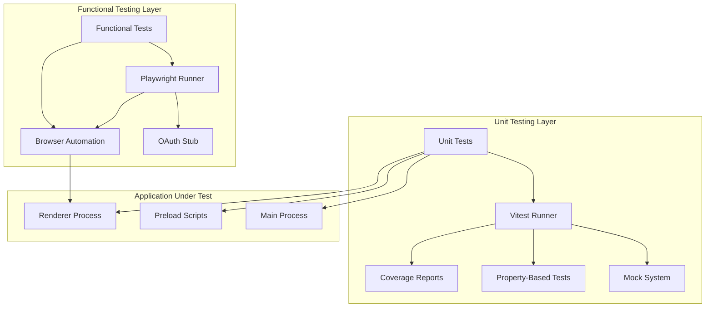

# Дизайн Документ: Инфраструктура Тестирования

## Обзор

Инфраструктура тестирования представляет собой комплексную систему для обеспечения качества кода через unit и функциональные тесты. Система построена на основе Vitest для unit тестирования и Playwright для функциональных тестов, включает property-based тестирование, моккинг внешних зависимостей и OAuth заглушки.

## Архитектура

### Общая Архитектура Тестирования



### Структура Тестовых Файлов

```
src/
├── components/
│   ├── Button.tsx
│   ├── Button.test.ts          # Unit тесты
│   └── Button.properties.test.ts # Property-based тесты
├── services/
│   ├── AuthService.ts
│   └── AuthService.test.ts
└── utils/
    ├── helpers.ts
    └── helpers.test.ts

tests/
├── functional/
│   ├── auth/
│   │   ├── login.spec.ts
│   │   ├── logout.spec.ts
│   │   └── oauth-stub.ts
│   ├── navigation/
│   │   ├── sidebar.spec.ts
│   │   └── routing.spec.ts
│   └── settings/
│       └── toggles.spec.ts
├── fixtures/
│   ├── auth-data.ts
│   └── test-users.ts
└── support/
    ├── oauth-mock.ts
    └── test-helpers.ts
```

## Компоненты и Интерфейсы

### Unit Testing Framework

#### Vitest Configuration

```typescript
interface VitestConfig {
  testEnvironment: "node" | "jsdom" | "happy-dom";
  coverage: {
    provider: "v8" | "istanbul";
    threshold: {
      global: {
        branches: 85;
        functions: 85;
        lines: 85;
        statements: 85;
      };
    };
  };
  setupFiles: string[];
  testMatch: string[];
}
```

#### Mock System Interface

```typescript
interface MockSystem {
  mockFileSystem(): FileSystemMock;
  mockNetwork(): NetworkMock;
  mockDatabase(): DatabaseMock;
  mockIPC(): IPCMock;
  restoreAll(): void;
}

interface FileSystemMock {
  readFile(path: string): Promise<string>;
  writeFile(path: string, content: string): Promise<void>;
  exists(path: string): boolean;
}

interface NetworkMock {
  get(url: string): Promise<MockResponse>;
  post(url: string, data: any): Promise<MockResponse>;
  intercept(pattern: string, handler: RequestHandler): void;
}
```

#### Property-Based Testing Interface

```typescript
interface PropertyTest<T> {
  forAll<A>(gen: Generator<A>, predicate: (a: A) => boolean): PropertyTest<A>;
  check(iterations?: number): TestResult;
  shrink(counterExample: T): T;
}

interface Generator<T> {
  generate(): T;
  shrink(value: T): T[];
}

interface TestResult {
  success: boolean;
  counterExample?: any;
  iterations: number;
  shrinkSteps?: number;
}
```

### Functional Testing Framework

#### Playwright Configuration

```typescript
interface PlaywrightConfig {
  testDir: string;
  timeout: number;
  retries: number;
  workers: number;
  use: {
    baseURL: string;
    headless: boolean;
    screenshot: "off" | "only-on-failure" | "on";
    video: "off" | "on-first-retry" | "retain-on-failure";
  };
  projects: TestProject[];
}

interface TestProject {
  name: string;
  use: BrowserContextOptions;
  testMatch: string[];
}
```

#### OAuth Stub Interface

```typescript
interface OAuthStub {
  configure(config: OAuthStubConfig): void;
  mockSuccessfulAuth(userProfile: UserProfile): void;
  mockFailedAuth(error: AuthError): void;
  mockCancelledAuth(): void;
  reset(): void;
}

interface OAuthStubConfig {
  clientId: string;
  redirectUri: string;
  scopes: string[];
  deterministic: boolean;
}

interface UserProfile {
  id: string;
  email: string;
  name: string;
  picture?: string;
}
```

## Модели Данных

### Test Configuration Model

```typescript
interface TestConfig {
  unit: UnitTestConfig;
  functional: FunctionalTestConfig;
  coverage: CoverageConfig;
  reporting: ReportingConfig;
}

interface UnitTestConfig {
  framework: "vitest";
  testPattern: string;
  setupFiles: string[];
  mockStrategy: "auto" | "manual";
  propertyBasedTesting: {
    enabled: boolean;
    library: string;
    iterations: number;
  };
}

interface FunctionalTestConfig {
  framework: "playwright";
  browsers: string[];
  baseUrl: string;
  timeout: number;
  retries: number;
  parallelism: number;
}

interface CoverageConfig {
  threshold: {
    statements: 85;
    branches: 85;
    functions: 85;
    lines: 85;
  };
  exclude: string[];
  include: string[];
}
```

### Test Result Model

```typescript
interface TestSuite {
  name: string;
  type: "unit" | "functional" | "property";
  tests: TestCase[];
  duration: number;
  status: "passed" | "failed" | "skipped";
}

interface TestCase {
  name: string;
  status: "passed" | "failed" | "skipped";
  duration: number;
  error?: TestError;
  assertions: number;
}

interface TestError {
  message: string;
  stack: string;
  expected?: any;
  actual?: any;
}
```

## Correctness Properties

_Свойство - это характеристика или поведение, которое должно выполняться во всех допустимых выполнениях системы - по сути, формальное утверждение о том, что система должна делать. Свойства служат мостом между человекочитаемыми спецификациями и машинно-проверяемыми гарантиями корректности._

### Property Reflection

После анализа критериев приемки выявлены следующие потенциальные избыточности:

**Объединяемые свойства:**

- Свойства 2.1, 2.2, 2.3 (моккинг файловой системы, сети, БД) объединены в одно свойство "Изоляция внешних зависимостей"
- Свойства 4.1, 4.2, 4.3 (обработка ошибок, граничные случаи, сообщения об ошибках) объединены в одно свойство "Покрытие обработки ошибок"
- Свойства 3.2, 3.3 (генерация тестовых случаев и shrinking) являются частью одного свойства Property-Based тестирования

**Уникальные свойства:**

- Свойство покрытия кода (1.2) остается отдельным как критически важная метрика
- Свойство организации файлов (1.3) остается отдельным для поддержания структуры проекта
- Свойство изоляции функциональных тестов (5.3, 6.1) остается отдельным для обеспечения надежности
- UI поведенческие свойства (7.2, 7.3, 8.1) остаются отдельными как специфичные для пользовательского интерфейса

### Свойства Корректности

**Property 1: Покрытие кода**
_Для любого_ запуска unit тестов, покрытие кода должно составлять минимум 85% для main, preload и renderer процессов
**Validates: Requirements 1.2**

**Property 2: Организация тестовых файлов**
_Для любого_ .test.ts файла в проекте, должен существовать соответствующий исходный файл в той же директории
**Validates: Requirements 1.3**

**Property 3: Изоляция внешних зависимостей**
_Для любого_ unit теста, все внешние зависимости (файловая система, сеть, база данных) должны быть замокированы и не выполнять реальные операции
**Validates: Requirements 2.1, 2.2, 2.3**

**Property 4: Покрытие асинхронных операций**
_Для любого_ асинхронного кода в приложении, должны существовать тесты, покрывающие Promises, async/await и IPC вызовы
**Validates: Requirements 2.4**

**Property 5: Property-based тестирование с fast-check**
_Для любой_ основной бизнес-логики, должны существовать property-based тесты с использованием fast-check, которые генерируют минимум 100 тестовых случаев и предоставляют минимальные контрпримеры через shrinking при неудаче
**Validates: Requirements 3.1, 3.2, 3.3**

**Property 6: Комплексное покрытие обработки ошибок**
_Для любого_ компонента с обработкой ошибок, должны существовать тесты, покрывающие все пути ошибок (сетевые ошибки, недоступность ресурсов, таймауты), граничные случаи (пустые данные, null/undefined, экстремальные значения) и корректность сообщений об ошибках
**Validates: Requirements 4.1, 4.2, 4.3**

**Property 7: Изоляция функциональных тестов**
_Для любого_ функционального теста, он должен выполняться в изолированной среде с автоматической очисткой состояния между тестами и без внешних сетевых вызовов к OAuth провайдерам
**Validates: Requirements 5.3, 6.1**

**Property 8: Активное состояние навигации**
_Для любого_ переключения между разделами приложения, активный элемент навигации должен соответствовать текущему разделу с корректным обновлением стилей
**Validates: Requirements 7.2**

**Property 9: Адаптивность макета боковой панели**
_Для любого_ изменения состояния боковой панели (сворачивание/разворачивание), макет основного содержимого должен корректно адаптироваться
**Validates: Requirements 7.3**

**Property 10: Реактивность переключателей настроек**
_Для любого_ переключателя настроек, клик должен изменять его состояние на противоположное
**Validates: Requirements 8.1**

## Обработка Ошибок

### Стратегии Обработки Ошибок в Тестах

#### Unit Test Error Handling

```typescript
interface TestErrorHandler {
  handleAsyncError(error: Error, context: TestContext): void;
  handleMockError(mockName: string, error: Error): void;
  handleAssertionError(assertion: string, expected: any, actual: any): void;
  handleTimeoutError(testName: string, timeout: number): void;
}
```

#### Functional Test Error Handling

```typescript
interface FunctionalTestErrorHandler {
  handlePageError(page: Page, error: Error): void;
  handleNetworkError(request: Request, error: Error): void;
  handleElementNotFound(selector: string, timeout: number): void;
  handleScreenshotFailure(testName: string, error: Error): void;
}
```

### Error Recovery Strategies

1. **Retry Mechanisms**: Автоматическое повторение неудачных тестов
2. **Graceful Degradation**: Продолжение выполнения тестов при частичных сбоях
3. **Error Reporting**: Детальное логирование ошибок с контекстом
4. **Cleanup Procedures**: Очистка состояния после неудачных тестов

## Стратегия Тестирования

### Двойной Подход к Тестированию

**Unit Tests и Property Tests являются взаимодополняющими:**

- **Unit tests**: Проверяют конкретные примеры, граничные случаи и условия ошибок
- **Property tests**: Проверяют универсальные свойства на множестве входных данных
- **Вместе**: Обеспечивают комплексное покрытие (unit тесты находят конкретные баги, property тесты проверяют общую корректность)

### Конфигурация Property-Based Testing

**Библиотека**: fast-check для TypeScript
**Минимальные итерации**: 100 итераций на каждый property тест
**Теги тестов**: Каждый property тест должен содержать комментарий, ссылающийся на свойство из дизайна
**Формат тега**: **Feature: testing-infrastructure, Property {number}: {property_text}**

### Структура Тестирования

#### Unit Testing Strategy

```typescript
// Пример конфигурации unit теста с property-based testing
describe("AuthService", () => {
  // Unit test для конкретного примера
  it("should authenticate valid user", () => {
    // Конкретный тестовый случай
  });

  // Property-based test
  it("should maintain user session consistency", () => {
    // Feature: testing-infrastructure, Property 5: Property-based тестирование бизнес-логики
    fc.assert(
      fc.property(
        fc.record({
          userId: fc.string(),
          token: fc.string(),
          expiresAt: fc.date(),
        }),
        (userSession) => {
          // Проверка свойства
          const result = authService.validateSession(userSession);
          return result.isValid === userSession.expiresAt > new Date();
        },
      ),
      { numRuns: 100 },
    );
  });
});
```

#### Functional Testing Strategy

```typescript
// Пример функционального теста
test("OAuth authentication flow", async ({ page }) => {
  // Feature: testing-infrastructure, Property 7: Изоляция функциональных тестов

  // Настройка OAuth заглушки
  await setupOAuthStub(page);

  // Выполнение теста без внешних сетевых вызовов
  await page.goto("/auth");
  await page.click('[data-testid="login-button"]');

  // Проверка результата
  await expect(page).toHaveURL("/dashboard");
});
```

### Test Coverage Requirements

**Минимальные пороги покрытия:**

- Statements: 85%
- Branches: 85%
- Functions: 85%
- Lines: 85%

**Исключения из покрытия:**

- Конфигурационные файлы
- Типы TypeScript
- Тестовые утилиты

### Continuous Integration Integration

```yaml
# Пример CI конфигурации
test:
  unit:
    command: "npm run test:unit"
    coverage: true
    threshold: 85%

  functional:
    command: "npm run test:functional"
    browsers: ["chromium", "firefox", "webkit"]
    retries: 2

  property:
    command: "npm run test:property"
    iterations: 100
    shrinking: true
```

### Performance Considerations

**Unit Tests:**

- Время выполнения: < 5 секунд для полного набора
- Параллельное выполнение: Включено
- Моки: Автоматические для внешних зависимостей

**Functional Tests:**

- Время выполнения: < 2 минуты для полного набора
- Параллельное выполнение: До 4 воркеров
- Браузеры: Headless режим по умолчанию

**Property-Based Tests:**

- Итерации: 100 минимум, 1000 для критических компонентов
- Shrinking: Включен для минимизации контрпримеров
- Timeout: 30 секунд на property тест
