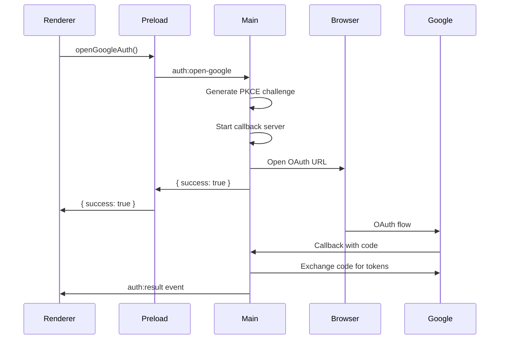

# IPC Contract Documentation

<!-- Requirements: platform-foundation.3.3, platform-foundation.3.4 -->

## Overview

This document defines the comprehensive Inter-Process Communication (IPC) contract for the Clerkly desktop application. The IPC system enables secure communication between the "Main Process" (Electron backend) and "Renderer Process" (React frontend) while maintaining strict security boundaries through Context Isolation.

**Contract Version**: 1.0.0  
**Total Channels**: 7 (6 invoke + 1 event + 1 logging)  
**Security Level**: Maximum (Context Isolation + Parameter Validation + Version Compatibility)

## Architecture

### Process Architecture

```
┌─────────────────┐    IPC     ┌─────────────────┐
│   Main Process  │◄──────────►│ Renderer Process│
│   (main.ts)     │            │   (React App)   │
└─────────────────┘            └─────────────────┘
         ▲                              ▲
         │                              │
         ▼                              ▼
┌─────────────────┐            ┌─────────────────┐
│  Preload Script │            │   Context API   │
│  (preload.ts)   │            │ (window.clerkly)│
└─────────────────┘            └─────────────────┘
```

### Communication Patterns

1. **Request-Response (invoke/handle)**: Bidirectional communication with return values
2. **Event Broadcasting (send/on)**: One-way communication from Main to Renderer
3. **Logging (send)**: One-way logging from Preload to Main
4. **Version Negotiation**: Compatibility checking between client and server versions

### Security Model

- **Context Isolation**: Enabled (`contextIsolation: true`)
- **Node Integration**: Disabled (`nodeIntegration: false`)
- **Secure Bridge**: All communication through `contextBridge.exposeInMainWorld`
- **Type Safety**: Full TypeScript typing for all IPC channels
- **Parameter Validation**: Runtime validation of all IPC messages
- **Error Isolation**: Errors contained within IPC boundaries
- **Logging Security**: All IPC calls logged for audit trail

## IPC Channel Registry

### Version Management Channels

#### `ipc:version-check`

**Purpose**: Negotiates IPC contract version compatibility between client and server

**Type**: Request-Response (invoke/handle)

**Parameters**: `{ clientVersion: IPCVersion }`

```typescript
interface IPCVersion {
  major: number;
  minor: number;
  patch: number;
}
```

**Returns**: `VersionNegotiationResult`

```typescript
interface VersionNegotiationResult {
  success: boolean;
  agreedVersion: IPCVersion;
  error?: string;
}
```

**Implementation Details**:

- Validates client version compatibility using semantic versioning rules
- Supports backward compatibility within same major version
- Returns agreed version for communication (typically the lower version)
- Provides detailed error messages for incompatible versions
- Logs all version negotiation attempts for debugging

**Version Compatibility Rules**:

- **Same Major Version**: Compatible (uses lower minor/patch version)
- **Different Major Version**: Incompatible (breaking changes)
- **Below Minimum Supported**: Incompatible (client must upgrade)
- **Future Minor/Patch**: Compatible (forward compatibility)

**Error Conditions**:

| Error Type                   | Description                  | Resolution                   |
| ---------------------------- | ---------------------------- | ---------------------------- |
| `Incompatible major version` | Client major version differs | Upgrade/downgrade client     |
| `Below minimum supported`    | Client version too old       | Upgrade client               |
| `Invalid version format`     | Malformed version object     | Fix version object structure |

**Usage Example**:

```typescript
// Check version compatibility
const clientVersion = { major: 1, minor: 0, patch: 0 };
const result = await window.clerkly.checkVersion(clientVersion);

if (result.success) {
  console.log(
    `Using IPC version ${result.agreedVersion.major}.${result.agreedVersion.minor}.${result.agreedVersion.patch}`,
  );
} else {
  console.error(`Version incompatible: ${result.error}`);
}
```

### Authentication Channels

#### `auth:open-google`

**Purpose**: Initiates Google OAuth authentication flow

**Type**: Request-Response (invoke/handle)

**Parameters**: None (`void`)

**Returns**: `AuthResult`

```typescript
interface AuthResult {
  success: boolean;
  error?: string;
}
```

**Implementation Details**:

- Generates secure PKCE challenge for OAuth flow
- Creates temporary HTTP callback server on random port
- Opens external browser with Google OAuth URL
- Returns immediately with operation status
- Actual authentication result delivered via `auth:result` event
- Automatically focuses application window when auth completes

**Security Considerations**:

- Uses PKCE (Proof Key for Code Exchange) for enhanced security
- State parameter validation prevents CSRF attacks
- Callback server binds to localhost only
- Temporary server automatically closes after use

**Error Conditions**:

| Error Type                        | Description                      | Resolution                         |
| --------------------------------- | -------------------------------- | ---------------------------------- |
| `OAuth client not configured`     | Google OAuth credentials missing | Configure OAuth in environment     |
| `Failed to start callback server` | Port binding failed              | Retry or check firewall settings   |
| `Browser launch failed`           | Cannot open external browser     | Check system browser configuration |

**Sequence Diagram**:



#### `auth:get-state`

**Purpose**: Retrieves current authentication state

**Type**: Request-Response (invoke/handle)

**Parameters**: None (`void`)

**Returns**: `AuthState`

```typescript
interface AuthState {
  authorized: boolean;
}
```

**Implementation Details**:

- Reads stored tokens from encrypted SQLite database
- Validates token expiration timestamps
- Automatically schedules token refresh if needed (within 5 minutes of expiry)
- Returns current authorization status
- Does not trigger network requests

**Performance Characteristics**:

- **Typical Response Time**: < 5ms (database read only)
- **Caching**: No caching (always fresh from database)
- **Database Queries**: Single SELECT query
- **Memory Usage**: Minimal (< 1KB)

**Error Conditions**:

| Error Type            | Description                 | Resolution                 |
| --------------------- | --------------------------- | -------------------------- |
| `Database read error` | Cannot access token storage | Check database permissions |
| `Token corruption`    | Stored tokens are malformed | Re-authenticate user       |

#### `auth:sign-out`

**Purpose**: Signs out the current user and clears all authentication data

**Type**: Request-Response (invoke/handle)

**Parameters**: None (`void`)

**Returns**: `OperationResult`

```typescript
interface OperationResult {
  success: boolean;
  error?: string;
}
```

**Implementation Details**:

- Clears all stored tokens from database (DELETE operation)
- Cancels any pending token refresh timers
- Sends `auth:result` event to notify renderer of state change
- Automatically focuses application window
- Operation is atomic (all-or-nothing)

**Side Effects**:

- Database: Removes all auth-related records
- Memory: Clears cached token refresh timers
- Events: Triggers `auth:result` with `{ success: true, authorized: false }`
- UI: Application returns to unauthorized state

**Error Conditions**:

| Error Type             | Description                        | Resolution                 |
| ---------------------- | ---------------------------------- | -------------------------- |
| `Database write error` | Cannot clear token storage         | Check database permissions |
| `Concurrent operation` | Another auth operation in progress | Retry after completion     |

### Sidebar Channels

#### `sidebar:get-state`

**Purpose**: Retrieves current sidebar collapse state

**Type**: Request-Response (invoke/handle)

**Parameters**: None (`void`)

**Returns**: `SidebarState`

```typescript
interface SidebarState {
  collapsed: boolean;
}
```

**Implementation Details**:

- Reads state from persistent SQLite database
- Returns default state (`collapsed: false`) if no data exists
- Single database query with fallback logic
- State persists across application restarts

**Default Behavior**:

- **First Launch**: Returns `{ collapsed: false }`
- **Subsequent Launches**: Returns last saved state
- **Database Error**: Returns `{ collapsed: false }` (safe default)

**Performance Characteristics**:

- **Response Time**: < 3ms (single database read)
- **Database Table**: `app_settings` with key-value storage
- **Storage Size**: < 10 bytes per state

#### `sidebar:set-state`

**Purpose**: Updates and persists sidebar collapse state

**Type**: Request-Response (invoke/handle)

**Parameters**: `SetSidebarStateParams`

```typescript
interface SetSidebarStateParams {
  collapsed: boolean;
}
```

**Returns**: `OperationResult`

**Implementation Details**:

- Validates input parameters (boolean type checking)
- Persists state to SQLite database using UPSERT operation
- State immediately available for subsequent `sidebar:get-state` calls
- Operation is atomic and transactional

**Validation Rules**:

- `collapsed` must be boolean type
- `null`, `undefined`, or other types rejected with validation error
- Empty parameters object rejected

**Database Schema**:

```sql
CREATE TABLE app_settings (
  key TEXT PRIMARY KEY,
  value TEXT NOT NULL
);

-- Sidebar state stored as:
-- key: 'sidebar_collapsed'
-- value: '0' (false) or '1' (true)
```

**Error Conditions**:

| Error Type                    | Description             | Resolution                 |
| ----------------------------- | ----------------------- | -------------------------- |
| `Parameter validation failed` | Invalid collapsed value | Provide boolean value      |
| `Database write error`        | Cannot save to database | Check database permissions |

### Event Channels

#### `auth:result`

**Purpose**: Delivers authentication results from "Main Process" to "Renderer Process"

**Type**: Event Broadcasting (send/on)

**Direction**: Main → Renderer (one-way)

**Payload**: `AuthResult`

```typescript
interface AuthResult {
  success: boolean;
  error?: string;
}
```

**Trigger Conditions**:

1. **OAuth Flow Completion**: When Google OAuth flow completes (success or failure)
2. **Token Refresh**: When automatic token refresh occurs
3. **Sign Out**: When user signs out (success: true, but user becomes unauthorized)
4. **Token Expiry**: When tokens expire and cannot be refreshed

**Implementation Details**:

- Automatically focuses application window when sent
- Event is fire-and-forget (no acknowledgment required)
- Multiple listeners supported in renderer
- Event payload includes success status and optional error message

**Event Handling Pattern**:

```typescript
// Renderer side - setting up listener
const cleanup = window.clerkly.onAuthResult((result) => {
  if (result.success) {
    // Handle successful auth state change
    updateAuthState("authorized");
  } else {
    // Handle auth failure
    showError(result.error || "Authentication failed");
    updateAuthState("unauthorized");
  }
});

// Cleanup when component unmounts
return cleanup;
```

**Reliability**:

- **Delivery**: Best effort (renderer must be ready to receive)
- **Ordering**: Events delivered in chronological order
- **Persistence**: Not persisted (missed events are lost)

### Logging Channels

#### `preload:log`

**Purpose**: Centralized logging from "Preload Script" to "Main Process"

**Type**: One-way Communication (send/on)

**Direction**: Preload → Main (one-way)

**Parameters**: `PreloadLogData`

```typescript
interface PreloadLogData {
  level: "DEBUG" | "INFO" | "WARN" | "ERROR";
  message: string;
  data?: unknown;
}
```

**Returns**: None (fire-and-forget)

**Implementation Details**:

- Enables centralized logging architecture
- All preload script logs routed through main process
- Supports structured logging with optional data payload
- Graceful fallback to console if IPC fails
- No response expected or required

**Log Levels**:

- **DEBUG**: Detailed diagnostic information (IPC call traces, performance metrics)
- **INFO**: General information (initialization, state changes)
- **WARN**: Warning conditions (recoverable errors, deprecations)
- **ERROR**: Error conditions (IPC failures, validation errors)

**Usage Pattern**:

```typescript
// Preload script logging
const logToMain = (level: string, message: string, data?: unknown): void => {
  try {
    ipcRenderer.send("preload:log", { level, message, data });
  } catch (error) {
    // Fallback to console if IPC fails
    console.error("Preload logging failed:", error);
    console.log(`[PRELOAD ${level}] ${message}`, data);
  }
};
```

**Log Processing**:

- Main process receives logs and routes to file system
- Logs written to `{userData}/clerkly.log`
- Log rotation: 1MB max size, 3 files retained
- Timestamp and formatting applied by main process

**Performance Impact**:

- **Overhead**: Minimal (< 1ms per log call)
- **Async**: Non-blocking send operation
- **Buffering**: OS-level IPC buffering
- **Failure Handling**: Graceful degradation to console

## Type Definitions

### Core Types

```typescript
// Requirements: platform-foundation.3.3, platform-foundation.3.4

// Common result type for operations that can succeed or fail
interface OperationResult {
  success: boolean;
  error?: string;
}

// Authentication result with optional error message
interface AuthResult extends OperationResult {
  success: boolean;
  error?: string;
}

// Authentication state information
interface AuthState {
  authorized: boolean;
}

// Sidebar state information
interface SidebarState {
  collapsed: boolean;
}

// Parameters for setting sidebar state
interface SetSidebarStateParams {
  collapsed: boolean;
}

// Preload logging data structure
interface PreloadLogData {
  level: "DEBUG" | "INFO" | "WARN" | "ERROR";
  message: string;
  data?: unknown;
}
```

### Channel Mapping

```typescript
// Complete IPC channel type definitions
interface IPCChannels {
  // Authentication channels
  "auth:open-google": {
    params: void;
    returns: AuthResult;
  };
  "auth:get-state": {
    params: void;
    returns: AuthState;
  };
  "auth:sign-out": {
    params: void;
    returns: OperationResult;
  };

  // Sidebar channels
  "sidebar:get-state": {
    params: void;
    returns: SidebarState;
  };
  "sidebar:set-state": {
    params: SetSidebarStateParams;
    returns: OperationResult;
  };
}

// Event channel definitions
interface IPCEvents {
  "auth:result": AuthResult;
}

// Logging channel definitions
interface IPCLogging {
  "preload:log": {
    params: PreloadLogData;
    returns: void;
  };
}
```

### Type Helpers

```typescript
// Type helper to extract parameter type for a given channel
export type IPCChannelParams<T extends keyof IPCChannels> = IPCChannels[T]["params"];

// Type helper to extract return type for a given channel
export type IPCChannelReturns<T extends keyof IPCChannels> = IPCChannels[T]["returns"];

// Type helper to extract event payload type for a given event
export type IPCEventPayload<T extends keyof IPCEvents> = IPCEvents[T];

// Union type of all available IPC channel names
export type IPCChannelName = keyof IPCChannels;

// Union type of all available IPC event names
export type IPCEventName = keyof IPCEvents;

// Union type of all available IPC logging channel names
export type IPCLoggingName = keyof IPCLogging;
```

### Window API Definition

```typescript
// Complete window.clerkly API interface
interface ClerklyAPI {
  // Authentication methods
  openGoogleAuth(): Promise<AuthResult>;
  getAuthState(): Promise<AuthState>;
  signOut(): Promise<OperationResult>;

  // Sidebar methods
  getSidebarState(): Promise<SidebarState>;
  setSidebarState(collapsed: boolean): Promise<OperationResult>;

  // Event listeners
  onAuthResult(callback: (result: AuthResult) => void): () => void;
}

// Global window extension
declare global {
  interface Window {
    clerkly: ClerklyAPI;
  }
}
```

## Security Considerations

### Input Validation

All IPC channels implement comprehensive parameter validation:

- **Type Checking**: Runtime validation of parameter types using TypeScript interfaces
- **Required Fields**: Validation of required properties with detailed error messages
- **Boundary Validation**: Checking of value ranges and constraints
- **Sanitization**: Input sanitization to prevent injection attacks
- **Error Handling**: Graceful handling of validation failures with structured responses
- **Safe Defaults**: Fallback to safe defaults on validation errors

**Validation Implementation**:

```typescript
// Example validation for sidebar:set-state
function validateSetSidebarState(params: unknown): SetSidebarStateParams {
  if (typeof params !== "object" || params === null) {
    throw new IPCValidationError("Parameters must be an object");
  }

  const { collapsed } = params as any;
  if (typeof collapsed !== "boolean") {
    throw new IPCValidationError("collapsed must be a boolean");
  }

  return { collapsed };
}
```

### Error Handling

Comprehensive error handling across all IPC channels:

- **Validation Errors**: Return structured error responses with specific error codes
- **Runtime Errors**: Logged with full stack traces and converted to user-friendly messages
- **Network Errors**: Handled with appropriate retry logic and timeout mechanisms
- **Database Errors**: Graceful degradation with default values and error recovery
- **System Errors**: Proper cleanup and resource management on failures

**Error Response Format**:

```typescript
interface IPCError {
  success: false;
  error: string;
  code?: string;
  details?: unknown;
}
```

### Data Protection

Comprehensive data protection measures:

- **Token Storage**: All authentication tokens encrypted using AES-256 in SQLite database
- **Sensitive Data**: Never logged in production builds (DEBUG level only in development)
- **PKCE Flow**: Secure OAuth implementation with PKCE (Proof Key for Code Exchange)
- **State Validation**: CSRF protection through cryptographically secure state parameter
- **Memory Protection**: Sensitive data cleared from memory after use
- **Database Encryption**: SQLite database encrypted at rest

**Encryption Details**:

```typescript
// Token encryption (conceptual - actual implementation in main.ts)
const encryptToken = (token: string): string => {
  const cipher = crypto.createCipher("aes-256-gcm", getEncryptionKey());
  return cipher.update(token, "utf8", "hex") + cipher.final("hex");
};
```

### Context Isolation Security

Strict enforcement of security boundaries:

- **No Node.js Access**: Renderer process completely isolated from Node.js APIs
- **Controlled API Surface**: Only explicitly exposed methods available to renderer
- **Type Safety**: All IPC communication fully typed to prevent runtime errors
- **Audit Trail**: All IPC calls logged for security auditing
- **Resource Limits**: IPC calls subject to rate limiting and resource constraints

**Security Verification**:

```typescript
// Context isolation verification (from tests)
expect(window.require).toBeUndefined();
expect(window.process).toBeUndefined();
expect(window.global).toBeUndefined();
expect(typeof window.clerkly).toBe("object");
```

## Usage Examples

### Quick Start Guide

#### Basic Setup

Before using any IPC channels, ensure your renderer process has access to the `window.clerkly` API:

```typescript
// Check if API is available
if (typeof window.clerkly === "undefined") {
  console.error("Clerkly API not available. Check preload script configuration.");
  return;
}

// API is ready to use
console.log("Clerkly API available:", Object.keys(window.clerkly));
```

#### Simple Authentication Check

```typescript
// Requirements: platform-foundation.3.3
// Quick authentication status check
const checkAuth = async () => {
  try {
    const authState = await window.clerkly.getAuthState();
    if (authState.authorized) {
      console.log("User is authenticated");
      showDashboard();
    } else {
      console.log("User needs to authenticate");
      showLoginScreen();
    }
  } catch (error) {
    console.error("Auth check failed:", error);
    showErrorMessage("Unable to check authentication status");
  }
};

// Call on app startup
checkAuth();
```

#### Simple Login Flow

```typescript
// Requirements: platform-foundation.3.3
// Basic login implementation
const handleLogin = async () => {
  try {
    // Start OAuth flow
    const result = await window.clerkly.openGoogleAuth();

    if (result.success) {
      console.log("OAuth flow started successfully");
      showMessage("Please complete authentication in your browser");
    } else {
      console.error("Failed to start OAuth:", result.error);
      showErrorMessage(result.error || "Authentication failed to start");
    }
  } catch (error) {
    console.error("Login error:", error);
    showErrorMessage("System error occurred during login");
  }
};

// Listen for authentication result
const cleanup = window.clerkly.onAuthResult((result) => {
  if (result.success) {
    console.log("Authentication successful");
    showMessage("Welcome! You are now logged in.");
    redirectToDashboard();
  } else {
    console.error("Authentication failed:", result.error);
    showErrorMessage(result.error || "Authentication failed");
  }
});

// Don't forget to cleanup when component unmounts
// cleanup();
```

#### Simple Sidebar Toggle

```typescript
// Requirements: platform-foundation.3.4
// Basic sidebar state management
const toggleSidebar = async () => {
  try {
    // Get current state
    const currentState = await window.clerkly.getSidebarState();
    const newCollapsed = !currentState.collapsed;

    // Update state
    const result = await window.clerkly.setSidebarState(newCollapsed);

    if (result.success) {
      console.log(`Sidebar ${newCollapsed ? "collapsed" : "expanded"}`);
      updateSidebarUI(newCollapsed);
    } else {
      console.error("Failed to update sidebar:", result.error);
    }
  } catch (error) {
    console.error("Sidebar toggle error:", error);
  }
};
```

### Common Use Cases

#### Application Initialization

```typescript
// Requirements: platform-foundation.3.3, platform-foundation.3.4
// Complete app initialization with IPC
const initializeApp = async () => {
  console.log("Initializing Clerkly application...");

  try {
    // 1. Check authentication status
    const authState = await window.clerkly.getAuthState();
    console.log("Auth status:", authState.authorized ? "authenticated" : "not authenticated");

    // 2. Load sidebar state
    const sidebarState = await window.clerkly.getSidebarState();
    console.log("Sidebar state:", sidebarState.collapsed ? "collapsed" : "expanded");

    // 3. Set up auth event listener
    const authCleanup = window.clerkly.onAuthResult((result) => {
      console.log("Auth event received:", result);
      handleAuthStateChange(result);
    });

    // 4. Initialize UI based on loaded state
    initializeUI({
      authenticated: authState.authorized,
      sidebarCollapsed: sidebarState.collapsed,
    });

    console.log("Application initialized successfully");

    // Return cleanup function
    return () => {
      authCleanup();
      console.log("Application cleanup completed");
    };
  } catch (error) {
    console.error("Application initialization failed:", error);
    showCriticalError("Failed to initialize application");
    throw error;
  }
};

// Usage
let appCleanup: (() => void) | null = null;

// Initialize on app start
initializeApp()
  .then((cleanup) => {
    appCleanup = cleanup;
  })
  .catch((error) => {
    console.error("Critical initialization error:", error);
  });

// Cleanup on app shutdown
window.addEventListener("beforeunload", () => {
  if (appCleanup) {
    appCleanup();
  }
});
```

#### User Session Management

```typescript
// Requirements: platform-foundation.3.3
// Complete session management implementation
class SessionManager {
  private authCleanup: (() => void) | null = null;
  private currentUser: { authenticated: boolean } = { authenticated: false };

  async initialize() {
    // Check initial auth state
    const authState = await window.clerkly.getAuthState();
    this.currentUser.authenticated = authState.authorized;

    // Set up auth event listener
    this.authCleanup = window.clerkly.onAuthResult((result) => {
      this.handleAuthResult(result);
    });

    console.log("Session manager initialized");
  }

  async login() {
    try {
      const result = await window.clerkly.openGoogleAuth();
      if (!result.success) {
        throw new Error(result.error || "Login failed");
      }
      // Actual result will come via event
    } catch (error) {
      console.error("Login failed:", error);
      throw error;
    }
  }

  async logout() {
    try {
      const result = await window.clerkly.signOut();
      if (!result.success) {
        throw new Error(result.error || "Logout failed");
      }
      // Auth state will update via event
    } catch (error) {
      console.error("Logout failed:", error);
      throw error;
    }
  }

  private handleAuthResult(result: AuthResult) {
    if (result.success) {
      this.currentUser.authenticated = true;
      this.onAuthStateChange?.(true);
    } else {
      this.currentUser.authenticated = false;
      this.onAuthStateChange?.(false);
    }
  }

  isAuthenticated(): boolean {
    return this.currentUser.authenticated;
  }

  onAuthStateChange?: (authenticated: boolean) => void;

  destroy() {
    if (this.authCleanup) {
      this.authCleanup();
      this.authCleanup = null;
    }
  }
}

// Usage
const sessionManager = new SessionManager();

// Initialize
await sessionManager.initialize();

// Set up auth state change handler
sessionManager.onAuthStateChange = (authenticated) => {
  if (authenticated) {
    showDashboard();
  } else {
    showLoginScreen();
  }
};

// Login
document.getElementById("login-btn")?.addEventListener("click", async () => {
  try {
    await sessionManager.login();
  } catch (error) {
    showErrorMessage("Login failed: " + error.message);
  }
});

// Logout
document.getElementById("logout-btn")?.addEventListener("click", async () => {
  try {
    await sessionManager.logout();
  } catch (error) {
    showErrorMessage("Logout failed: " + error.message);
  }
});
```

#### Persistent UI State Management

```typescript
// Requirements: platform-foundation.3.4
// UI state management with persistence
class UIStateManager {
  private sidebarCollapsed = false;

  async initialize() {
    // Load saved sidebar state
    try {
      const sidebarState = await window.clerkly.getSidebarState();
      this.sidebarCollapsed = sidebarState.collapsed;
      this.applySidebarState();
    } catch (error) {
      console.error("Failed to load UI state:", error);
      // Use default state
      this.sidebarCollapsed = false;
    }
  }

  async toggleSidebar() {
    const newCollapsed = !this.sidebarCollapsed;

    try {
      // Optimistic update
      this.sidebarCollapsed = newCollapsed;
      this.applySidebarState();

      // Persist to backend
      const result = await window.clerkly.setSidebarState(newCollapsed);

      if (!result.success) {
        // Revert on failure
        this.sidebarCollapsed = !newCollapsed;
        this.applySidebarState();
        throw new Error(result.error || "Failed to save sidebar state");
      }
    } catch (error) {
      console.error("Sidebar toggle failed:", error);
      showErrorMessage("Failed to update sidebar state");
    }
  }

  private applySidebarState() {
    const sidebar = document.getElementById("sidebar");
    const mainContent = document.getElementById("main-content");

    if (sidebar && mainContent) {
      if (this.sidebarCollapsed) {
        sidebar.classList.add("collapsed");
        mainContent.classList.add("sidebar-collapsed");
      } else {
        sidebar.classList.remove("collapsed");
        mainContent.classList.remove("sidebar-collapsed");
      }
    }
  }

  isSidebarCollapsed(): boolean {
    return this.sidebarCollapsed;
  }
}

// Usage
const uiStateManager = new UIStateManager();

// Initialize
await uiStateManager.initialize();

// Toggle sidebar
document.getElementById("sidebar-toggle")?.addEventListener("click", () => {
  uiStateManager.toggleSidebar();
});
```

### Error Handling Examples

#### Robust Error Handling

```typescript
// Requirements: platform-foundation.3.3, platform-foundation.3.4
// Comprehensive error handling for IPC calls
class IPCErrorHandler {
  static async withRetry<T>(
    operation: () => Promise<T>,
    maxRetries: number = 3,
    delay: number = 1000,
  ): Promise<T> {
    let lastError: Error;

    for (let attempt = 0; attempt < maxRetries; attempt++) {
      try {
        return await operation();
      } catch (error) {
        lastError = error as Error;

        // Don't retry validation errors
        if (error instanceof Error && error.message.includes("validation")) {
          throw error;
        }

        if (attempt < maxRetries - 1) {
          console.warn(`Attempt ${attempt + 1} failed, retrying in ${delay}ms...`);
          await new Promise((resolve) => setTimeout(resolve, delay));
          delay *= 2; // Exponential backoff
        }
      }
    }

    throw lastError!;
  }

  static async withFallback<T>(
    operation: () => Promise<T>,
    fallback: T,
    context: string,
  ): Promise<T> {
    try {
      return await operation();
    } catch (error) {
      console.warn(`Operation failed (${context}), using fallback:`, error);
      return fallback;
    }
  }

  static handleError(error: unknown, context: string): void {
    console.error(`Error in ${context}:`, error);

    if (error instanceof Error) {
      if (error.message.includes("validation")) {
        showErrorMessage("Invalid input. Please check your data.");
      } else if (error.message.includes("network")) {
        showErrorMessage("Network error. Please check your connection.");
      } else if (error.message.includes("auth")) {
        showErrorMessage("Authentication required. Please sign in.");
        redirectToLogin();
      } else {
        showErrorMessage("An unexpected error occurred. Please try again.");
      }
    } else {
      showErrorMessage("System error occurred. Please restart the application.");
    }
  }
}

// Usage examples
const robustAuthCheck = async () => {
  try {
    const authState = await IPCErrorHandler.withRetry(
      () => window.clerkly.getAuthState(),
      3, // max retries
      1000, // initial delay
    );
    return authState.authorized;
  } catch (error) {
    IPCErrorHandler.handleError(error, "authentication check");
    return false;
  }
};

const safeSidebarState = async () => {
  return await IPCErrorHandler.withFallback(
    () => window.clerkly.getSidebarState(),
    { collapsed: false }, // fallback
    "sidebar state retrieval",
  );
};
```

#### Network Error Recovery

```typescript
// Requirements: platform-foundation.3.3
// Network error handling for authentication
const handleNetworkErrors = async () => {
  try {
    const result = await window.clerkly.openGoogleAuth();
    return result;
  } catch (error) {
    if (error instanceof Error) {
      if (error.message.includes("network") || error.message.includes("timeout")) {
        // Show network error dialog
        const retry = await showNetworkErrorDialog();
        if (retry) {
          // Retry after user confirmation
          return handleNetworkErrors();
        }
      } else if (error.message.includes("browser")) {
        // Browser launch failed
        showBrowserErrorDialog();
      }
    }
    throw error;
  }
};

const showNetworkErrorDialog = (): Promise<boolean> => {
  return new Promise((resolve) => {
    const dialog = document.createElement("div");
    dialog.innerHTML = `
      <div class="error-dialog">
        <h3>Network Error</h3>
        <p>Unable to connect to authentication server. Please check your internet connection.</p>
        <button id="retry-btn">Retry</button>
        <button id="cancel-btn">Cancel</button>
      </div>
    `;

    document.body.appendChild(dialog);

    dialog.querySelector("#retry-btn")?.addEventListener("click", () => {
      document.body.removeChild(dialog);
      resolve(true);
    });

    dialog.querySelector("#cancel-btn")?.addEventListener("click", () => {
      document.body.removeChild(dialog);
      resolve(false);
    });
  });
};
```

### Performance Optimization Examples

#### Debounced State Updates

```typescript
// Requirements: platform-foundation.3.4
// Optimized sidebar state updates with debouncing
class OptimizedSidebarManager {
  private pendingUpdate: boolean | null = null;
  private updateTimeout: NodeJS.Timeout | null = null;
  private readonly DEBOUNCE_DELAY = 300; // ms

  async updateSidebarState(collapsed: boolean) {
    // Store pending update
    this.pendingUpdate = collapsed;

    // Clear existing timeout
    if (this.updateTimeout) {
      clearTimeout(this.updateTimeout);
    }

    // Apply UI change immediately (optimistic update)
    this.applyUIState(collapsed);

    // Debounce the backend update
    this.updateTimeout = setTimeout(async () => {
      if (this.pendingUpdate !== null) {
        try {
          const result = await window.clerkly.setSidebarState(this.pendingUpdate);
          if (!result.success) {
            console.error("Failed to persist sidebar state:", result.error);
            // Could revert UI state here if needed
          }
        } catch (error) {
          console.error("Sidebar state persistence error:", error);
        } finally {
          this.pendingUpdate = null;
          this.updateTimeout = null;
        }
      }
    }, this.DEBOUNCE_DELAY);
  }

  private applyUIState(collapsed: boolean) {
    const sidebar = document.getElementById("sidebar");
    if (sidebar) {
      sidebar.classList.toggle("collapsed", collapsed);
    }
  }

  destroy() {
    if (this.updateTimeout) {
      clearTimeout(this.updateTimeout);
    }
  }
}

// Usage
const sidebarManager = new OptimizedSidebarManager();

// Rapid toggle calls will be debounced
document.getElementById("toggle-btn")?.addEventListener("click", () => {
  const isCollapsed = document.getElementById("sidebar")?.classList.contains("collapsed");
  sidebarManager.updateSidebarState(!isCollapsed);
});
```

#### Cached Authentication State

```typescript
// Requirements: platform-foundation.3.3
// Authentication state with caching
class CachedAuthManager {
  private authCache: {
    authorized: boolean;
    timestamp: number;
    ttl: number;
  } | null = null;

  private readonly CACHE_TTL = 30000; // 30 seconds

  async getAuthState(useCache: boolean = true): Promise<{ authorized: boolean }> {
    // Check cache first
    if (useCache && this.authCache) {
      const now = Date.now();
      if (now - this.authCache.timestamp < this.authCache.ttl) {
        console.log("Using cached auth state");
        return { authorized: this.authCache.authorized };
      }
    }

    // Fetch fresh state
    try {
      const authState = await window.clerkly.getAuthState();

      // Update cache
      this.authCache = {
        authorized: authState.authorized,
        timestamp: Date.now(),
        ttl: this.CACHE_TTL,
      };

      console.log("Fetched fresh auth state");
      return authState;
    } catch (error) {
      // Return cached state on error if available
      if (this.authCache) {
        console.warn("Using stale cached auth state due to error:", error);
        return { authorized: this.authCache.authorized };
      }
      throw error;
    }
  }

  invalidateCache() {
    this.authCache = null;
  }

  // Call this when auth state changes
  onAuthStateChange(authorized: boolean) {
    this.authCache = {
      authorized,
      timestamp: Date.now(),
      ttl: this.CACHE_TTL,
    };
  }
}

// Usage
const authManager = new CachedAuthManager();

// Fast auth checks (uses cache)
const isAuthenticated = await authManager.getAuthState();

// Force fresh check
const freshAuthState = await authManager.getAuthState(false);

// Invalidate cache when needed
authManager.invalidateCache();
```

### Testing Examples

#### Unit Testing IPC Calls

```typescript
// Requirements: platform-foundation.3.3, platform-foundation.3.4
// Unit tests for IPC functionality
describe("IPC Integration Tests", () => {
  beforeEach(() => {
    // Mock window.clerkly API
    (global as any).window = {
      clerkly: {
        getAuthState: jest.fn(),
        openGoogleAuth: jest.fn(),
        signOut: jest.fn(),
        getSidebarState: jest.fn(),
        setSidebarState: jest.fn(),
        onAuthResult: jest.fn(),
      },
    };
  });

  /* Preconditions: mocked window.clerkly API available
     Action: call getAuthState and verify response handling
     Assertions: correct state returned and errors handled
     Requirements: platform-foundation.3.3 */
  it("should handle auth state correctly", async () => {
    const mockAuthState = { authorized: true };
    (window.clerkly.getAuthState as jest.Mock).mockResolvedValue(mockAuthState);

    const result = await window.clerkly.getAuthState();

    expect(result).toEqual(mockAuthState);
    expect(window.clerkly.getAuthState).toHaveBeenCalledTimes(1);
  });

  /* Preconditions: mocked window.clerkly API with error simulation
     Action: call IPC method that throws error
     Assertions: error is properly caught and handled
     Requirements: platform-foundation.3.3 */
  it("should handle IPC errors gracefully", async () => {
    const mockError = new Error("Network error");
    (window.clerkly.getAuthState as jest.Mock).mockRejectedValue(mockError);

    await expect(window.clerkly.getAuthState()).rejects.toThrow("Network error");
  });

  /* Preconditions: mocked sidebar state API
     Action: toggle sidebar state multiple times
     Assertions: state updates correctly and persists
     Requirements: platform-foundation.3.4 */
  it("should handle sidebar state updates", async () => {
    (window.clerkly.getSidebarState as jest.Mock).mockResolvedValue({ collapsed: false });
    (window.clerkly.setSidebarState as jest.Mock).mockResolvedValue({ success: true });

    // Get initial state
    const initialState = await window.clerkly.getSidebarState();
    expect(initialState.collapsed).toBe(false);

    // Update state
    const updateResult = await window.clerkly.setSidebarState(true);
    expect(updateResult.success).toBe(true);
    expect(window.clerkly.setSidebarState).toHaveBeenCalledWith(true);
  });
});
```

#### Integration Testing

```typescript
// Requirements: platform-foundation.3.3, platform-foundation.3.4
// Integration tests for complete workflows
describe("Complete Workflow Integration", () => {
  /* Preconditions: full application environment with real IPC
     Action: perform complete authentication workflow
     Assertions: all steps complete successfully
     Requirements: platform-foundation.3.3 */
  it("should complete full authentication workflow", async () => {
    // Initial state should be unauthenticated
    const initialState = await window.clerkly.getAuthState();
    expect(initialState.authorized).toBe(false);

    // Start authentication
    const authResult = await window.clerkly.openGoogleAuth();
    expect(authResult.success).toBe(true);

    // Simulate successful OAuth callback (would happen in real app)
    // This would trigger the auth:result event

    // After authentication, state should be updated
    // (In real test, you'd wait for the event or simulate it)

    // Sign out
    const signOutResult = await window.clerkly.signOut();
    expect(signOutResult.success).toBe(true);

    // Final state should be unauthenticated
    const finalState = await window.clerkly.getAuthState();
    expect(finalState.authorized).toBe(false);
  });
});
```

## Usage Patterns

### Renderer Process (React)

#### Authentication Flow

```typescript
// Complete authentication implementation
const useAuth = () => {
  const [authState, setAuthState] = useState<"checking" | "authorized" | "unauthorized">(
    "checking",
  );
  const [error, setError] = useState<string | null>(null);

  // Check initial auth state
  useEffect(() => {
    const checkInitialAuth = async () => {
      try {
        const state = await window.clerkly.getAuthState();
        setAuthState(state.authorized ? "authorized" : "unauthorized");
      } catch (err) {
        console.error("Failed to check auth state:", err);
        setAuthState("unauthorized");
      }
    };

    checkInitialAuth();
  }, []);

  // Listen for auth result events
  useEffect(() => {
    const cleanup = window.clerkly.onAuthResult((result) => {
      if (result.success) {
        setAuthState("authorized");
        setError(null);
      } else {
        setAuthState("unauthorized");
        setError(result.error || "Authentication failed");
      }
    });

    return cleanup;
  }, []);

  // Login handler
  const handleLogin = async () => {
    try {
      setError(null);
      const result = await window.clerkly.openGoogleAuth();
      if (!result.success) {
        setError(result.error || "Failed to start authentication");
      }
      // Actual result will come via auth:result event
    } catch (error) {
      console.error("Login error:", error);
      setError("System error occurred. Please try again.");
    }
  };

  // Logout handler
  const handleLogout = async () => {
    try {
      setError(null);
      const result = await window.clerkly.signOut();
      if (!result.success) {
        setError(result.error || "Failed to sign out");
      }
      // Auth state will update via auth:result event
    } catch (error) {
      console.error("Logout error:", error);
      setError("System error occurred. Please try again.");
    }
  };

  return { authState, error, handleLogin, handleLogout };
};
```

#### Sidebar State Management

```typescript
// Complete sidebar state management
const useSidebar = () => {
  const [collapsed, setCollapsed] = useState<boolean>(false);
  const [loading, setLoading] = useState<boolean>(true);

  // Load initial sidebar state
  useEffect(() => {
    const loadSidebarState = async () => {
      try {
        const state = await window.clerkly.getSidebarState();
        setCollapsed(state.collapsed);
      } catch (error) {
        console.error("Failed to load sidebar state:", error);
        // Use default state on error
        setCollapsed(false);
      } finally {
        setLoading(false);
      }
    };

    loadSidebarState();
  }, []);

  // Toggle sidebar with persistence
  const toggleSidebar = async () => {
    const newCollapsed = !collapsed;

    // Optimistic update
    setCollapsed(newCollapsed);

    try {
      const result = await window.clerkly.setSidebarState(newCollapsed);
      if (!result.success) {
        // Revert on failure
        setCollapsed(!newCollapsed);
        console.error("Failed to save sidebar state:", result.error);
      }
    } catch (error) {
      // Revert on error
      setCollapsed(!newCollapsed);
      console.error("Sidebar state error:", error);
    }
  };

  return { collapsed, loading, toggleSidebar };
};
```

#### Error Handling Best Practices

```typescript
// Comprehensive error handling wrapper
const withErrorHandling = <T extends unknown[], R>(
  ipcCall: (...args: T) => Promise<R>,
  fallbackValue?: R,
) => {
  return async (...args: T): Promise<R> => {
    try {
      const result = await ipcCall(...args);
      return result;
    } catch (error) {
      // Log error for debugging
      console.error("IPC call failed:", error);

      // Show user-friendly error
      if (error instanceof Error) {
        showNotification("error", error.message);
      } else {
        showNotification("error", "An unexpected error occurred");
      }

      // Return fallback value or re-throw
      if (fallbackValue !== undefined) {
        return fallbackValue;
      }
      throw error;
    }
  };
};

// Usage with error handling
const safeGetAuthState = withErrorHandling(
  window.clerkly.getAuthState,
  { authorized: false }, // fallback
);
```

### Main Process Implementation

#### IPC Handler Registration

```typescript
// Requirements: platform-foundation.3.3, platform-foundation.3.4
// Complete IPC handler setup with logging and validation

const wrapIPCHandler = <T, R>(
  channel: string,
  handler: (event: Electron.IpcMainInvokeEvent, params: T) => Promise<R> | R,
) => {
  return async (event: Electron.IpcMainInvokeEvent, params: T): Promise<R> => {
    const startTime = performance.now();
    logDebug(rootDir, `IPC call initiated: ${channel}`, { params });

    try {
      // Validate parameters
      validateIPCParams(channel, params);

      // Execute handler
      const result = await handler(event, params);

      // Log success
      const duration = performance.now() - startTime;
      logDebug(rootDir, `IPC call completed: ${channel}`, {
        duration: `${duration.toFixed(2)}ms`,
        success: true,
      });

      return result;
    } catch (error) {
      // Log error
      const duration = performance.now() - startTime;
      logError(rootDir, `IPC call failed: ${channel}`, {
        duration: `${duration.toFixed(2)}ms`,
        error: error instanceof Error ? error.message : String(error),
        params,
      });

      // Return structured error response
      if (error instanceof IPCValidationError) {
        return { success: false, error: error.message } as R;
      }

      // Re-throw unexpected errors
      throw error;
    }
  };
};

// Register all IPC handlers
const registerIPCHandlers = () => {
  // Authentication handlers
  ipcMain.handle("auth:open-google", wrapIPCHandler("auth:open-google", handleOpenGoogleAuth));
  ipcMain.handle("auth:get-state", wrapIPCHandler("auth:get-state", handleGetAuthState));
  ipcMain.handle("auth:sign-out", wrapIPCHandler("auth:sign-out", handleSignOut));

  // Sidebar handlers
  ipcMain.handle("sidebar:get-state", wrapIPCHandler("sidebar:get-state", handleGetSidebarState));
  ipcMain.handle("sidebar:set-state", wrapIPCHandler("sidebar:set-state", handleSetSidebarState));

  // Logging handler
  ipcMain.on("preload:log", handlePreloadLog);
};
```

#### Event Broadcasting

```typescript
// Requirements: platform-foundation.3.3
// Send events to renderer with proper error handling

const sendAuthResult = (result: AuthResult) => {
  try {
    if (mainWindow && !mainWindow.isDestroyed()) {
      logDebug(rootDir, "Sending auth result to renderer", { result });
      mainWindow.webContents.send("auth:result", result);

      // Focus window for user attention
      if (!mainWindow.isVisible()) {
        mainWindow.show();
      }
      if (!mainWindow.isFocused()) {
        mainWindow.focus();
      }
    } else {
      logWarn(rootDir, "Cannot send auth result: window not available");
    }
  } catch (error) {
    logError(rootDir, "Failed to send auth result", { error, result });
  }
};

// Usage in auth handlers
const handleOAuthCallback = async (code: string, state: string) => {
  try {
    // Exchange code for tokens
    const tokens = await exchangeCodeForTokens(code, state);

    // Save tokens
    await saveTokens(tokens);

    // Notify renderer of success
    sendAuthResult({ success: true });
  } catch (error) {
    logError(rootDir, "OAuth callback failed", { error });
    sendAuthResult({
      success: false,
      error: "Authentication failed. Please try again.",
    });
  }
};
```

## Performance Considerations

### IPC Timing and Metrics

Comprehensive performance monitoring for all IPC operations:

- **Measurement**: All IPC calls timed with high-precision performance.now()
- **Monitoring**: Performance metrics collected and logged for optimization analysis
- **Timeouts**: Reasonable timeouts for network operations (30s for OAuth, 5s for database)
- **Caching**: Strategic caching of frequently accessed data with TTL expiration
- **Benchmarking**: Regular performance benchmarks to detect regressions

**Performance Targets**:

| Channel             | Target Response Time | Typical Range | Max Acceptable |
| ------------------- | -------------------- | ------------- | -------------- |
| `auth:get-state`    | < 5ms                | 2-8ms         | 50ms           |
| `sidebar:get-state` | < 3ms                | 1-5ms         | 20ms           |
| `sidebar:set-state` | < 10ms               | 5-15ms        | 100ms          |
| `auth:open-google`  | < 100ms              | 50-200ms      | 1000ms         |
| `auth:sign-out`     | < 50ms               | 20-100ms      | 500ms          |

**Performance Monitoring**:

```typescript
// Performance tracking implementation
interface IPCMetrics {
  channel: string;
  duration: number;
  timestamp: number;
  success: boolean;
  params?: unknown;
}

const trackIPCPerformance = (channel: string, duration: number, success: boolean) => {
  const metric: IPCMetrics = {
    channel,
    duration,
    timestamp: Date.now(),
    success,
  };

  // Log slow operations
  if (duration > getPerformanceThreshold(channel)) {
    logWarn(rootDir, `Slow IPC operation detected: ${channel}`, metric);
  }

  // Store metrics for analysis
  storeMetric(metric);
};
```

### Resource Management

Efficient resource utilization across all IPC operations:

- **Connection Pooling**: Efficient SQLite database connection management with connection reuse
- **Memory Usage**: Careful management of event listeners and cleanup on component unmount
- **Cleanup**: Proper cleanup of resources, timers, and event handlers
- **Garbage Collection**: Minimal object allocation in hot paths
- **Database Optimization**: Indexed queries and prepared statements for frequent operations

**Resource Monitoring**:

```typescript
// Resource usage tracking
interface ResourceMetrics {
  memoryUsage: NodeJS.MemoryUsage;
  activeConnections: number;
  eventListeners: number;
  pendingOperations: number;
}

const getResourceMetrics = (): ResourceMetrics => ({
  memoryUsage: process.memoryUsage(),
  activeConnections: getDatabaseConnectionCount(),
  eventListeners: getEventListenerCount(),
  pendingOperations: getPendingOperationCount(),
});
```

### Optimization Strategies

- **Batch Operations**: Group multiple database operations where possible
- **Lazy Loading**: Defer expensive operations until actually needed
- **Debouncing**: Debounce rapid successive calls (e.g., sidebar state changes)
- **Preloading**: Preload frequently accessed data during application startup
- **Compression**: Compress large data payloads in IPC messages

**Debouncing Example**:

```typescript
// Debounced sidebar state updates
const debouncedSetSidebarState = debounce(async (collapsed: boolean) => {
  try {
    await window.clerkly.setSidebarState(collapsed);
  } catch (error) {
    console.error("Failed to save sidebar state:", error);
  }
}, 300); // 300ms debounce
```

## Logging and Debugging

### IPC Logging

Comprehensive logging system for all IPC communication:

- **Request Logging**: Channel name, parameters, timestamp, and unique request ID
- **Response Logging**: Results, duration, success/failure status, and response size
- **Error Logging**: Detailed error information, stack traces, and context data
- **Performance Logging**: Timing information, resource usage, and optimization metrics
- **Security Logging**: Authentication events, validation failures, and security violations

**Log Format**:

```
[TIMESTAMP] [LEVEL] [CONTEXT] Message { structured_data }

Examples:
[2024-01-15T10:30:45.123Z] [DEBUG] [IPC] Call initiated: auth:open-google { requestId: "req_001", args: [] }
[2024-01-15T10:30:45.168Z] [DEBUG] [IPC] Call completed: auth:open-google { requestId: "req_001", duration: "45.23ms", success: true }
[2024-01-15T10:30:45.170Z] [ERROR] [IPC] Call failed: sidebar:set-state { requestId: "req_002", duration: "12.45ms", error: "Validation failed: collapsed must be boolean", params: { collapsed: null } }
```

### Debug Configuration

Flexible debugging configuration for different environments:

```typescript
// Debug configuration
interface DebugConfig {
  logLevel: "DEBUG" | "INFO" | "WARN" | "ERROR";
  enableIPCTracing: boolean;
  enablePerformanceMetrics: boolean;
  enableSecurityAudit: boolean;
  logToFile: boolean;
  logToConsole: boolean;
}

// Environment-specific configurations
const debugConfigs: Record<string, DebugConfig> = {
  development: {
    logLevel: "DEBUG",
    enableIPCTracing: true,
    enablePerformanceMetrics: true,
    enableSecurityAudit: true,
    logToFile: true,
    logToConsole: true,
  },
  production: {
    logLevel: "INFO",
    enableIPCTracing: false,
    enablePerformanceMetrics: true,
    enableSecurityAudit: true,
    logToFile: true,
    logToConsole: false,
  },
  test: {
    logLevel: "WARN",
    enableIPCTracing: false,
    enablePerformanceMetrics: false,
    enableSecurityAudit: false,
    logToFile: false,
    logToConsole: true,
  },
};
```

### Debug Tools

Development and debugging utilities:

```typescript
// IPC debugging utilities
const IPCDebugger = {
  // Enable detailed IPC tracing
  enableTracing: () => {
    process.env.CLERKLY_LOG_LEVEL = "DEBUG";
    logInfo(rootDir, "IPC tracing enabled");
  },

  // Get IPC performance metrics
  getMetrics: (): IPCMetrics[] => {
    return getStoredMetrics();
  },

  // Test IPC channel connectivity
  testChannels: async (): Promise<Record<string, boolean>> => {
    const channels = ["auth:get-state", "sidebar:get-state"];
    const results: Record<string, boolean> = {};

    for (const channel of channels) {
      try {
        await ipcRenderer.invoke(channel);
        results[channel] = true;
      } catch (error) {
        results[channel] = false;
        console.error(`Channel ${channel} failed:`, error);
      }
    }

    return results;
  },

  // Monitor IPC traffic in real-time
  monitorTraffic: (callback: (event: IPCTrafficEvent) => void) => {
    // Implementation for real-time IPC monitoring
    return subscribeToIPCEvents(callback);
  },
};

// Make debugger available in development
if (process.env.NODE_ENV === "development") {
  (global as any).IPCDebugger = IPCDebugger;
}
```

### Troubleshooting Guide

Common issues and their solutions:

| Issue                       | Symptoms                               | Diagnosis                  | Solution                      |
| --------------------------- | -------------------------------------- | -------------------------- | ----------------------------- |
| **IPC Timeout**             | Calls hang indefinitely                | Check network connectivity | Implement proper timeouts     |
| **Validation Errors**       | Frequent parameter validation failures | Review parameter types     | Update client-side validation |
| **Memory Leaks**            | Increasing memory usage                | Monitor event listeners    | Ensure proper cleanup         |
| **Performance Degradation** | Slow IPC responses                     | Check database locks       | Optimize database queries     |
| **Authentication Failures** | OAuth flow fails                       | Check OAuth configuration  | Verify client credentials     |

**Diagnostic Commands**:

```bash
# Enable debug logging
export CLERKLY_LOG_LEVEL=DEBUG

# Monitor IPC performance
tail -f ~/Library/Application\ Support/Clerkly/clerkly.log | grep "IPC"

# Check database integrity
sqlite3 ~/Library/Application\ Support/Clerkly/app.db ".schema"

# Verify OAuth configuration
node -e "console.log(process.env.GOOGLE_CLIENT_ID ? 'OAuth configured' : 'OAuth not configured')"
```

## Versioning and Compatibility

### Contract Versioning

Comprehensive versioning strategy for IPC contract evolution with automated compatibility checking:

- **Semantic Versioning**: Major.Minor.Patch versioning scheme following semver.org
- **Breaking Changes**: Major version increments for breaking changes (parameter changes, removed channels)
- **Feature Additions**: Minor version increments for new channels or optional parameters
- **Bug Fixes**: Patch version increments for bug fixes and performance improvements
- **Backward Compatibility**: Maintained within major versions with deprecation warnings
- **Deprecation Policy**: 2 minor version deprecation period before removal
- **Automatic Negotiation**: Built-in version negotiation via `ipc:version-check` channel

### Version Management System

**Current Implementation**:

```typescript
// Current IPC contract version
export const CURRENT_IPC_VERSION: IPCVersion = {
  major: 1,
  minor: 0,
  patch: 0,
};

// Minimum supported version for backward compatibility
export const MIN_SUPPORTED_IPC_VERSION: IPCVersion = {
  major: 1,
  minor: 0,
  patch: 0,
};
```

**Channel Version Tracking**:

Each IPC channel is tracked with its introduction version:

```typescript
export const CHANNEL_VERSIONS: Record<IPCChannelName, IPCVersion> = {
  "ipc:version-check": { major: 1, minor: 0, patch: 0 },
  "auth:open-google": { major: 1, minor: 0, patch: 0 },
  "auth:get-state": { major: 1, minor: 0, patch: 0 },
  "auth:sign-out": { major: 1, minor: 0, patch: 0 },
  "sidebar:get-state": { major: 1, minor: 0, patch: 0 },
  "sidebar:set-state": { major: 1, minor: 0, patch: 0 },
};
```

**Compatibility Checking**:

Automatic compatibility validation for all IPC calls:

```typescript
// Check if client version is compatible
const compatibility = isVersionCompatible(clientVersion);
if (!compatibility.compatible) {
  throw new IPCVersionError(compatibility.reason);
}

// Check if specific channel is available in client version
if (!isChannelAvailable(channel, clientVersion)) {
  throw new IPCVersionError(`Channel not available in version ${versionToString(clientVersion)}`);
}
```

### Current Version

**Version**: 1.0.0  
**Release Date**: 2024-01-15  
**Supported Channels**: 7 total (6 invoke + 1 event + 1 logging)

**Channel Inventory**:

| Category           | Channels                                              | Status |
| ------------------ | ----------------------------------------------------- | ------ |
| Version Management | `ipc:version-check`                                   | Stable |
| Authentication     | `auth:open-google`, `auth:get-state`, `auth:sign-out` | Stable |
| Sidebar            | `sidebar:get-state`, `sidebar:set-state`              | Stable |
| Events             | `auth:result`                                         | Stable |
| Logging            | `preload:log`                                         | Stable |

### Version History

#### v1.0.0 (2024-01-15) - Initial Release

**Added**:

- Authentication channels: `auth:open-google`, `auth:get-state`, `auth:sign-out`
- Sidebar channels: `sidebar:get-state`, `sidebar:set-state`
- Event channel: `auth:result`
- Logging channel: `preload:log`
- Complete TypeScript type definitions
- Comprehensive parameter validation
- Security measures and Context Isolation
- Performance monitoring and logging

**Security**:

- PKCE OAuth flow implementation
- AES-256 token encryption
- Context Isolation enforcement
- Input validation and sanitization

### Migration Guide

#### Upgrading Between Versions

When upgrading between IPC contract versions:

1. **Check Breaking Changes**: Review changelog for breaking changes in new version
2. **Update Type Definitions**: Import updated type definitions from new version
3. **Update Client Code**: Modify client code to handle new parameters or return types
4. **Test Integration**: Verify all IPC calls work correctly with new version
5. **Handle Deprecations**: Replace deprecated channels/parameters with new alternatives
6. **Validate Security**: Ensure security measures are still effective

#### Version Compatibility Matrix

| Client Version | Contract Version | Compatibility | Notes                     |
| -------------- | ---------------- | ------------- | ------------------------- |
| 1.0.x          | 1.0.x            | ✅ Full       | Complete compatibility    |
| 1.0.x          | 1.1.x            | ✅ Forward    | New features available    |
| 1.1.x          | 1.0.x            | ⚠️ Limited    | Some features unavailable |
| 2.0.x          | 1.x.x            | ❌ None       | Breaking changes          |

#### Deprecation Handling

```typescript
// Example of handling deprecated channels
const legacyAuthCheck = async (): Promise<AuthState> => {
  try {
    // Try new channel first
    return await window.clerkly.getAuthState();
  } catch (error) {
    // Fallback to deprecated channel (if still available)
    console.warn("Using deprecated auth channel. Please upgrade.");
    return await window.clerkly.getAuthStateLegacy();
  }
};
```

### Future Roadmap

#### Planned Features

**v1.1.0** (Q2 2024):

- File operation channels: `file:read`, `file:write`, `file:delete`
- System integration: `system:notification`, `system:tray`
- Enhanced logging: structured logging with correlation IDs

**v1.2.0** (Q3 2024):

- Data synchronization: `sync:start`, `sync:status`, `sync:stop`
- Plugin system: `plugin:load`, `plugin:unload`, `plugin:list`
- Advanced security: certificate pinning, request signing

**v2.0.0** (Q4 2024):

- Major architecture updates (breaking changes)
- Performance optimizations
- New security model
- Streaming IPC support

#### Compatibility Roadmap

- **v1.x Support**: Maintained until v2.2.0 release
- **Migration Tools**: Automated migration tools for v1.x → v2.x
- **Documentation**: Comprehensive migration guides and examples
- **Support Timeline**: 18 months support for each major version

## Error Reference

### Error Classification

Comprehensive error classification system for all IPC operations:

#### Validation Errors

| Error Code           | Error Type           | Description                 | Resolution                                |
| -------------------- | -------------------- | --------------------------- | ----------------------------------------- |
| `IPC_VALIDATION_001` | `IPCValidationError` | Parameter validation failed | Check parameter types and required fields |
| `IPC_VALIDATION_002` | `IPCValidationError` | Missing required parameter  | Provide all required parameters           |
| `IPC_VALIDATION_003` | `IPCValidationError` | Invalid parameter type      | Use correct TypeScript types              |
| `IPC_VALIDATION_004` | `IPCValidationError` | Parameter out of range      | Check value constraints                   |

#### Authentication Errors

| Error Code         | Error Type          | Description                  | Resolution                         |
| ------------------ | ------------------- | ---------------------------- | ---------------------------------- |
| `AUTH_CONFIG_001`  | `AuthConfigError`   | OAuth configuration missing  | Configure Google OAuth credentials |
| `AUTH_CONFIG_002`  | `AuthConfigError`   | Invalid OAuth client ID      | Verify OAuth client configuration  |
| `AUTH_NETWORK_001` | `NetworkError`      | OAuth server unreachable     | Check internet connection          |
| `AUTH_TOKEN_001`   | `TokenExpiredError` | Authentication token expired | Re-authenticate user               |
| `AUTH_TOKEN_002`   | `TokenInvalidError` | Authentication token invalid | Clear tokens and re-authenticate   |

#### Database Errors

| Error Code          | Error Type      | Description                        | Resolution                       |
| ------------------- | --------------- | ---------------------------------- | -------------------------------- |
| `DB_CONNECTION_001` | `DatabaseError` | Database connection failed         | Check database file permissions  |
| `DB_OPERATION_001`  | `DatabaseError` | Database operation failed          | Check disk space and permissions |
| `DB_CORRUPTION_001` | `DatabaseError` | Database file corrupted            | Restore from backup or recreate  |
| `DB_LOCK_001`       | `DatabaseError` | Database locked by another process | Wait and retry operation         |

#### System Errors

| Error Code           | Error Type        | Description               | Resolution                             |
| -------------------- | ----------------- | ------------------------- | -------------------------------------- |
| `SYS_NETWORK_001`    | `NetworkError`    | Network request failed    | Check internet connection and firewall |
| `SYS_BROWSER_001`    | `SystemError`     | Browser launch failed     | Check system browser configuration     |
| `SYS_PERMISSION_001` | `PermissionError` | Insufficient permissions  | Check file/directory permissions       |
| `SYS_RESOURCE_001`   | `ResourceError`   | System resource exhausted | Free up system resources               |

### Error Response Format

Standardized error response structure for all IPC channels:

```typescript
interface IPCErrorResponse {
  success: false;
  error: string; // Human-readable error message
  code?: string; // Machine-readable error code
  details?: {
    // Additional error context
    channel: string; // IPC channel that failed
    timestamp: number; // Error timestamp
    requestId?: string; // Request correlation ID
    context?: unknown; // Additional context data
  };
}

// Example error responses
const validationError: IPCErrorResponse = {
  success: false,
  error: "Parameter validation failed: collapsed must be a boolean",
  code: "IPC_VALIDATION_003",
  details: {
    channel: "sidebar:set-state",
    timestamp: 1705312345123,
    requestId: "req_001",
    context: { receivedType: "string", expectedType: "boolean" },
  },
};

const authError: IPCErrorResponse = {
  success: false,
  error: "Authentication token has expired",
  code: "AUTH_TOKEN_001",
  details: {
    channel: "auth:get-state",
    timestamp: 1705312345123,
    context: { expiresAt: 1705312300000, currentTime: 1705312345123 },
  },
};
```

### Error Handling Best Practices

#### Client-Side Error Handling

```typescript
// Comprehensive error handling in renderer
const handleIPCError = (error: unknown, context: string): void => {
  if (error instanceof Error) {
    // Log technical details for debugging
    console.error(`IPC error in ${context}:`, error);

    // Show user-friendly message based on error type
    if (error.message.includes("validation")) {
      showNotification("error", "Invalid input. Please check your data and try again.");
    } else if (error.message.includes("network")) {
      showNotification("error", "Network error. Please check your connection.");
    } else if (error.message.includes("auth")) {
      showNotification("error", "Authentication required. Please sign in.");
      redirectToLogin();
    } else {
      showNotification("error", "An unexpected error occurred. Please try again.");
    }
  } else {
    console.error(`Unknown error in ${context}:`, error);
    showNotification("error", "System error occurred. Please restart the application.");
  }
};

// Usage in IPC calls
const safeIPCCall = async <T>(
  operation: () => Promise<T>,
  context: string,
  fallback?: T,
): Promise<T | undefined> => {
  try {
    return await operation();
  } catch (error) {
    handleIPCError(error, context);
    return fallback;
  }
};
```

#### Server-Side Error Handling

```typescript
// Requirements: platform-foundation.3.3, platform-foundation.3.4
// Comprehensive error handling in main process

class IPCErrorHandler {
  static handle(error: unknown, channel: string, params?: unknown): IPCErrorResponse {
    const timestamp = Date.now();
    const requestId = generateRequestId();

    // Log error for debugging
    logError(rootDir, `IPC error in ${channel}`, {
      error: error instanceof Error ? error.message : String(error),
      stack: error instanceof Error ? error.stack : undefined,
      params,
      requestId,
    });

    // Create structured error response
    if (error instanceof IPCValidationError) {
      return {
        success: false,
        error: error.message,
        code: error.code,
        details: { channel, timestamp, requestId, context: error.context },
      };
    }

    if (error instanceof DatabaseError) {
      return {
        success: false,
        error: "Data operation failed. Please try again.",
        code: error.code,
        details: { channel, timestamp, requestId },
      };
    }

    if (error instanceof NetworkError) {
      return {
        success: false,
        error: "Network operation failed. Please check your connection.",
        code: error.code,
        details: { channel, timestamp, requestId },
      };
    }

    // Generic error handling
    return {
      success: false,
      error: "An unexpected error occurred. Please try again.",
      code: "SYS_UNKNOWN_001",
      details: { channel, timestamp, requestId },
    };
  }
}
```

### Recovery Strategies

#### Automatic Recovery

```typescript
// Automatic retry with exponential backoff
const retryWithBackoff = async <T>(
  operation: () => Promise<T>,
  maxRetries: number = 3,
  baseDelay: number = 1000,
): Promise<T> => {
  let lastError: Error;

  for (let attempt = 0; attempt < maxRetries; attempt++) {
    try {
      return await operation();
    } catch (error) {
      lastError = error as Error;

      // Don't retry validation errors
      if (error instanceof IPCValidationError) {
        throw error;
      }

      // Calculate delay with exponential backoff
      const delay = baseDelay * Math.pow(2, attempt);
      await new Promise((resolve) => setTimeout(resolve, delay));
    }
  }

  throw lastError!;
};
```

#### Graceful Degradation

```typescript
// Graceful degradation for non-critical operations
const withGracefulDegradation = async <T>(
  operation: () => Promise<T>,
  fallback: T,
  context: string,
): Promise<T> => {
  try {
    return await operation();
  } catch (error) {
    logWarn(rootDir, `Operation failed, using fallback: ${context}`, { error });
    return fallback;
  }
};

// Usage example
const getSidebarState = async (): Promise<SidebarState> => {
  return withGracefulDegradation(
    () => window.clerkly.getSidebarState(),
    { collapsed: false }, // safe default
    "sidebar state retrieval",
  );
};
```

## Testing

### Testing Strategy

Comprehensive testing approach for IPC contract validation:

#### Unit Testing

**Handler Testing**: Test each IPC handler in isolation with mocked dependencies

```typescript
// Requirements: platform-foundation.3.3, platform-foundation.3.4
describe("IPC Handlers", () => {
  /* Preconditions: mocked database and OAuth client, clean test environment
     Action: call each IPC handler with various parameter combinations
     Assertions: verify correct responses, error handling, and side effects
     Requirements: platform-foundation.3.3, platform-foundation.3.4 */

  describe("auth:get-state", () => {
    /* Preconditions: database contains valid non-expired tokens
       Action: call auth:get-state IPC handler
       Assertions: returns authorized true
       Requirements: platform-foundation.3.3 */
    it("should return authorized true for valid tokens", async () => {
      mockedReadTokens.mockReturnValue({
        accessToken: "valid-token",
        expiresAt: Date.now() + 120000,
      });

      const result = await handler({}, undefined);
      expect(result).toEqual({ authorized: true });
    });

    /* Preconditions: database contains expired tokens
       Action: call auth:get-state IPC handler
       Assertions: returns authorized false
       Requirements: platform-foundation.3.3 */
    it("should return authorized false for expired tokens", async () => {
      mockedReadTokens.mockReturnValue({
        accessToken: "expired-token",
        expiresAt: Date.now() - 1000,
      });

      const result = await handler({}, undefined);
      expect(result).toEqual({ authorized: false });
    });
  });
});
```

**Validation Testing**: Test parameter validation logic with edge cases

```typescript
describe("IPC Parameter Validation", () => {
  /* Preconditions: validation functions available, test data prepared
     Action: call validation functions with invalid parameters
     Assertions: proper validation errors thrown with correct messages
     Requirements: platform-foundation.3.4 */

  it("should validate sidebar:set-state parameters", () => {
    // Valid parameters
    expect(() => validateSetSidebarState({ collapsed: true })).not.toThrow();
    expect(() => validateSetSidebarState({ collapsed: false })).not.toThrow();

    // Invalid parameters
    expect(() => validateSetSidebarState(null)).toThrow("Parameters must be an object");
    expect(() => validateSetSidebarState({})).toThrow("collapsed must be a boolean");
    expect(() => validateSetSidebarState({ collapsed: "true" })).toThrow(
      "collapsed must be a boolean",
    );
  });
});
```

**Error Testing**: Test error handling and edge cases

```typescript
describe("IPC Error Handling", () => {
  /* Preconditions: error conditions can be simulated, handlers available
     Action: trigger various error conditions in IPC handlers
     Assertions: proper error responses returned, errors logged correctly
     Requirements: platform-foundation.3.3, platform-foundation.3.4 */

  it("should handle database errors gracefully", async () => {
    mockedDatabase.get.mockImplementation(() => {
      throw new Error("Database connection failed");
    });

    const result = await handler({}, undefined);
    expect(result.success).toBe(false);
    expect(result.error).toContain("operation failed");
  });
});
```

#### Integration Testing

**End-to-End IPC Flow Testing**: Test complete IPC flows from renderer to main

```typescript
describe("End-to-End IPC Integration", () => {
  /* Preconditions: full application environment, real IPC channels
     Action: perform complete user workflows through IPC
     Assertions: verify end-to-end functionality works correctly
     Requirements: platform-foundation.3.3, platform-foundation.3.4 */

  it("should complete full authentication flow", async () => {
    // Start auth flow
    const authResult = await window.clerkly.openGoogleAuth();
    expect(authResult.success).toBe(true);

    // Simulate OAuth callback
    await simulateOAuthCallback("valid-code", "valid-state");

    // Check auth state
    const state = await window.clerkly.getAuthState();
    expect(state.authorized).toBe(true);

    // Sign out
    const signOutResult = await window.clerkly.signOut();
    expect(signOutResult.success).toBe(true);

    // Verify signed out
    const finalState = await window.clerkly.getAuthState();
    expect(finalState.authorized).toBe(false);
  });
});
```

**Security Testing**: Verify Context Isolation and security measures

```typescript
describe("IPC Security", () => {
  /* Preconditions: renderer process with context isolation enabled
     Action: attempt to access restricted APIs and bypass security
     Assertions: all security measures work correctly, no bypasses possible
     Requirements: platform-foundation.3.1, platform-foundation.3.2 */

  it("should enforce context isolation", () => {
    expect(window.require).toBeUndefined();
    expect(window.process).toBeUndefined();
    expect(window.global).toBeUndefined();
    expect(typeof window.clerkly).toBe("object");
  });

  it("should validate all IPC parameters", async () => {
    // Attempt parameter injection
    await expect(
      window.clerkly.setSidebarState({ collapsed: true, malicious: "payload" } as any),
    ).rejects.toThrow();
  });
});
```

#### Performance Testing

**IPC Call Performance**: Measure and validate IPC call performance

```typescript
describe("IPC Performance", () => {
  /* Preconditions: performance measurement tools available
     Action: execute IPC calls and measure response times
     Assertions: all calls meet performance targets
     Requirements: platform-foundation.3.3 */

  it("should meet performance targets", async () => {
    const iterations = 100;
    const results: number[] = [];

    for (let i = 0; i < iterations; i++) {
      const start = performance.now();
      await window.clerkly.getAuthState();
      const duration = performance.now() - start;
      results.push(duration);
    }

    const average = results.reduce((a, b) => a + b) / results.length;
    const p95 = results.sort()[Math.floor(results.length * 0.95)];

    expect(average).toBeLessThan(5); // 5ms average
    expect(p95).toBeLessThan(20); // 20ms 95th percentile
  });
});
```

### Mock Testing

**Dependency Mocking**: Use mocks for external dependencies in tests

```typescript
// Mock implementations for testing
const createMockDatabase = () => ({
  get: jest.fn(),
  run: jest.fn(),
  prepare: jest.fn(),
  close: jest.fn(),
});

const createMockOAuthClient = () => ({
  generateAuthUrl: jest.fn(),
  getToken: jest.fn(),
  setCredentials: jest.fn(),
});

// Test setup with mocks
beforeEach(() => {
  mockDatabase = createMockDatabase();
  mockOAuthClient = createMockOAuthClient();

  // Reset all mocks
  jest.clearAllMocks();
});
```

### Property-Based Testing

**IPC Channel Stability**: Generate various IPC messages and verify stability

```typescript
// Requirements: platform-foundation.3.3, platform-foundation.3.4
describe("Property-Based IPC Testing", () => {
  /* Preconditions: property testing framework available, generators defined
     Action: generate random valid and invalid IPC parameters
     Assertions: system handles all inputs gracefully without crashes
     Requirements: platform-foundation.3.3, platform-foundation.3.4 */

  it("should handle all valid sidebar state parameters", () => {
    fc.assert(
      fc.property(fc.boolean(), async (collapsed) => {
        const result = await window.clerkly.setSidebarState(collapsed);
        expect(result.success).toBe(true);

        const state = await window.clerkly.getSidebarState();
        expect(state.collapsed).toBe(collapsed);
      }),
    );
  });

  it("should reject all invalid parameters gracefully", () => {
    fc.assert(
      fc.property(
        fc.anything().filter((x) => typeof x !== "boolean"),
        async (invalidValue) => {
          await expect(window.clerkly.setSidebarState(invalidValue as any)).rejects.toThrow();
        },
      ),
    );
  });
});
```

### Test Coverage Requirements

**Coverage Targets**:

- **Unit Tests**: > 95% line coverage for IPC handlers
- **Integration Tests**: > 90% coverage of IPC flows
- **Error Paths**: 100% coverage of error handling code
- **Security Tests**: 100% coverage of security-critical paths

**Coverage Verification**:

```bash
# Run tests with coverage
npm test -- --coverage

# Verify coverage thresholds
npm run test:coverage-check

# Generate coverage report
npm run test:coverage-report
```

## Future Enhancements

### Planned Features

Roadmap for expanding IPC contract capabilities:

#### v1.1.0 (Q2 2024) - File Operations

**New Channels**:

- `file:read` - Read file contents with encoding support
- `file:write` - Write file contents with atomic operations
- `file:delete` - Delete files with confirmation
- `file:exists` - Check file existence
- `file:watch` - Monitor file changes

**Enhanced Security**:

- File path validation and sandboxing
- Permission-based file access control
- Virus scanning integration

#### v1.2.0 (Q3 2024) - System Integration

**New Channels**:

- `system:notification` - Display system notifications
- `system:tray` - Manage system tray interactions
- `system:clipboard` - Clipboard read/write operations
- `system:shell` - Execute shell commands (restricted)

**Enhanced Logging**:

- Structured logging with correlation IDs
- Log aggregation and analysis
- Performance profiling integration

#### v1.3.0 (Q4 2024) - Data Synchronization

**New Channels**:

- `sync:start` - Initialize data synchronization
- `sync:status` - Get synchronization status
- `sync:stop` - Stop synchronization process
- `sync:conflict` - Handle synchronization conflicts

**Enhanced Performance**:

- Streaming IPC for large data transfers
- Connection pooling optimization
- Caching layer improvements

#### v2.0.0 (Q1 2025) - Major Architecture Update

**Breaking Changes**:

- New security model with enhanced isolation
- Redesigned error handling system
- Performance optimizations
- Plugin system architecture

**New Capabilities**:

- Multi-window IPC support
- Cross-process data sharing
- Advanced debugging tools
- Real-time performance monitoring

### Compatibility Roadmap

**Support Timeline**:

- **v1.x Series**: Supported until v2.2.0 release (18 months)
- **Migration Period**: 6 months overlap between major versions
- **LTS Support**: v1.x LTS version maintained for critical fixes

**Migration Strategy**:

- Automated migration tools for v1.x → v2.x
- Comprehensive migration documentation
- Step-by-step migration guides
- Community support and examples

### Research and Development

**Experimental Features** (Subject to change):

- WebRTC-based IPC for enhanced performance
- Machine learning integration for predictive caching
- Blockchain-based security verification
- Real-time collaboration features

**Performance Goals**:

- 50% reduction in IPC latency
- 90% improvement in throughput
- Zero-copy data transfers
- Sub-millisecond response times

---

## Appendices

### Appendix A: Complete Type Definitions

```typescript
// Requirements: platform-foundation.3.3, platform-foundation.3.4
// Complete TypeScript definitions for all IPC channels

// ============================================================================
// Core Interfaces
// ============================================================================

export interface OperationResult {
  success: boolean;
  error?: string;
}

export interface AuthResult extends OperationResult {
  success: boolean;
  error?: string;
}

export interface AuthState {
  authorized: boolean;
}

export interface SidebarState {
  collapsed: boolean;
}

export interface SetSidebarStateParams {
  collapsed: boolean;
}

export interface PreloadLogData {
  level: "DEBUG" | "INFO" | "WARN" | "ERROR";
  message: string;
  data?: unknown;
}

// ============================================================================
// Channel Definitions
// ============================================================================

export interface IPCChannels {
  "auth:open-google": {
    params: void;
    returns: AuthResult;
  };
  "auth:get-state": {
    params: void;
    returns: AuthState;
  };
  "auth:sign-out": {
    params: void;
    returns: OperationResult;
  };
  "sidebar:get-state": {
    params: void;
    returns: SidebarState;
  };
  "sidebar:set-state": {
    params: SetSidebarStateParams;
    returns: OperationResult;
  };
}

export interface IPCEvents {
  "auth:result": AuthResult;
}

export interface IPCLogging {
  "preload:log": {
    params: PreloadLogData;
    returns: void;
  };
}

// ============================================================================
// Type Helpers
// ============================================================================

export type IPCChannelParams<T extends keyof IPCChannels> = IPCChannels[T]["params"];
export type IPCChannelReturns<T extends keyof IPCChannels> = IPCChannels[T]["returns"];
export type IPCEventPayload<T extends keyof IPCEvents> = IPCEvents[T];
export type IPCChannelName = keyof IPCChannels;
export type IPCEventName = keyof IPCEvents;
export type IPCLoggingName = keyof IPCLogging;

// ============================================================================
// Window API
// ============================================================================

export interface ClerklyAPI {
  // Authentication methods
  openGoogleAuth(): Promise<AuthResult>;
  getAuthState(): Promise<AuthState>;
  signOut(): Promise<OperationResult>;

  // Sidebar methods
  getSidebarState(): Promise<SidebarState>;
  setSidebarState(collapsed: boolean): Promise<OperationResult>;

  // Event listeners
  onAuthResult(callback: (result: AuthResult) => void): () => void;
}

declare global {
  interface Window {
    clerkly: ClerklyAPI;
  }
}

// ============================================================================
// Error Types
// ============================================================================

export class IPCValidationError extends Error {
  constructor(
    message: string,
    public code: string = "IPC_VALIDATION_ERROR",
    public context?: unknown,
  ) {
    super(message);
    this.name = "IPCValidationError";
  }
}

export class DatabaseError extends Error {
  constructor(
    message: string,
    public code: string = "DATABASE_ERROR",
    public context?: unknown,
  ) {
    super(message);
    this.name = "DatabaseError";
  }
}

export class NetworkError extends Error {
  constructor(
    message: string,
    public code: string = "NETWORK_ERROR",
    public context?: unknown,
  ) {
    super(message);
    this.name = "NetworkError";
  }
}

export interface IPCErrorResponse {
  success: false;
  error: string;
  code?: string;
  details?: {
    channel: string;
    timestamp: number;
    requestId?: string;
    context?: unknown;
  };
}
```

### Appendix B: Implementation Examples

#### Complete Preload Script Template

```typescript
// Requirements: platform-foundation.3.3, platform-foundation.3.4
import { contextBridge, ipcRenderer } from "electron";
import type {
  AuthResult,
  AuthState,
  SidebarState,
  OperationResult,
  PreloadLogData,
} from "./src/ipc/types";

// Centralized logging utility
const createLogger = () => {
  const logToMain = (level: string, message: string, data?: unknown): void => {
    try {
      ipcRenderer.send("preload:log", { level, message, data } as PreloadLogData);
    } catch (error) {
      console.error("Preload logging failed:", error);
      console.log(`[PRELOAD ${level}] ${message}`, data);
    }
  };

  return {
    debug: (message: string, data?: unknown) => logToMain("DEBUG", message, data),
    info: (message: string, data?: unknown) => logToMain("INFO", message, data),
    warn: (message: string, data?: unknown) => logToMain("WARN", message, data),
    error: (message: string, data?: unknown) => logToMain("ERROR", message, data),
  };
};

const logger = createLogger();

// IPC call wrapper with logging and error handling
const createIPCWrapper = <T extends unknown[], R>(
  channel: string,
  ipcCall: (...args: T) => Promise<R>,
) => {
  return async (...args: T): Promise<R> => {
    const startTime = performance.now();
    const requestId = `req_${Date.now()}_${Math.random().toString(36).substr(2, 9)}`;

    logger.debug(`IPC call initiated: ${channel}`, { requestId, args });

    try {
      const result = await ipcCall(...args);
      const duration = performance.now() - startTime;

      logger.debug(`IPC call completed: ${channel}`, {
        requestId,
        duration: `${duration.toFixed(2)}ms`,
        success: true,
      });

      return result;
    } catch (error) {
      const duration = performance.now() - startTime;

      logger.error(`IPC call failed: ${channel}`, {
        requestId,
        duration: `${duration.toFixed(2)}ms`,
        error: error instanceof Error ? error.message : String(error),
        args,
      });

      throw error;
    }
  };
};

// Complete API implementation
const api: ClerklyAPI = {
  // Authentication methods
  openGoogleAuth: createIPCWrapper(
    "auth:open-google",
    (): Promise<AuthResult> => ipcRenderer.invoke("auth:open-google"),
  ),

  getAuthState: createIPCWrapper(
    "auth:get-state",
    (): Promise<AuthState> => ipcRenderer.invoke("auth:get-state"),
  ),

  signOut: createIPCWrapper(
    "auth:sign-out",
    (): Promise<OperationResult> => ipcRenderer.invoke("auth:sign-out"),
  ),

  // Sidebar methods
  getSidebarState: createIPCWrapper(
    "sidebar:get-state",
    (): Promise<SidebarState> => ipcRenderer.invoke("sidebar:get-state"),
  ),

  setSidebarState: createIPCWrapper(
    "sidebar:set-state",
    (collapsed: boolean): Promise<OperationResult> =>
      ipcRenderer.invoke("sidebar:set-state", { collapsed }),
  ),

  // Event listeners
  onAuthResult: (callback: (result: AuthResult) => void): (() => void) => {
    logger.debug("Setting up auth result listener");

    const handler = (_: Electron.IpcRendererEvent, result: AuthResult) => {
      logger.debug("Received auth result from main process", { result });
      callback(result);
    };

    ipcRenderer.on("auth:result", handler);

    return () => {
      logger.debug("Removing auth result listener");
      ipcRenderer.removeListener("auth:result", handler);
    };
  },
};

// Expose API to renderer
contextBridge.exposeInMainWorld("clerkly", api);

// Log initialization
logger.info("Preload script initialized", {
  contextIsolation: true,
  nodeIntegration: false,
  apiMethods: Object.keys(api),
  timestamp: new Date().toISOString(),
});
```

#### Complete Main Process Handler Template

```typescript
// Requirements: platform-foundation.3.3, platform-foundation.3.4
import { ipcMain, BrowserWindow } from "electron";
import type {
  AuthResult,
  AuthState,
  SidebarState,
  OperationResult,
  SetSidebarStateParams,
  PreloadLogData,
} from "./src/ipc/types";

// Handler wrapper with comprehensive error handling
const createIPCHandler = <T, R>(
  channel: string,
  handler: (event: Electron.IpcMainInvokeEvent, params: T) => Promise<R> | R,
) => {
  return async (event: Electron.IpcMainInvokeEvent, params: T): Promise<R> => {
    const startTime = performance.now();
    const requestId = `main_${Date.now()}_${Math.random().toString(36).substr(2, 9)}`;

    logDebug(rootDir, `IPC handler called: ${channel}`, { requestId, params });

    try {
      // Validate parameters
      validateIPCParams(channel, params);

      // Execute handler
      const result = await handler(event, params);

      // Log success
      const duration = performance.now() - startTime;
      logDebug(rootDir, `IPC handler completed: ${channel}`, {
        requestId,
        duration: `${duration.toFixed(2)}ms`,
        success: true,
      });

      return result;
    } catch (error) {
      // Log error
      const duration = performance.now() - startTime;
      logError(rootDir, `IPC handler failed: ${channel}`, {
        requestId,
        duration: `${duration.toFixed(2)}ms`,
        error: error instanceof Error ? error.message : String(error),
        stack: error instanceof Error ? error.stack : undefined,
        params,
      });

      // Handle different error types
      if (error instanceof IPCValidationError) {
        return {
          success: false,
          error: error.message,
          code: error.code,
        } as R;
      }

      // Re-throw unexpected errors
      throw error;
    }
  };
};

// Register all IPC handlers
export const registerIPCHandlers = (mainWindow: BrowserWindow, rootDir: string) => {
  // Authentication handlers
  ipcMain.handle(
    "auth:open-google",
    createIPCHandler("auth:open-google", async (_event, _params): Promise<AuthResult> => {
      // Implementation here
      return { success: true };
    }),
  );

  ipcMain.handle(
    "auth:get-state",
    createIPCHandler("auth:get-state", async (_event, _params): Promise<AuthState> => {
      // Implementation here
      return { authorized: false };
    }),
  );

  ipcMain.handle(
    "auth:sign-out",
    createIPCHandler("auth:sign-out", async (_event, _params): Promise<OperationResult> => {
      // Implementation here
      return { success: true };
    }),
  );

  // Sidebar handlers
  ipcMain.handle(
    "sidebar:get-state",
    createIPCHandler("sidebar:get-state", async (_event, _params): Promise<SidebarState> => {
      // Implementation here
      return { collapsed: false };
    }),
  );

  ipcMain.handle(
    "sidebar:set-state",
    createIPCHandler(
      "sidebar:set-state",
      async (_event, params: SetSidebarStateParams): Promise<OperationResult> => {
        // Implementation here
        return { success: true };
      },
    ),
  );

  // Logging handler
  ipcMain.on("preload:log", (_event, logData: PreloadLogData) => {
    const { level, message, data } = logData;

    switch (level) {
      case "DEBUG":
        logDebug(rootDir, `[PRELOAD] ${message}`, data);
        break;
      case "INFO":
        logInfo(rootDir, `[PRELOAD] ${message}`, data);
        break;
      case "WARN":
        logWarn(rootDir, `[PRELOAD] ${message}`, data);
        break;
      case "ERROR":
        logError(rootDir, `[PRELOAD] ${message}`, data);
        break;
      default:
        logInfo(rootDir, `[PRELOAD] ${message}`, data);
    }
  });

  logInfo(rootDir, "All IPC handlers registered successfully", {
    channels: [
      "auth:open-google",
      "auth:get-state",
      "auth:sign-out",
      "sidebar:get-state",
      "sidebar:set-state",
      "preload:log",
    ],
  });
};
```

---

**Document Version**: 1.0.0  
**Last Updated**: 2024-01-15  
**Maintained By**: Platform Foundation Team  
**Next Review**: 2024-04-15

**Requirements Coverage**:

- ✅ platform-foundation.3.3: IPC infrastructure provides secure communication channels
- ✅ platform-foundation.3.4: IPC channel registry maintains stable contract
